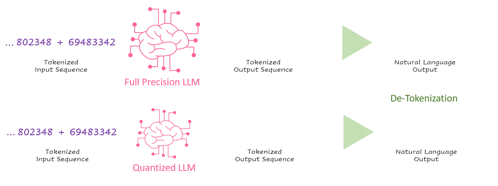

    <h1>Awesome LLM Compression</h1>
    
    
    

Awesome LLM compression research papers and tools to accelerate LLM training and inference. 

# Contents

- [📑 Papers](#papers)
  - [Survey](#survey)
  - [Quantization](#quantization)
  - [Pruning and Sparsity](#pruning-and-sparsity)
  - [Distillation](#distillation)
  - [Efficient Prompting](#efficient-prompting)
  - [KV Cache Compression](#kv-cache-compression)
  - [Other](#other)
- [🔧 Tools](#tools)
- [🙌 Contributing](#contributing)
- [🌟 Star History](#star-history)

## Papers

### Survey

- A Survey on Model Compression for Large Language Models   TACL [[Paper]](https://arxiv.org/abs/2308.07633)

- The Cost of Compression: Investigating the Impact of Compression on Parametric Knowledge in Language Models   EMNLP 2023 [[Paper]](https://arxiv.org/abs/2312.00960) [[Code]](https://github.com/NamburiSrinath/LLMCompression)

- The Efficiency Spectrum of Large Language Models: An Algorithmic Survey   Arxiv 2023 [[Paper]](https://arxiv.org/abs/2312.00678)

- Efficient Large Language Models: A Survey   TMLR [[Paper]](https://arxiv.org/abs/2312.03863) [[GitHub Page]](https://github.com/AIoT-MLSys-Lab/Efficient-LLMs-Survey)

- Towards Efficient Generative Large Language Model Serving: A Survey from Algorithms to Systems   ICML 2024 Tutorial [[Paper]](https://arxiv.org/abs/2312.15234) [[Tutorial]](https://icml.cc/virtual/2024/tutorial/35229)

- Understanding LLMs: A Comprehensive Overview from Training to Inference   Arxiv 2024 [[Paper]](https://arxiv.org/abs/2401.02038) 

- Faster and Lighter LLMs: A Survey on Current Challenges and Way Forward   IJCAI 2024 (Survey Track) [[Paper]](https://arxiv.org/abs/2402.01799) [[GitHub Page]](https://github.com/nyunAI/Faster-LLM-Survey)

- A Survey of Resource-efficient LLM and Multimodal Foundation Models   Arxiv 2024 [[Paper]](https://arxiv.org/abs/2401.08092) 

- A Survey on Hardware Accelerators for Large Language Models   Arxiv 2024 [[Paper]](https://arxiv.org/abs/2401.09890) 

- A Comprehensive Survey of Compression Algorithms for Language Models   Arxiv 2024 [[Paper]](https://arxiv.org/abs/2401.15347)

- A Survey on Transformer Compression   Arxiv 2024 [[Paper]](https://arxiv.org/abs/2402.05964)

- Model Compression and Efficient Inference for Large Language Models: A Survey   Arxiv 2024 [[Paper]](https://arxiv.org/abs/2402.09748) 

- LLM Inference Unveiled: Survey and Roofline Model Insights   Arxiv 2024 [[Paper]](https://arxiv.org/abs/2402.16363) 

- A Survey on Knowledge Distillation of Large Language Models   Arxiv 2024 [[Paper]](https://arxiv.org/abs/2402.13116) [[GitHub Page]](https://github.com/Tebmer/Awesome-Knowledge-Distillation-of-LLMs)

- Efficient Prompting Methods for Large Language Models: A Survey   Arxiv 2024 [[Paper]](https://arxiv.org/abs/2404.01077)

- Survey on Knowledge Distillation for Large Language Models: Methods, Evaluation, and Application   Arxiv 2024 [[Paper]](https://arxiv.org/abs/2407.01885)

- On-Device Language Models: A Comprehensive Review   Arxiv 2024 [[Paper]](https://arxiv.org/abs/2409.00088) [[GitHub Page]](https://github.com/NexaAI/Awesome-LLMs-on-device) [[Download On-device LLMs]](https://nexaai.com/models)

- A Survey of Low-bit Large Language Models: Basics, Systems, and Algorithms   Arxiv 2024 [[Paper]](https://arxiv.org/abs/2409.16694) 

- Contextual Compression in Retrieval-Augmented Generation for Large Language Models: A Survey   Arxiv 2024 [[Paper]](https://arxiv.org/abs/2409.13385) 

- Prompt Compression for Large Language Models: A Survey   Arxiv 2024 [[Paper]](https://arxiv.org/abs/2410.12388) 

- A Comprehensive Study on Quantization Techniques for Large Language Models   Arxiv 2024 [[Paper]](https://arxiv.org/abs/2411.02530) 

- A Survey on Large Language Model Acceleration based on KV Cache Management   Arxiv 2024 [[Paper]](https://arxiv.org/abs/2412.19442) 

- Efficient AI in Practice: Training and Deployment of Efficient LLMs for Industry Applications   Arxiv 2025 [[Paper]](https://arxiv.org/abs/2502.14305) 

- Key, Value, Compress: A Systematic Exploration of KV Cache Compression Techniques   CICC 2025 [[Paper]](https://arxiv.org/abs/2503.11816)

- Are We There Yet? A Measurement Study of Efficiency for LLM Applications on Mobile Devices   Arxiv 2025 [[Paper]](https://arxiv.org/abs/2504.00002) 

### Quantization

- ZeroQuant: Efficient and Affordable Post-Training Quantization for Large-Scale Transformers   NeurIPS 2022 [[Paper]](https://arxiv.org/abs/2206.01861) [[Code (DeepSpeed)]](https://github.com/microsoft/DeepSpeed)

- LLM.int8(): 8-bit Matrix Multiplication for Transformers at Scale   NeurIPS 2022 [[Paper]](https://arxiv.org/abs/2208.07339) [[Code]](https://github.com/TimDettmers/bitsandbytes)

- Outlier Suppression: Pushing the Limit of Low-bit Transformer Language Models   NeurIPS 2022 [[Paper]](https://arxiv.org/abs/2209.13325) [[Code]](https://github.com/wimh966/outlier_suppression)

- LUT-GEMM: Quantized Matrix Multiplication based on LUTs for Efficient Inference in Large-Scale Generative Language Models   ICLR 2024 [[Paper]](https://arxiv.org/abs/2206.09557) 

- SmoothQuant: Accurate and Efficient Post-Training Quantization for Large Language Models   ICML 2023 [[Paper]](https://arxiv.org/abs/2211.10438) [[Code]](https://github.com/mit-han-lab/smoothquant)

- FlexRound: Learnable Rounding based on Element-wise Division for Post-Training Quantization   ICML 2023 [[Paper]](https://arxiv.org/abs/2306.00317) [[Code (DeepSpeed)]](https://github.com/microsoft/DeepSpeed)

- Understanding INT4 Quantization for Transformer Models: Latency Speedup, Composability, and Failure Cases   ICML 2023 [[Paper]](https://arxiv.org/abs/2301.12017) [[Code]](https://openreview.net/attachment?id=-tYCaP0phY_&name=supplementary_material)

- The case for 4-bit precision: k-bit Inference Scaling Laws   ICML 2023 [[Paper]](https://proceedings.mlr.press/v202/dettmers23a.html)

- GPTQ: Accurate Post-Training Quantization for Generative Pre-trained Transformers   ICLR 2023 [[Paper]](https://arxiv.org/abs/2210.17323) [[Code]](https://github.com/IST-DASLab/gptq)

- PreQuant: A Task-agnostic Quantization Approach for Pre-trained Language Models   ACL 2023 [[Paper]](https://arxiv.org/abs/2306.00014) 

- Boost Transformer-based Language Models with GPU-Friendly Sparsity and Quantization   ACL 2023 [[Paper]](https://aclanthology.org/2023.findings-acl.15.pdf) 

- QLoRA: Efficient Finetuning of Quantized LLMs   NeurIPS 2023 [[Paper]](https://arxiv.org/abs/2305.14314) [[Code]](https://github.com/artidoro/qlora)

- The Quantization Model of Neural Scaling   NeurIPS 2023 [[Paper]](https://arxiv.org/abs/2303.13506)

- Quantized Distributed Training of Large Models with Convergence Guarantees   ICML 2023 [[Paper]](https://arxiv.org/abs/2302.02390)

- RPTQ: Reorder-based Post-training Quantization for Large Language Models   Arxiv 2023 [[Paper]](https://arxiv.org/abs/2304.01089) [[Code]](https://github.com/hahnyuan/RPTQ4LLM)

- ZeroQuant-V2: Exploring Post-training Quantization in LLMs from Comprehensive Study to Low Rank Compensation   AAAI 2024 [[Paper]](https://arxiv.org/abs/2303.08302) [[Code]](https://github.com/microsoft/DeepSpeed)

- Integer or Floating Point? New Outlooks for Low-Bit Quantization on Large Language Models   ICML 2024 [[Paper]](https://arxiv.org/abs/2305.12356)

- Memory-Efficient Fine-Tuning of Compressed Large Language Models via sub-4-bit Integer Quantization   NeurIPS 2023 [[Paper]](https://arxiv.org/abs/2305.14152)

- Compress, Then Prompt: Improving Accuracy-Efficiency Trade-off of LLM Inference with Transferable Prompt   Arxiv 2023 [[Paper]](https://arxiv.org/abs/2305.11186)

- AWQ: Activation-aware Weight Quantization for LLM Compression and Acceleration   MLSys 2024 (Best Paper 🏆) [[Paper]](https://arxiv.org/abs/2306.00978) [[Code]](https://github.com/mit-han-lab/llm-awq)

- LLM-QAT: Data-Free Quantization Aware Training for Large Language Models   ACL Findings 2024 [[Paper]](https://arxiv.org/abs/2305.17888) [[Code]](https://github.com/facebookresearch/LLM-QAT)

- SpQR: A Sparse-Quantized Representation for Near-Lossless LLM Weight Compression   ICLR 2024 [[Paper]](https://arxiv.org/abs/2306.03078) [[Code]](https://github.com/Vahe1994/SpQR)

- OWQ: Lessons learned from activation outliers for weight quantization in large language models   AAAI 2024 [[Paper]](https://arxiv.org/abs/2306.02272)

- SqueezeLLM: Dense-and-Sparse Quantization   ICML 2024 [[Paper]](https://arxiv.org/abs/2306.07629)  [[Code]](https://github.com/SqueezeAILab/SqueezeLLM)

- INT2.1: Towards Fine-Tunable Quantized Large Language Models with Error Correction through Low-Rank Adaptation   Arxiv 2023 [[Paper]](https://arxiv.org/abs/2306.08162)

- LQ-LoRA: Low-rank Plus Quantized Matrix Decomposition for Efficient Language Model Finetuning   ICLR 2024 [[Paper]](https://arxiv.org/abs/2311.12023)

- INT-FP-QSim: Mixed Precision and Formats For Large Language Models and Vision Transformers   Arxiv 2023 [[Paper]](https://arxiv.org/abs/2307.03712) [[Code]](https://github.com/lightmatter-ai/INT-FP-QSim)

- QIGen: Generating Efficient Kernels for Quantized Inference on Large Language Models   Arxiv 2023 [[Paper]](https://arxiv.org/abs/2307.03738) [[Code]](https://github.com/IST-DASLab/QIGen)

- Do Emergent Abilities Exist in Quantized Large Language Models: An Empirical Study   COLING 2024 [[Paper]](https://arxiv.org/abs/2307.08072)

- ZeroQuant-FP: A Leap Forward in LLMs Post-Training W4A8 Quantization Using Floating-Point Formats   Arxiv 2023 [[Paper]](https://arxiv.org/abs/2307.09782) [[Code (DeepSpeed)]](https://github.com/microsoft/DeepSpeed)

- OliVe: Accelerating Large Language Models via Hardware-friendly Outlier-Victim Pair Quantization   ISCA 2023 [[Paper]](https://arxiv.org/abs/2304.07493)

- NUPES : Non-Uniform Post-Training Quantization via Power Exponent Search   Arxiv 2023 [[Paper]](https://arxiv.org/abs/2308.05600)

- GPT-Zip: Deep Compression of Finetuned Large Language Models   ICML 2023 Workshop ES-FoMO [[Paper]](https://openreview.net/forum?id=hO0c2tG2xL)

- Generating Efficient Kernels for Quantized Inference on Large Language Models   ICML 2023 Workshop ES-FoMO [[Paper]](https://openreview.net/forum?id=jjazoNAf1S)

- Gradient-Based Post-Training Quantization: Challenging the Status Quo   Arxiv 2023 [[Paper]](https://arxiv.org/abs/2308.07662)

- FineQuant: Unlocking Efficiency with Fine-Grained Weight-Only Quantization for LLMs   Arxiv 2023 [[Paper]](https://arxiv.org/abs/2308.09723)

- OmniQuant: Omnidirectionally Calibrated Quantization for Large Language Models   ICLR 2024 [[Paper]](https://arxiv.org/abs/2308.13137) [[Code]](https://github.com/OpenGVLab/OmniQuant)

- FPTQ: Fine-grained Post-Training Quantization for Large Language Models   Arxiv 2023 [[Paper]](https://arxiv.org/abs/2308.15987)

- eDKM: An Efficient and Accurate Train-time Weight Clustering for Large Language Models   IEEE Computer Architecture Letters 2023 [[Paper]](https://arxiv.org/abs/2309.00964)

- QuantEase: Optimization-based Quantization for Language Models -- An Efficient and Intuitive Algorithm   Arxiv 2023 [[Paper]](https://arxiv.org/abs/2309.01885)

- Norm Tweaking: High-performance Low-bit Quantization of Large Language Models   AAAI 2024 [[Paper]](https://arxiv.org/abs/2309.02784)

- Understanding the Impact of Post-Training Quantization on Large-scale Language Models   Arxiv 2023 [[Paper]](https://arxiv.org/abs/2309.05210)

- MEMORY-VQ: Compression for Tractable Internet-Scale Memory   NAACL 2024 [[Paper]](https://arxiv.org/abs/2308.14903)

- Optimize Weight Rounding via Signed Gradient Descent for the Quantization of LLMs   EMNLP Findings 2024 [[Paper]](https://arxiv.org/abs/2309.05516) [[Code]](https://github.com/intel/auto-round)

- Efficient Post-training Quantization with FP8 Formats   MLSys 2024 [[Paper]](https://arxiv.org/abs/2309.14592) [[Code (Intel® Neural Compressor)]](https://github.com/intel/neural-compressor)

- QA-LoRA: Quantization-Aware Low-Rank Adaptation of Large Language Models   ICLR 2024 [[Paper]](https://arxiv.org/abs/2309.14717) [[Code]](https://github.com/yuhuixu1993/qa-lora)

- Rethinking Channel Dimensions to Isolate Outliers for Low-bit Weight Quantization of Large Language Models   ICLR 2024 [[Paper]](https://arxiv.org/abs/2309.15531) [[Code]](https://github.com/johnheo/adadim-llm)

- ModuLoRA: Finetuning 3-Bit LLMs on Consumer GPUs by Integrating with Modular Quantizers   TMLR (Featured Certification 🌟) [[Paper]](https://arxiv.org/abs/2309.16119) 

- PB-LLM: Partially Binarized Large Language Models   ICLR 2024 [[Paper]](https://arxiv.org/abs/2310.00034) [[Code]](https://github.com/hahnyuan/PB-LLM)

- Dual Grained Quantization: Efficient Fine-Grained Quantization for LLM   Arxiv 2023 [[Paper]](https://arxiv.org/abs/2310.04836) 

- QLLM: Accurate and Efficient Low-Bitwidth Quantization for Large Language Models   ICLR 2024 [[Paper]](https://arxiv.org/abs/2310.08041) [[Code]](https://github.com/ModelTC/QLLM)

- LoftQ: LoRA-Fine-Tuning-Aware Quantization for Large Language Models   ICLR 2024 [[Paper]](https://arxiv.org/abs/2310.08659) [[Code]](https://github.com/yxli2123/LoftQ)

- QFT: Quantized Full-parameter Tuning of LLMs with Affordable Resources   Arxiv 2023 [[Paper]](https://arxiv.org/abs/2310.07147) 

- TEQ: Trainable Equivalent Transformation for Quantization of LLMs   Arxiv 2023 [[Paper]](https://arxiv.org/abs/2310.10944) [[Code (Intel® Neural Compressor)]](https://github.com/intel/neural-compressor)

- BitNet: Scaling 1-bit Transformers for Large Language Models   Arxiv 2023 [[Paper]](https://arxiv.org/abs/2310.11453)  [[Code]](https://github.com/Beomi/BitNet-Transformers)

- FP8-LM: Training FP8 Large Language Models   Arxiv 2023 [[Paper]](https://arxiv.org/abs/2310.18313) [[Code]](https://github.com/Azure/MS-AMP)

- QUIK: Towards End-to-End 4-Bit Inference on Generative Large Language Models   EMNLP 2024 [[Paper]](https://arxiv.org/abs/2310.09259) [[Code]](https://github.com/IST-DASLab/QUIK)

- AFPQ: Asymmetric Floating Point Quantization for LLMs   ACL Findings 2024 [[Paper]](https://arxiv.org/abs/2311.01792) [[Code]](https://github.com/zhangsichengsjtu/AFPQ)

- AWEQ: Post-Training Quantization with Activation-Weight Equalization for Large Language Models   Arxiv 2023 [[Paper]](https://arxiv.org/abs/2311.01305) 

- Atom: Low-bit Quantization for Efficient and Accurate LLM Serving   MLSys 2024 [[Paper]](https://arxiv.org/abs/2310.19102) [[Code]](https://github.com/efeslab/Atom)

- QMoE: Practical Sub-1-Bit Compression of Trillion-Parameter Models   Arxiv 2023 [[Paper]](https://arxiv.org/abs/2310.16795) 

- Dissecting the Runtime Performance of the Training, Fine-tuning, and Inference of Large Language Models   Arxiv 2023 [[Paper]](https://arxiv.org/abs/2311.03687) 

- How Does Calibration Data Affect the Post-training Pruning and Quantization of Large Language Models?   Arxiv 2023 [[Paper]](https://arxiv.org/abs/2311.09755)

- A Speed Odyssey for Deployable Quantization of LLMs   Arxiv 2023 [[Paper]](https://arxiv.org/abs/2311.09550)

- Enabling Fast 2-bit LLM on GPUs: Memory Alignment, Sparse Outlier, and Asynchronous Dequantization   Arxiv 2023 [[Paper]](https://arxiv.org/abs/2311.16442)

- Quantizable Transformers: Removing Outliers by Helping Attention Heads Do Nothing   NeurIPS 2023 [[Paper]](https://arxiv.org/abs/2306.12929) [[Code]](https://github.com/Qualcomm-AI-research/outlier-free-transformers)

- Efficient LLM Inference on CPUs   NeurIPS 2023 on Efficient Natural Language and Speech Processing [[Paper]](https://arxiv.org/abs/2311.00502) [[Code]](https://github.com/intel/intel-extension-for-transformers)

- The Cost of Compression: Investigating the Impact of Compression on Parametric Knowledge in Language Models   EMNLP Findings 2023 [[Paper]](https://arxiv.org/abs/2312.00960) 

- Zero-Shot Sharpness-Aware Quantization for Pre-trained Language Models   EMNLP 2023 [[Paper]](https://arxiv.org/abs/2310.13315) 

- Revisiting Block-based Quantisation: What is Important for Sub-8-bit LLM Inference?   EMNLP 2023 [[Paper]](https://arxiv.org/abs/2310.05079) [[Code]](https://github.com/ChengZhang-98/llm-mixed-q) 

- Outlier Suppression+: Accurate quantization of large language models by equivalent and optimal shifting and scaling   EMNLP 2023 [[Paper]](https://arxiv.org/abs/2304.09145)

- Watermarking LLMs with Weight Quantization   EMNLP 2023 [[Paper]](https://arxiv.org/abs/2310.11237) [[Code]](https://github.com/Twilight92z/Quantize-Watermark)

- Enhancing Computation Efficiency in Large Language Models through Weight and Activation Quantization   EMNLP 2023 [[Paper]](https://arxiv.org/abs/2311.05161)

- LLM-FP4: 4-Bit Floating-Point Quantized Transformers   EMNLP 2023 [[Paper]](https://arxiv.org/abs/2310.16836) [[Code]](https://github.com/nbasyl/LLM-FP4)

- Agile-Quant: Activation-Guided Quantization for Faster Inference of LLMs on the Edge   AAAI 2024 [[Paper]](https://arxiv.org/abs/2312.05693)

- SmoothQuant+: Accurate and Efficient 4-bit Post-Training WeightQuantization for LLM   Arxiv 2023 [[Paper]](https://arxiv.org/abs/2312.03788)

- CBQ: Cross-Block Quantization for Large Language Models   Arxiv 2023 [[Paper]](https://arxiv.org/abs/2312.07950)

- ZeroQuant(4+2): Redefining LLMs Quantization with a New FP6-Centric Strategy for Diverse Generative Tasks   Arxiv 2023 [[Paper]](https://arxiv.org/abs/2312.08583)

- QuIP: 2-Bit Quantization of Large Language Models With Guarantees   NeurIPS 2023 [[Paper]](https://openreview.net/pdf?id=xrk9g5vcXR) [[Code]](https://github.com/jerry-chee/QuIP)

- A Performance Evaluation of a Quantized Large Language Model on Various Smartphones   Arxiv 2023 [[Paper]](https://arxiv.org/abs/2312.12472)

- DeltaZip: Multi-Tenant Language Model Serving via Delta Compression   Arxiv 2023 [[Paper]](https://arxiv.org/abs/2312.05215) [[Code]](https://github.com/eth-easl/deltazip)

- FlightLLM: Efficient Large Language Model Inference with a Complete Mapping Flow on FPGA   FPGA 2024 [[Paper]](https://arxiv.org/abs/2401.03868)

- Extreme Compression of Large Language Models via Additive Quantization   ICML 2024 [[Paper]](https://arxiv.org/abs/2401.06118) [[Code]](https://github.com/Vahe1994/AQLM)

- Quantized Side Tuning: Fast and Memory-Efficient Tuning of Quantized Large Language Models   Arxiv 2024 [[Paper]](https://arxiv.org/abs/2401.07159)

- Inferflow: an Efficient and Highly Configurable Inference Engine for Large Language Models   Arxiv 2024 [[Paper]](https://arxiv.org/abs/2401.08294)

- FP6-LLM: Efficiently Serving Large Language Models Through FP6-Centric Algorithm-System Co-Design   USENIX ATC 2024 [[Paper]](https://arxiv.org/abs/2401.14112)

- Can Large Language Models Understand Context?   Arxiv 2024 [[Paper]](https://arxiv.org/abs/2401.18079)

- EdgeQAT: Entropy and Distribution Guided Quantization-Aware Training for the Acceleration of Lightweight LLMs on the Edge   Arxiv 2024 [[Paper]](https://arxiv.org/abs/2402.10787) [[Code]](https://github.com/shawnricecake/EdgeQAT)

- Any-Precision LLM: Low-Cost Deployment of Multiple, Different-Sized LLMs   Arxiv 2024 [[Paper]](https://arxiv.org/abs/2402.10517) 

- LQER: Low-Rank Quantization Error Reconstruction for LLMs   ICML 2024 [[Paper]](https://arxiv.org/abs/2402.02446) 

- BiLLM: Pushing the Limit of Post-Training Quantization for LLMs   Arxiv 2024 [[Paper]](https://arxiv.org/abs/2402.04291) [[Code]](https://github.com/Aaronhuang-778/BiLLM)

- QuIP#: Even Better LLM Quantization with Hadamard Incoherence and Lattice Codebooks   ICML 2024 [[Paper]](https://arxiv.org/abs/2402.04396) [[Code]](https://github.com/Cornell-RelaxML/quip-sharp)

- L4Q: Parameter Efficient Quantization-Aware Training on Large Language Models via LoRA-wise LSQ   Arxiv 2024 [[Paper]](https://arxiv.org/abs/2402.04902) 

- TP-Aware Dequantization   Arxiv 2024 [[Paper]](https://arxiv.org/abs/2402.04925) 

- ApiQ: Finetuning of 2-Bit Quantized Large Language Model   EMNLP 2024 [[Paper]](https://arxiv.org/abs/2402.05147) 

- Accurate LoRA-Finetuning Quantization of LLMs via Information Retention   Arxiv 2024 [[Paper]](https://arxiv.org/abs/2402.05445) [[Code]](https://github.com/htqin/ir-qlora)

- BitDelta: Your Fine-Tune May Only Be Worth One Bit   Arxiv 2024 [[Paper]](https://arxiv.org/abs/2402.10193) [[Code]](https://github.com/FasterDecoding/BitDelta)

- QDyLoRA: Quantized Dynamic Low-Rank Adaptation for Efficient Large Language Model Tuning   EMNLP 2024 Industry Track [[Paper]](https://arxiv.org/abs/2402.10462) 

- Any-Precision LLM: Low-Cost Deployment of Multiple, Different-Sized LLMs   ICML 2024 [[Paper]](https://arxiv.org/abs/2402.10517) 

- BitDistiller: Unleashing the Potential of Sub-4-Bit LLMs via Self-Distillation   ACL 2024 [[Paper]](https://arxiv.org/abs/2402.10631) [[Code]](https://github.com/DD-DuDa/BitDistiller)

- OneBit: Towards Extremely Low-bit Large Language Models   Arxiv 2024 [[Paper]](https://arxiv.org/abs/2402.11295)

- DB-LLM: Accurate Dual-Binarization for Efficient LLMs   ACL Findings 2024 [[Paper]](https://arxiv.org/abs/2402.11960)

- WKVQuant: Quantizing Weight and Key/Value Cache for Large Language Models Gains More   Arxiv 2024 [[Paper]](https://arxiv.org/abs/2402.12065)

- GPTVQ: The Blessing of Dimensionality for LLM Quantization   Arxiv 2024 [[Paper]](https://arxiv.org/abs/2402.15319) [[Code]](https://github.com/qualcomm-ai-research/gptvq)

- APTQ: Attention-aware Post-Training Mixed-Precision Quantization for Large Language Models   DAC 2024 [[Paper]](https://arxiv.org/abs/2402.14866) 

- A Comprehensive Evaluation of Quantization Strategies for Large Language Models   DAC 2024 [[Paper]](https://arxiv.org/abs/2402.16775) 

- Evaluating Quantized Large Language Models   Arxiv 2024 [[Paper]](https://arxiv.org/abs/2402.18158)

- FlattenQuant: Breaking Through the Inference Compute-bound for Large Language Models with Per-tensor Quantization   Arxiv 2024 [[Paper]](https://arxiv.org/abs/2402.17985)

- LLM-PQ: Serving LLM on Heterogeneous Clusters with Phase-Aware Partition and Adaptive Quantization   Arxiv 2024 [[Paper]](https://arxiv.org/abs/2403.01136)

- IntactKV: Improving Large Languagze Model Quantization by Keeping Pivot Tokens Intact   ACL Findings 2024 [[Paper]](https://arxiv.org/abs/2403.01241) [[Code]](https://github.com/ruikangliu/IntactKV)

- On the Compressibility of Quantized Large Language Models   Arxiv 2024 [[Paper]](https://arxiv.org/abs/2403.01384)

- EasyQuant: An Efficient Data-free Quantization Algorithm for LLMs   Arxiv 2024 [[Paper]](https://arxiv.org/abs/2403.02775)

- What Makes Quantization for Large Language Models Hard? An Empirical Study from the Lens of Perturbation   Arxiv 2024 [[Paper]](https://arxiv.org/abs/2403.06408)

- AffineQuant: Affine Transformation Quantization for Large Language Models   ICLR 2024 [[Paper]](https://browse.arxiv.org/abs/2402.00858) [[Code]](https://github.com/bytedance/AffineQuant)

- Oh! We Freeze: Improving Quantized Knowledge Distillation via Signal Propagation Analysis for Large Language Models   ICLR Practical ML for Low Resource Settings Workshop 2024 [[Paper]](https://arxiv.org/abs/2403.18159) 

- Accurate Block Quantization in LLMs with Outliers   Arxiv 2024 [[Paper]](https://arxiv.org/abs/2403.20137)

- QuaRot: Outlier-Free 4-Bit Inference in Rotated LLMs   Arxiv 2024 [[Paper]](https://arxiv.org/abs/2404.00456) [[Code]](https://github.com/spcl/QuaRot)

- Minimize Quantization Output Error with Bias Compensation   Arxiv 2024 [[Paper]](https://arxiv.org/abs/2404.01892) [[Code]](https://github.com/GongCheng1919/bias-compensation)

- Cherry on Top: Parameter Heterogeneity and Quantization in Large Language Models   Arxiv 2024 [[Paper]](https://arxiv.org/abs/2404.02837)

- Increased LLM Vulnerabilities from Fine-tuning and Quantization   Arxiv 2024 [[Paper]](https://arxiv.org/abs/2404.04392)

- Quantization of Large Language Models with an Overdetermined Basis   Arxiv 2024 [[Paper]](https://arxiv.org/abs/2404.09737)

- How Good Are Low-bit Quantized LLaMA3 Models? An Empirical Study   Arxiv 2024 [[Paper]](https://arxiv.org/abs/2404.14047) [[Code]](https://github.com/Macaronlin/LLaMA3-Quantization) [[Model]](https://huggingface.co/LLMQ)

- How to Parameterize Asymmetric Quantization Ranges for Quantization-Aware Training   Arxiv 2024 [[Paper]](https://arxiv.org/abs/2404.16898)

- Mitigating the Impact of Outlier Channels for Language Model Quantization with Activation Regularization   Arxiv 2024 [[Paper]](https://arxiv.org/abs/2404.03605) [[Code]](https://github.com/aninrusimha/qat-pretrain)

- When Quantization Affects Confidence of Large Language Models?   NAACL 2024 [[Paper]](https://arxiv.org/abs/2405.00632)

- QServe: W4A8KV4 Quantization and System Co-design for Efficient LLM Serving   Arxiv 2024 [[Paper]](https://arxiv.org/abs/2405.04532) [[Code]](https://github.com/mit-han-lab/qserve)

- Learning from Students: Applying t-Distributions to Explore Accurate and Efficient Formats for LLMs   ICML 2024 [[Paper]](https://arxiv.org/abs/2405.03103)

- LLM-QBench: A Benchmark Towards the Best Practice for Post-training Quantization of Large Language Models   Arxiv 2024 [[Paper]](https://arxiv.org/abs/2405.06001) [[Code]](https://github.com/ModelTC/llmc)

- SKVQ: Sliding-window Key and Value Cache Quantization for Large Language Models   Arxiv 2024 [[Paper]](https://arxiv.org/abs/2405.06219) 

- Combining multiple post-training techniques to achieve most efficient quantized LLMs   Arxiv 2024 [[Paper]](https://arxiv.org/abs/2405.07135) 

- Edge Intelligence Optimization for Large Language Model Inference with Batching and Quantization   Arxiv 2024 [[Paper]](https://arxiv.org/abs/2405.07140) 

- SliM-LLM: Salience-Driven Mixed-Precision Quantization for Large Language Models   Arxiv 2024 [[Paper]](https://arxiv.org/abs/2405.14917) [[Code]](https://github.com/Aaronhuang-778/SliM-LLM)

- OAC: Output-adaptive Calibration for Accurate Post-training Quantization   Arxiv 2024 [[Paper]](https://arxiv.org/abs/2405.15025) 

- PV-Tuning: Beyond Straight-Through Estimation for Extreme LLM Compression   Arxiv 2024 [[Paper]](https://arxiv.org/abs/2405.14852) 

- SpinQuant -- LLM quantization with learned rotations   ICLR 2025 [[Paper]](https://www.arxiv.org/abs/2405.16406) 

- Compressing Large Language Models using Low Rank and Low Precision Decomposition   Arxiv 2024 [[Paper]](https://arxiv.org/abs/2405.18886) [[Code]](https://github.com/pilancilab/caldera)

- Athena: Efficient Block-Wise Post-Training Quantization for Large Language Models Using Second-Order Matrix Derivative Information   Arxiv 2024 [[Paper]](https://arxiv.org/abs/2405.17470) 

- Exploiting LLM Quantization   Arxiv 2024 [[Paper]](https://arxiv.org/abs/2405.18137) 

- One QuantLLM for ALL: Fine-tuning Quantized LLMs Once for Efficient Deployments   Arxiv 2024 [[Paper]](https://arxiv.org/abs/2405.20202) 

- LCQ: Low-Rank Codebook based Quantization for Large Language Models   Arxiv 2024 [[Paper]](https://arxiv.org/abs/2405.20973) 

- LoQT: Low Rank Adapters for Quantized Training   Arxiv 2024 [[Paper]](https://arxiv.org/abs/2405.16528) [[Code]](https://github.com/sebulo/LoQT)

- CLAQ: Pushing the Limits of Low-Bit Post-Training Quantization for LLMs   Arxiv 2024 [[Paper]](https://arxiv.org/abs/2405.17233) [[Code]](https://github.com/fayuge/CLAQ)

- I-LLM: Efficient Integer-Only Inference for Fully-Quantized Low-Bit Large Language Models   Arxiv 2024 [[Paper]](https://arxiv.org/abs/2405.17849)

- Outliers and Calibration Sets have Diminishing Effect on Quantization of Modern LLMs   Arxiv 2024 [[Paper]](https://arxiv.org/abs/2405.20835)

- DuQuant: Distributing Outliers via Dual Transformation Makes Stronger Quantized LLMs   NeurIPS 2024 [[Paper]](https://arxiv.org/abs/2406.01721) [[Code]](https://github.com/Hsu1023/DuQuant)

- ShiftAddLLM: Accelerating Pretrained LLMs via Post-Training Multiplication-Less Reparameterization   Arxiv 2024 [[Paper]](https://arxiv.org/abs/2406.05981) [[Code]](https://github.com/GATECH-EIC/ShiftAddLLM)

- Low-Rank Quantization-Aware Training for LLMs   Arxiv 2024 [[Paper]](https://arxiv.org/abs/2406.06385)

- TernaryLLM: Ternarized Large Language Model   Arxiv 2024 [[Paper]](https://arxiv.org/abs/2406.07177)

- Examining Post-Training Quantization for Mixture-of-Experts: A Benchmark   Arxiv 2024 [[Paper]](https://arxiv.org/abs/2406.08155) [[Code]](https://github.com/UNITES-Lab/moe-quantization)

- Delta-CoMe: Training-Free Delta-Compression with Mixed-Precision for Large Language Models   Arxiv 2024 [[Paper]](https://arxiv.org/abs/2406.08903)

- QQQ: Quality Quattuor-Bit Quantization for Large Language Models   Arxiv 2024 [[Paper]](https://arxiv.org/abs/2406.09904) [[Code]](https://github.com/HandH1998/QQQ)

- QTIP: Quantization with Trellises and Incoherence Processing   NeurIPS 2024 [[Paper]](https://arxiv.org/abs/2406.11235) [[Code]](https://github.com/Cornell-RelaxML/qtip)

- Prefixing Attention Sinks can Mitigate Activation Outliers for Large Language Model Quantization   EMNLP 2024 [[Paper]](https://arxiv.org/abs/2406.12016) 

- Mixture of Scales: Memory-Efficient Token-Adaptive Binarization for Large Language Models   Arxiv 2024 [[Paper]](https://arxiv.org/abs/2406.12311) 

- Tender: Accelerating Large Language Models via Tensor Decomposition and Runtime Requantization   ISCA 2024 [[Paper]](https://arxiv.org/abs/2406.12930) 

- SDQ: Sparse Decomposed Quantization for LLM Inference   Arxiv 2024 [[Paper]](https://arxiv.org/abs/2406.13868) 

- Attention-aware Post-training Quantization without Backpropagation   Arxiv 2024 [[Paper]](https://arxiv.org/abs/2406.13474) 

- EDGE-LLM: Enabling Efficient Large Language Model Adaptation on Edge Devices via Layerwise Unified Compression and Adaptive Layer Tuning and Voting   Arxiv 2024 [[Paper]](https://arxiv.org/abs/2406.15758) [[Code]](https://github.com/GATECH-EIC/Edge-LLM)

- Compensate Quantization Errors: Make Weights Hierarchical to Compensate Each Other   Arxiv 2024 [[Paper]](https://arxiv.org/abs/2406.16299) 

- Layer-Wise Quantization: A Pragmatic and Effective Method for Quantizing LLMs Beyond Integer Bit-Levels   Arxiv 2024 [[Paper]](https://arxiv.org/abs/2406.17415) [[Code]](https://github.com/RazvanDu/LayerwiseQuant)

- CDQuant: Accurate Post-training Weight Quantization of Large Pre-trained Models using Greedy Coordinate Descent   Arxiv 2024 [[Paper]](https://arxiv.org/abs/2406.17542) 

- OutlierTune: Efficient Channel-Wise Quantization for Large Language Models   Arxiv 2024 [[Paper]](https://arxiv.org/abs/2406.18832) 

- T-MAC: CPU Renaissance via Table Lookup for Low-Bit LLM Deployment on Edge   Arxiv 2024 [[Paper]](https://arxiv.org/abs/2407.00088) [[Code]](https://github.com/microsoft/T-MAC)

- GPTQT: Quantize Large Language Models Twice to Push the Efficiency   ICORIS 2024 [[Paper]](https://arxiv.org/abs/2407.02891) 

- Improving Conversational Abilities of Quantized Large Language Models via Direct Preference Alignment   ACL 2024 [[Paper]](https://arxiv.org/abs/2407.03051) 

- How Does Quantization Affect Multilingual LLMs?   EMNLP Findings 2024 [[Paper]](https://arxiv.org/abs/2407.03211) 

- RoLoRA: Fine-tuning Rotated Outlier-free LLMs for Effective Weight-Activation Quantization   EMNLP Findings 2024 [[Paper]](https://arxiv.org/abs/2407.08044) [[Code]](https://github.com/HuangOwen/RoLoRA) 

- Q-GaLore: Quantized GaLore with INT4 Projection and Layer-Adaptive Low-Rank Gradients   Arxiv 2024 [[Paper]](https://arxiv.org/abs/2407.08296) [[Code]](https://github.com/VITA-Group/Q-GaLore) 

- FlashAttention-3: Fast and Accurate Attention with Asynchrony and Low-precision   Arxiv 2024 [[Paper]](https://arxiv.org/abs/2407.08608) [[Code]](https://github.com/Dao-AILab/flash-attention) 

- Accuracy is Not All You Need   Arxiv 2024 [[Paper]](https://arxiv.org/abs/2407.09141)

- BitNet b1.58 Reloaded: State-of-the-art Performance Also on Smaller Networks   Arxiv 2024 [[Paper]](https://arxiv.org/abs/2407.09527)

- LeanQuant: Accurate Large Language Model Quantization with Loss-Error-Aware Grid   Arxiv 2024 [[Paper]](https://arxiv.org/abs/2407.10032)

- Fast Matrix Multiplications for Lookup Table-Quantized LLMs   EMNLP Findings 2024 [[Paper]](https://arxiv.org/abs/2407.10960) [[Code]](https://github.com/HanGuo97/flute) 

- EfficientQAT: Efficient Quantization-Aware Training for Large Language Models   Arxiv 2024 [[Paper]](https://arxiv.org/abs/2407.11062) [[Code]](https://github.com/OpenGVLab/EfficientQAT) 

- LRQ: Optimizing Post-Training Quantization for Large Language Models by Learning Low-Rank Weight-Scaling Matrices   Arxiv 2024 [[Paper]](https://arxiv.org/abs/2407.11534) [[Code]](https://github.com/onliwad101/FlexRound_LRQ) 

- Exploring Quantization for Efficient Pre-Training of Transformer Language Models   EMNLP Findings 2024 [[Paper]](https://arxiv.org/abs/2407.11722) [[Code]](https://github.com/chandar-lab/EfficientLLMs) 

- Spectra: A Comprehensive Study of Ternary, Quantized, and FP16 Language Models   Arxiv 2024 [[Paper]](https://arxiv.org/abs/2407.12327) [[Code]](https://github.com/NolanoOrg/SpectraSuite) 

- Mamba-PTQ: Outlier Channels in Recurrent Large Language Models    Efficient Systems for Foundation Models Workshop @ ICML 2024 [[Paper]](https://arxiv.org/abs/2407.12397)

- Compensate Quantization Errors+: Quantized Models Are Inquisitive Learners   Arxiv 2024 [[Paper]](https://arxiv.org/abs/2407.15508)

- Accurate and Efficient Fine-Tuning of Quantized Large Language Models Through Optimal Balance   Arxiv 2024 [[Paper]](https://arxiv.org/abs/2407.17029) [[Code]](https://github.com/xiaocaigou/qbaraqahira) 

- STBLLM: Breaking the 1-Bit Barrier with Structured Binary LLMs   Arxiv 2024 [[Paper]](https://arxiv.org/abs/2408.01803)

- Advancing Multimodal Large Language Models with Quantization-Aware Scale Learning for Efficient Adaptation   ACM MM 2024 [[Paper]](https://arxiv.org/abs/2408.03735)

- ABQ-LLM: Arbitrary-Bit Quantized Inference Acceleration for Large Language Models   Arxiv 2024 [[Paper]](https://arxiv.org/abs/2408.08554) 

- MARLIN: Mixed-Precision Auto-Regressive Parallel Inference on Large Language Models   Arxiv 2024 [[Paper]](https://arxiv.org/abs/2408.11743) [[Code (Marlin)]](https://github.com/IST-DASLab/marlin) [[Code (Sparse Marlin)]](https://github.com/IST-DASLab/Sparse-Marlin)

- Matmul or No Matmal in the Era of 1-bit LLMs   Arxiv 2024 [[Paper]](https://arxiv.org/abs/2408.11939)

- MobileQuant: Mobile-friendly Quantization for On-device Language Models    EMNLP Findings 2024 [[Paper]](https://arxiv.org/abs/2408.13933) [[Code]](https://github.com/saic-fi/MobileQuant) 

- GIFT-SW: Gaussian noise Injected Fine-Tuning of Salient Weights for LLMs   Arxiv 2024 [[Paper]](https://arxiv.org/abs/2408.15300) [[Code]](https://github.com/On-Point-RND/GIFT_SW-v2-Gaussian-noise-Injected-Fine-Tuning-of-Salient-Weights-for-LLMs) 

- Foundations of Large Language Model Compression -- Part 1: Weight Quantization   Arxiv 2024 [[Paper]](https://arxiv.org/abs/2409.02026) [[Code]](https://github.com/seannz/cvxq) 

- OPAL: Outlier-Preserved Microscaling Quantization A ccelerator for Generative Large Language Models   DAC 2024 [[Paper]](https://arxiv.org/abs/2409.05902)

- VPTQ: Extreme Low-bit Vector Post-Training Quantization for Large Language Models   EMNLP 2024 [[Paper]](https://arxiv.org/abs/2409.17066) [[Code]](https://github.com/microsoft/VPTQ)

- Scaling FP8 training to trillion-token LLMs   Arxiv 2024 [[Paper]](https://arxiv.org/abs/2409.12517)

- Accumulator-Aware Post-Training Quantization   Arxiv 2024 [[Paper]](https://arxiv.org/abs/2409.17092)

- Efficient Arbitrary Precision Acceleration for Large Language Models on GPU Tensor Cores   Arxiv 2024 [[Paper]](https://arxiv.org/abs/2409.17870)

- Rotated Runtime Smooth: Training-Free Activation Smoother for accurate INT4 inference   Arxiv 2024 [[Paper]](https://arxiv.org/abs/2409.20361) [[Code]](https://github.com/Coco58323/Rotated_Runtime_Smooth)

- EXAQ: Exponent Aware Quantization For LLMs Acceleration   Arxiv 2024 [[Paper]](https://arxiv.org/abs/2410.03185) 

- ARB-LLM: Alternating Refined Binarizations for Large Language Models   Arxiv 2024 [[Paper]](https://arxiv.org/abs/2410.03129) [[Code]](https://github.com/ZHITENGLI/ARB-LLM)

- PrefixQuant: Static Quantization Beats Dynamic through Prefixed Outliers in LLMs   Arxiv 2024 [[Paper]](https://arxiv.org/abs/2410.05265) [[Code]](https://github.com/ChenMnZ/PrefixQuant)

- SpaLLM: Unified Compressive Adaptation of Large Language Models with Sketching   Arxiv 2024 [[Paper]](https://arxiv.org/abs/2410.06364) 

- Scaling Laws for Mixed quantization in Large Language Models   Arxiv 2024 [[Paper]](https://arxiv.org/abs/2410.06722) 

- Q-VLM: Post-training Quantization for Large Vision-Language Models   NeurIPS 2024 [[Paper]](https://arxiv.org/abs/2410.08119) [[Code]](https://github.com/ChangyuanWang17/QVLM)

- CrossQuant: A Post-Training Quantization Method with Smaller Quantization Kernel for Precise Large Language Model Compression   Arxiv 2024 [[Paper]](https://arxiv.org/abs/2410.07505) 

- FlatQuant: Flatness Matters for LLM Quantization   Arxiv 2024 [[Paper]](https://arxiv.org/abs/2410.09426) [[Code]](https://github.com/ruikangliu/FlatQuant)

- DeltaDQ: Ultra-High Delta Compression for Fine-Tuned LLMs via Group-wise Dropout and Separate Quantization   Arxiv 2024 [[Paper]](https://arxiv.org/abs/2410.08666) 

- QEFT: Quantization for Efficient Fine-Tuning of LLMs   EMNLP Findings 2024 [[Paper]](https://arxiv.org/abs/2410.08661) [[Code]](https://github.com/xvyaward/qeft)

- Continuous Approximations for Improving Quantization Aware Training of LLMs   Arxiv 2024 [[Paper]](https://arxiv.org/abs/2410.10849) 

- DAQ: Density-Aware Post-Training Weight-Only Quantization For LLMs   Arxiv 2024 [[Paper]](https://arxiv.org/abs/2410.12187) 

- COMET: Towards Partical W4A4KV4 LLMs Serving   Arxiv 2024 [[Paper]](https://arxiv.org/abs/2410.12168) 

- Scaling laws for post-training quantized large language models   Arxiv 2024 [[Paper]](https://arxiv.org/abs/2410.12119) 

- Channel-Wise Mixed-Precision Quantization for Large Language Models   Arxiv 2024 [[Paper]](https://arxiv.org/abs/2410.13056) 

- Understanding the difficulty of low-precision post-training quantization of large language models   Arxiv 2024 [[Paper]](https://arxiv.org/abs/2410.14570) 

- QuAILoRA: Quantization-Aware Initialization for LoRA   NeurIPS Workshop on Efficient Natural Language and Speech Processing (ENLSP-IV) 2024 [[Paper]](https://arxiv.org/abs/2410.14713) 

- SDP4Bit: Toward 4-bit Communication Quantization in Sharded Data Parallelism for LLM Training   NeurIPS 2024 [[Paper]](https://arxiv.org/abs/2410.15526) 

- Pyramid Vector Quantization for LLMs   Arxiv 2024 [[Paper]](https://arxiv.org/abs/2410.16926) 

- TesseraQ: Ultra Low-Bit LLM Post-Training Quantization with Block Reconstruction   Arxiv 2024 [[Paper]](https://arxiv.org/abs/2410.19103) [[Code]](https://github.com/Intelligent-Computing-Lab-Yale/TesseraQ)

- COAT: Compressing Optimizer states and Activation for Memory-Efficient FP8 Training   Arxiv 2024 [[Paper]](https://arxiv.org/abs/2410.19313) [[Code]](https://github.com/NVlabs/COAT)

- GWQ: Gradient-Aware Weight Quantization for Large Language Models   Arxiv 2024 [[Paper]](https://arxiv.org/abs/2411.00850) 

- "Give Me BF16 or Give Me Death"? Accuracy-Performance Trade-Offs in LLM Quantization   Arxiv 2024 [[Paper]](https://arxiv.org/abs/2411.02355) 

- Interactions Across Blocks in Post-Training Quantization of Large Language Models   Arxiv 2024 [[Paper]](https://arxiv.org/abs/2411.03934) 

- BitNet a4.8: 4-bit Activations for 1-bit LLMs   Arxiv 2024 [[Paper]](https://arxiv.org/abs/2411.04965) 

- The Super Weight in Large Language Models   Arxiv 2024 [[Paper]](https://arxiv.org/abs/2411.07191) [[Code]](https://github.com/mengxiayu/LLMSuperWeight)

- ASER: Activation Smoothing and Error Reconstruction for Large Language Model Quantization   Arxiv 2024 [[Paper]](https://arxiv.org/abs/2411.07762) 

- Towards Low-bit Communication for Tensor Parallel LLM Inference   Arxiv 2024 [[Paper]](https://arxiv.org/abs/2411.07942) 

- AMXFP4: Taming Activation Outliers with Asymmetric Microscaling Floating-Point for 4-bit LLM Inference   Arxiv 2024 [[Paper]](https://arxiv.org/abs/2411.09909) [[Code]](https://github.com/aiha-lab/MX-QLLM)

- Scaling Laws for Precision   Arxiv 2024 [[Paper]](https://arxiv.org/abs/2411.04330) 

- BitMoD: Bit-serial Mixture-of-Datatype LLM Acceleration   HPCA 2025 [[Paper]](https://arxiv.org/abs/2411.11745) [[Code]](https://github.com/yc2367/BitMoD-HPCA-25)

- SageAttention2 Technical Report: Accurate 4 Bit Attention for Plug-and-play Inference Acceleration   Arxiv 2024 [[Paper]](https://arxiv.org/abs/2411.10958) [[Code]](https://github.com/thu-ml/SageAttention)

- AutoMixQ: Self-Adjusting Quantization for High Performance Memory-Efficient Fine-Tuning   Arxiv 2024 [[Paper]](https://arxiv.org/abs/2411.13814)

- Anda: Unlocking Efficient LLM Inference with a Variable-Length Grouped Activation Data Format   HPCA 2025 [[Paper]](https://arxiv.org/abs/2411.15982)

- MixPE: Quantization and Hardware Co-design for Efficient LLM Inference   Arxiv 2024 [[Paper]](https://arxiv.org/abs/2411.16158)

- Pushing the Limits of Large Language Model Quantization via the Linearity Theorem   Arxiv 2024 [[Paper]](https://arxiv.org/abs/2411.17525)

- Low-Bit Quantization Favors Undertrained LLMs: Scaling Laws for Quantized LLMs with 100T Training Tokens   Arxiv 2024 [[Paper]](https://arxiv.org/abs/2411.17691) [[Models]](https://huggingface.co/Xu-Ouyang)

- DFRot: Achieving Outlier-Free and Massive Activation-Free for Rotated LLMs with Refined Rotation   Arxiv 2024 [[Paper]](https://arxiv.org/abs/2412.00648) [[Code]](https://github.com/JingyangXiang/DFRot)

- RILQ: Rank-Insensitive LoRA-based Quantization Error Compensation for Boosting 2-bit Large Language Model Accuracy   Arxiv 2024 [[Paper]](https://arxiv.org/abs/2412.01129)

- CPTQuant -- A Novel Mixed Precision Post-Training Quantization Techniques for Large Language Models   Arxiv 2024 [[Paper]](https://arxiv.org/abs/2412.03599)

- SKIM: Any-bit Quantization Pushing The Limits of Post-Training Quantization   Arxiv 2024 [[Paper]](https://arxiv.org/abs/2412.04180)

- Direct Quantized Training of Language Models with Stochastic Rounding   Arxiv 2024 [[Paper]](https://arxiv.org/abs/2412.04787) [[Code]](https://github.com/KYuuto1006/DQT)

- Taming Sensitive Weights : Noise Perturbation Fine-tuning for Robust LLM Quantization   Arxiv 2024 [[Paper]](https://arxiv.org/abs/2412.06858)

- Low-Rank Correction for Quantized LLMs   Arxiv 2024 [[Paper]](https://arxiv.org/abs/2412.07902)

- CRVQ: Channel-relaxed Vector Quantization for Extreme Compression of LLMs   Arxiv 2024 [[Paper]](https://arxiv.org/abs/2412.09282) 

- ResQ: Mixed-Precision Quantization of Large Language Models with Low-Rank Residuals   Arxiv 2024 [[Paper]](https://arxiv.org/abs/2412.14363) [[Code]](https://github.com/utkarsh-dmx/project-resq)

- MixLLM: LLM Quantization with Global Mixed-precision between Output-features and Highly-efficient System Design   Arxiv 2024 [[Paper]](https://arxiv.org/abs/2412.14590)

- GQSA: Group Quantization and Sparsity for Accelerating Large Language Model Inference   Arxiv 2024 [[Paper]](https://arxiv.org/pdf/2412.17560)

- LSAQ: Layer-Specific Adaptive Quantization for Large Language Model Deployment   Arxiv 2024 [[Paper]](https://arxiv.org/abs/2412.18135)

- Pushing the Envelope of Low-Bit LLM via Dynamic Error Compensation   Arxiv 2024 [[Paper]](https://arxiv.org/abs/2412.20185)

- HALO: Hadamard-Assisted Lossless Optimization for Efficient Low-Precision LLM Training and Fine-Tuning   Arxiv 2025 [[Paper]](https://arxiv.org/abs/2501.02625)

- The Power of Negative Zero: Datatype Customization for Quantized Large Language Models   Arxiv 2025 [[Paper]](https://arxiv.org/abs/2501.04052)

- FlexQuant: Elastic Quantization Framework for Locally Hosted LLM on Edge Devices   Arxiv 2025 [[Paper]](https://arxiv.org/abs/2501.07139)

- Rethinking Post-Training Quantization: Introducing a Statistical Pre-Calibration Approach   Arxiv 2025 [[Paper]](https://arxiv.org/abs/2501.09107)

- Qrazor: Reliable and effortless 4-bit llm quantization by significant data razoring   Arxiv 2025 [[Paper]](https://arxiv.org/abs/2501.13331)

- OstQuant: Refining Large Language Model Quantization with Orthogonal and Scaling Transformations for Better Distribution Fitting   ICLR 2025 [[Paper]](https://arxiv.org/abs/2501.13331) [[Code]](https://github.com/BrotherHappy/OSTQuant)

- HWPQ: Hessian-free Weight Pruning-Quantization For LLM Compression And Acceleration   Arxiv 2025 [[Paper]](https://arxiv.org/abs/2501.16376)

- Progressive Binarization with Semi-Structured Pruning for LLMs   Arxiv 2025 [[Paper]](https://arxiv.org/abs/2502.01705) [[Code]](https://github.com/XIANGLONGYAN/PBS2P)

- Unlocking Efficient Large Inference Models: One-Bit Unrolling Tips the Scales   Arxiv 2025 [[Paper]](https://arxiv.org/abs/2502.01908)

- QuEST: Stable Training of LLMs with 1-Bit Weights and Activations   Arxiv 2025 [[Paper]](https://arxiv.org/abs/2502.05003)

- ParetoQ: Scaling Laws in Extremely Low-bit LLM Quantization   Arxiv 2025 [[Paper]](https://arxiv.org/abs/2502.02631)

- Systematic Outliers in Large Language Models   ICLR 2025 [[Paper]](https://arxiv.org/abs/2502.06415) [[Code]](https://github.com/an-yongqi/systematic-outliers)

- Can Post-Training Quantization Benefit from an Additional QLoRA Integration?   NAACL 2025 [[Paper]](https://arxiv.org/abs/2502.10202)

- 1bit-Merging: Dynamic Quantized Merging for Large Language Models   Arxiv 2025 [[Paper]](https://arxiv.org/abs/2502.10743)

- Towards Efficient Pre-training: Exploring FP4 Precision in Large Language Models   Arxiv 2025 [[Paper]](https://arxiv.org/abs/2502.11458)

- Continual Quantization-Aware Pre-Training: When to transition from 16-bit to 1.58-bit pre-training for BitNet language models?   Arxiv 2025 [[Paper]](https://arxiv.org/abs/2502.11895)

- QuZO: Quantized Zeroth-Order Fine-Tuning for Large Language Models   Arxiv 2025 [[Paper]](https://arxiv.org/abs/2502.12346)

- Benchmarking Post-Training Quantization in LLMs: Comprehensive Taxonomy, Unified Evaluation, and Comparative Analysis   Arxiv 2025 [[Paper]](https://arxiv.org/abs/2502.13178)

- Compression Scaling Laws:Unifying Sparsity and Quantization   Arxiv 2025 [[Paper]](https://arxiv.org/abs/2502.16440)

- M-ANT: Efficient Low-bit Group Quantization for LLMs via Mathematically Adaptive Numerical Type   Arxiv 2025 [[Paper]](https://arxiv.org/abs/2502.18755)

- Identifying Sensitive Weights via Post-quantization Integral   Arxiv 2025 [[Paper]](https://arxiv.org/abs/2503.01901)

- RSQ: Learning from Important Tokens Leads to Better Quantized LLMs   Arxiv 2025 [[Paper]](https://arxiv.org/abs/2503.01820) [[Code]](https://github.com/ylsung/rsq)

- Universality of Layer-Level Entropy-Weighted Quantization Beyond Model Architecture and Size   Arxiv 2025 [[Paper]](https://arxiv.org/abs/2503.04704)

- Towards Superior Quantization Accuracy: A Layer-sensitive Approach   Arxiv 2025 [[Paper]](https://arxiv.org/abs/2503.06518)

- MergeQuant: Accurate 4-bit Static Quantization of Large Language Models by Channel-wise Calibration   Arxiv 2025 [[Paper]](https://arxiv.org/abs/2503.07654)

- ClusComp: A Simple Paradigm for Model Compression and Efficient Finetuning   Arxiv 2025 [[Paper]](https://arxiv.org/abs/2503.13089)

- MoQa: Rethinking MoE Quantization with Multi-stage Data-model Distribution Awareness   Arxiv 2025 [[Paper]](https://arxiv.org/abs/2503.21135)

- GPTQv2: Efficient Finetuning-Free Quantization for Asymmetric Calibration   Arxiv 2025 [[Paper]](https://arxiv.org/abs/2504.02692) [[Code]](https://github.com/Intelligent-Computing-Lab-Yale/GPTQv2)

### Pruning and Sparsity

- The Lazy Neuron Phenomenon: On Emergence of Activation Sparsity in Transformers   ICLR 2023 [[Paper]](https://openreview.net/forum?id=TJ2nxciYCk-)

- Deja Vu: Contextual Sparsity for Efficient LLMs at Inference Time   ICML 2023 [[Paper]](https://proceedings.mlr.press/v202/liu23am.html)  [[Code]](https://github.com/FMInference/DejaVu)

- LoSparse: Structured Compression of Large Language Models based on Low-Rank and Sparse Approximation   ICML 2023 [[Paper]](https://arxiv.org/abs/2306.11222)  [[Code]](https://github.com/yxli2123/LoSparse)

- LLM-Pruner: On the Structural Pruning of Large Language Models   NeurIPS 2023 [[Paper]](https://arxiv.org/abs/2305.11627) [[Code]](https://github.com/horseee/LLM-Pruner)

- ZipLM: Inference-Aware Structured Pruning of Language Models   NeurIPS 2023  [[Paper]](https://arxiv.org/abs/2302.04089) [[Code]](https://github.com/IST-DASLab/ZipLM)

- H2O: Heavy-Hitter Oracle for Efficient Generative Inference of Large Language Models   NeurIPS 2023 [[Paper]](https://arxiv.org/pdf/2306.14048.pdf) [[Code]](https://github.com/FMInference/H2O)

- The Emergence of Essential Sparsity in Large Pre-trained Models: The Weights that Matter   NeurIPS 2023 [[Paper]](https://openreview.net/pdf?id=bU9hwbsVcy) [[Code]](https://github.com/VITA-Group/essential_sparsity)

- Learning to Compress Prompts with Gist Tokens   NeurIPS 2023 [[Paper]](https://arxiv.org/pdf/2304.08467.pdf)

- Dynamic Context Pruning for Efficient and Interpretable Autoregressive Transformers   NeurIPS 2023 [[Paper]](https://openreview.net/pdf?id=uvdJgFFzby)

- Prune and Tune: Improving Efficient Pruning Techniques for Massive Language Models   ICLR 2023 TinyPapers [[Paper]](https://openreview.net/pdf?id=cKlgcx7nSZ)

- SparseGPT: Massive Language Models Can Be Accurately Pruned in One-Shot   ICML 2023 [[Paper]](https://arxiv.org/abs/2301.00774) [[Code]](https://github.com/IST-DASLab/sparsegpt)

- AdaLoRA: Adaptive Budget Allocation for Parameter-Efficient Fine-Tuning   ICLR 2023 [[Paper]](https://arxiv.org/abs/2303.10512)

- Rethinking the Role of Scale for In-Context Learning: An Interpretability-based Case Study at 66 Billion Scale   ACL 2023 [[Paper]](https://arxiv.org/abs/2212.09095) [[Code]](https://github.com/amazon-science/llm-interpret)

- Structured Pruning for Efficient Generative Pre-trained Language Models   ACL 2023 [[Paper]](https://aclanthology.org/2023.findings-acl.692.pdf)

- A Simple and Effective Pruning Approach for Large Language Models   ICLR 2024 [[Paper]](https://arxiv.org/abs/2306.11695) [[Code]](https://github.com/locuslab/wanda)

- Pruning Meets Low-Rank Parameter-Efficient Fine-Tuning   ACL Findings 2024 [[Paper]](https://arxiv.org/abs/2305.18403) 

- Structural pruning of large language models via neural architecture search   AutoML 2023 [[Paper]](https://www.amazon.science/publications/structural-pruning-of-large-language-models-via-neural-architecture-search) 

- Pruning Large Language Models via Accuracy Predictor   ICASSP 2024 [[Paper]](https://arxiv.org/abs/2309.09507) 

- Flash-LLM: Enabling Cost-Effective and Highly-Efficient Large Generative Model Inference with Unstructured Sparsity   VLDB 2024 [[Paper]](https://arxiv.org/abs/2309.10285) [[Cde]](https://github.com/AlibabaResearch/flash-llm)

- Compressing LLMs: The Truth is Rarely Pure and Never Simple   ICLR 2024 [[Paper]](https://arxiv.org/abs/2310.01382) 

- Pruning Small Pre-Trained Weights Irreversibly and Monotonically Impairs "Difficult" Downstream Tasks in LLMs   ICML 2024 [[Paper]](https://arxiv.org/abs/2310.02277)  [[Code]](https://github.com/VITA-Group/Junk_DNA_Hypothesis)

- Compresso: Structured Pruning with Collaborative Prompting Learns Compact Large Language Models   Arxiv 2023 [[Paper]](https://arxiv.org/abs/2310.05015) [[Code]](https://github.com/microsoft/Moonlit/tree/main/Compresso)

- Outlier Weighed Layerwise Sparsity (OWL): A Missing Secret Sauce for Pruning LLMs to High Sparsity   Arxiv 2023 [[Paper]](https://arxiv.org/abs/2310.05175) [[Code]](https://github.com/luuyin/OWL)

- Sheared LLaMA: Accelerating Language Model Pre-training via Structured Pruning   Arxiv 2023 [[Paper]](https://arxiv.org/abs/2310.06694) [[Code]](https://github.com/princeton-nlp/LLM-Shearing)

- Dynamic Sparse No Training: Training-Free Fine-tuning for Sparse LLMs   ICLR 2024 [[Paper]](https://arxiv.org/abs/2310.08915) [[Code]](https://github.com/zxyxmu/DSnoT)

- One-Shot Sensitivity-Aware Mixed Sparsity Pruning for Large Language Models   ICASSP 2024 [[Paper]](https://arxiv.org/abs/2310.09499) 

- Survival of the Most Influential Prompts: Efficient Black-Box Prompt Search via Clustering and Pruning   EMNLP Findings 2023 [[Paper]](https://arxiv.org/abs/2310.12774) 

- The Cost of Compression: Investigating the Impact of Compression on Parametric Knowledge in Language Models   EMNLP Findings 2023 [[Paper]](https://arxiv.org/abs/2312.00960) 

- Divergent Token Metrics: Measuring degradation to prune away LLM components -- and optimize quantization   Arxiv 2023 [[Paper]](https://arxiv.org/abs/2311.01544) 

- LoRAShear: Efficient Large Language Model Structured Pruning and Knowledge Recovery   Arxiv 2023 [[Paper]](https://arxiv.org/abs/2310.18356) 

- ReLU Strikes Back: Exploiting Activation Sparsity in Large Language Models   Arxiv 2023 [[Paper]](https://arxiv.org/abs/2310.04564) 

- E-Sparse: Boosting the Large Language Model Inference through Entropy-based N:M Sparsity   Arxiv 2023 [[Paper]](https://arxiv.org/abs/2310.15929)

- Beyond Size: How Gradients Shape Pruning Decisions in Large Language Models   Arxiv 2023 [[Paper]](https://arxiv.org/abs/2311.04902) [[Code]](https://github.com/RocktimJyotiDas/GBLM-Pruner)

- On the Impact of Calibration Data in Post-training Quantization and Pruning   ACL 2024 [[Paper]](https://arxiv.org/abs/2311.09755)

- BESA: Pruning Large Language Models with Blockwise Parameter-Efficient Sparsity Allocation   OpenReview [[Paper]](https://openreview.net/pdf?id=gC6JTEU3jl) [[Code]](https://github.com/LinkAnonymous/BESA)

- PUSHING GRADIENT TOWARDS ZERO: A NOVEL PRUNING METHOD FOR LARGE LANGUAGE MODELS   OpenReview 2023 [[Paper]](https://openreview.net/attachment?id=IU4L7wiwxw&name=pdf)

- Plug-and-Play: An Efficient Post-training Pruning Method for Large Language Models   ICLR 2024 [[Paper]](https://openreview.net/forum?id=Tr0lPx9woF) [[Code]](https://github.com/biomedical-cybernetics/Relative-importance-and-activation-pruning)

- Lighter, yet More Faithful: Investigating Hallucinations in Pruned Large Language Models for Abstractive Summarization   Arxiv 2023 [[Paper]](https://arxiv.org/pdf/2311.09335.pdf) [[Code]](https://github.com/casszhao/PruneHall)

- LORAPRUNE: PRUNING MEETS LOW-RANK PARAMETER-EFFICIENT FINE-TUNING   Arxiv 2023 [[Paper]](https://arxiv.org/pdf/2305.18403.pdf)

- Mini-GPTs: Efficient Large Language Models through Contextual Pruning   Arxiv 2023 [[Paper]](https://arxiv.org/abs/2312.12682) [[Code]](https://github.com/tval2/contextual-pruning)

- The LLM Surgeon   Arxiv 2023 [[Paper]](https://arxiv.org/abs/2312.17244)

- Fluctuation-based Adaptive Structured Pruning for Large Language Models   AAAI 2024 [[Paper]](https://arxiv.org/abs/2312.11983)

- How to Prune Your Language Model: Recovering Accuracy on the "Sparsity May Cry'' Benchmark   CPAL 2024 [[Paper]](https://arxiv.org/abs/2312.13547)

- PERP: Rethinking the Prune-Retrain Paradigm in the Era of LLMs   Arxiv 2023 [[Paper]](https://arxiv.org/abs/2312.15230)

- Fast and Optimal Weight Update for Pruned Large Language Models   Arxiv 2024 [[Paper]](https://arxiv.org/abs/2401.02938)

- APT: Adaptive Pruning and Tuning Pretrained Language Models for Efficient Training and Inference   Arxiv 2024 [[Paper]](https://arxiv.org/abs/2401.12200)

- Scaling Sparse Fine-Tuning to Large Language Models   Arxiv 2024 [[Paper]](https://arxiv.org/abs/2401.16405)

- SliceGPT: Compress Large Language Models by Deleting Rows and Columns   ICLR 2024 [[Paper]](https://arxiv.org/abs/2401.15024) [[Code]](https://github.com/microsoft/TransformerCompression)

- Shortened LLaMA: A Simple Depth Pruning for Large Language Models   Arxiv 2024 [[Paper]](https://arxiv.org/abs/2402.02834)

- Everybody Prune Now: Structured Pruning of LLMs with only Forward Passes   Arxiv 2024 [[Paper]](https://arxiv.org/abs/2402.05406) [[Code]](https://github.com/ldery/Bonsai)

- NutePrune: Efficient Progressive Pruning with Numerous Teachers for Large Language Models   Arxiv 2024 [[Paper]](https://arxiv.org/abs/2402.09773)

- LaCo: Large Language Model Pruning via Layer Collapse   EMNLP Findings 2024 [[Paper]](https://arxiv.org/abs/2402.11187) 

- Why Lift so Heavy? Slimming Large Language Models by Cutting Off the Layers   Arxiv 2024 [[Paper]](https://arxiv.org/abs/2402.11700)

- EBFT: Effective and Block-Wise Fine-Tuning for Sparse LLMs   Arxiv 2024 [[Paper]](https://arxiv.org/pdf/2402.12419) [[Code]](https://github.com/sunggo/EBFT)

- Data-free Weight Compress and Denoise for Large Language Models   Arxiv 2024 [[Paper]](https://arxiv.org/abs/2402.16319)

- Gradient-Free Adaptive Global Pruning for Pre-trained Language Models   Arxiv 2024 [[Paper]](https://arxiv.org/abs/2402.17946)

- ShortGPT: Layers in Large Language Models are More Redundant Than You Expect   Arxiv 2024 [[Paper]](https://arxiv.org/abs/2403.03853)

- LLaVA-PruMerge: Adaptive Token Reduction for Efficient Large Multimodal Models   Arxiv 2024 [[Paper]](https://arxiv.org/abs/2403.15388) [[Code]](https://github.com/42Shawn/LLaVA-PruMerge)

- Compressing Large Language Models by Streamlining the Unimportant Layer   Arxiv 2024 [[Paper]](https://arxiv.org/abs/2403.19135)

- LoRAP: Transformer Sub-Layers Deserve Differentiated Structured Compression for Large Language Models   Arxiv 2024 [[Paper]](https://arxiv.org/abs/2404.09695)

- LoNAS: Elastic Low-Rank Adapters for Efficient Large Language Models   COLING 2024 [[Paper]](https://aclanthology.org/2024.lrec-main.940) [[Code]](https://github.com/IntelLabs/Hardware-Aware-Automated-Machine-Learning/tree/main/LoNAS)

- Shears: Unstructured Sparsity with Neural Low-rank Adapter Search   NAACL 2024 [[Paper]](https://arxiv.org/abs/2404.10934) [[Code]](https://github.com/IntelLabs/Hardware-Aware-Automated-Machine-Learning/tree/main/Shears)

- Eigenpruning   NAACL 2024 Abstract [[Paper]](https://arxiv.org/abs/2404.03147)

- OpenBA-V2: Reaching 77.3% High Compression Ratio with Fast Multi-Stage Pruning   Arxiv 2024 [[Paper]](https://arxiv.org/abs/2405.05957)

- Pruning as a Domain-specific LLM Extractor   NAACL 2024 Findings [[Paper]](https://arxiv.org/abs/2405.06275) [[Code]](https://github.com/psunlpgroup/D-Pruner)

- Differentiable Model Scaling using Differentiable Topk   ICML 2024 [[Paper]](https://arxiv.org/abs/2405.07194)

- COPAL: Continual Pruning in Large Language Generative Models   ICML 2024 [[Paper]](https://arxiv.org/abs/2405.02347)

- Pruner-Zero: Evolving Symbolic Pruning Metric from scratch for Large Language Models    ICML 2024 [[Paper]](https://arxiv.org/abs/2406.02924) [[Code]](https://github.com/pprp/Pruner-Zero)

- Feature-based Low-Rank Compression of Large Language Models via Bayesian Optimization   ACL Findings 2024 [[Paper]](https://arxiv.org/abs/2405.10616)

- Surgical Feature-Space Decomposition of LLMs: Why, When and How?   ACL 2024 [[Paper]](https://arxiv.org/abs/2405.13039)

- Pruning Large Language Models to Intra-module Low-rank Architecture with Transitional Activations   ACL Findings 2024 [[Paper]](https://arxiv.org/abs/2407.05690)

- Light-PEFT: Lightening Parameter-Efficient Fine-Tuning via Early Pruning   ACL Findings 2024 [[Paper]](https://arxiv.org/abs/2406.03792) [[Code]](https://github.com/gccnlp/Light-PEFT)

- Quest: Query-Aware Sparsity for Efficient Long-Context LLM Inference   ICML 2024 [[Paper]](https://arxiv.org/abs/2406.10774) [[Code]](https://github.com/mit-han-lab/Quest)

- MoreauPruner: Robust Pruning of Large Language Models against Weight Perturbations   Arxiv 2024 [[Paper]](https://arxiv.org/abs/2406.07017) [[Code]](https://github.com/ShiningSord/MoreauPruner)

- ALPS: Improved Optimization for Highly Sparse One-Shot Pruning for Large Language Models   Arxiv 2024 [[Paper]](https://arxiv.org/abs/2406.07831)

- HiP Attention: Sparse Sub-Quadratic Attention with Hierarchical Attention Pruning   Arxiv 2024 [[Paper]](https://arxiv.org/abs/2406.09827)

- Optimization-based Structural Pruning for Large Language Models without Back-Propagation   Arxiv 2024 [[Paper]](https://arxiv.org/abs/2406.10576)

- BlockPruner: Fine-grained Pruning for Large Language Models   Arxiv 2024 [[Paper]](https://arxiv.org/abs/2406.10594) [[Code]](https://github.com/MrGGLS/BlockPruner)

- Rethinking Pruning Large Language Models: Benefits and Pitfalls of Reconstruction Error Minimization   Arxiv 2024 [[Paper]](https://arxiv.org/abs/2406.15524) 

- RankAdaptor: Hierarchical Dynamic Low-Rank Adaptation for Structural Pruned LLMs   Arxiv 2024 [[Paper]](https://arxiv.org/abs/2406.15734) 

- What Matters in Transformers? Not All Attention is Needed   Arxiv 2024 [[Paper]](https://arxiv.org/abs/2406.15786) [[Code]](https://github.com/Shwai-He/LLM-Drop)

- Pruning via Merging: Compressing LLMs via Manifold Alignment Based Layer Merging   EMNLP 2024 [[Paper]](https://arxiv.org/abs/2406.16330) 

- ShadowLLM: Predictor-based Contextual Sparsity for Large Language Models   Arxiv 2024 [[Paper]](https://arxiv.org/abs/2406.16635) [[Code]](https://github.com/abdelfattah-lab/shadow_llm/)

- Finding Transformer Circuits with Edge Pruning   Arxiv 2024 [[Paper]](https://arxiv.org/abs/2406.16778) [[Code]](https://github.com/princeton-nlp/Edge-Pruning)

- Efficient Expert Pruning for Sparse Mixture-of-Experts Language Models: Enhancing Performance and Reducing Inference Costs   Arxiv 2024 [[Paper]](https://arxiv.org/abs/2407.00945) [[Code]](https://github.com/imagination-research/EEP)

- MINI-LLM: Memory-Efficient Structured Pruning for Large Language Models   Arxiv 2024 [[Paper]](https://arxiv.org/abs/2407.11681) 

- Reconstruct the Pruned Model without Any Retraining    Arxiv 2024 [[Paper]](https://arxiv.org/abs/2407.13331) 

- A deeper look at depth pruning of LLMs   ICML TF2M Workshop 2024 [[Paper]](https://arxiv.org/abs/2407.16286) [[Code]](https://github.com/shoaibahmed/llm_depth_pruning)

- Greedy Output Approximation: Towards Efficient Structured Pruning for LLMs Without Retraining   Arxiv 2024 [[Paper]](https://arxiv.org/abs/2407.19126) 

- Pruning Large Language Models with Semi-Structural Adaptive Sparse Training   Arxiv 2024 [[Paper]](https://arxiv.org/abs/2407.20584) 

- A Convex-optimization-based Layer-wise Post-training Pruner for Large Language Models   Arxiv 2024 [[Paper]](https://arxiv.org/abs/2408.03728) 

- ThinK: Thinner Key Cache by Query-Driven Pruning   Arxiv 2024 [[Paper]](https://arxiv.org/abs/2407.21018) 

- MoDeGPT: Modular Decomposition for Large Language Model Compression   Arxiv 2024 [[Paper]](https://www.arxiv.org/abs/2408.09632) 

- LLM-Barber: Block-Aware Rebuilder for Sparsity Mask in One-Shot for Large Language Models   Arxiv 2024 [[Paper]](https://arxiv.org/abs/2408.10631) [[Code]](https://github.com/YupengSu/LLM-Barber)

- LLM Pruning and Distillation in Practice: The Minitron Approach   Arxiv 2024 [[Paper]](https://arxiv.org/abs/2408.11796) [[Models]](https://huggingface.co/nvidia/Mistral-NeMo-Minitron-8B-Base)

- Training-Free Activation Sparsity in Large Language Models   Arxiv 2024 [[Paper]](https://arxiv.org/abs/2408.14690) 

- Enhancing One-shot Pruned Pre-trained Language Models through Sparse-Dense-Sparse Mechanism   COLING 2025 [[Paper]](https://arxiv.org/abs/2408.10473)

- PAT: Pruning-Aware Tuning for Large Language Models   Arxiv 2024 [[Paper]](https://arxiv.org/abs/2408.14721) [[Code]](https://github.com/kriskrisliu/PAT_Pruning-Aware-Tuning)

- Sirius: Contextual Sparsity with Correction for Efficient LLMs   Arxiv 2024 [[Paper]](https://arxiv.org/abs/2409.03856) [[Code]](https://github.com/Infini-AI-Lab/Sirius)

- STUN: Structured-Then-Unstructured Pruning for Scalable MoE Pruning   Arxiv 2024 [[Paper]](https://arxiv.org/abs/2409.06211)

- DISP-LLM: Dimension-Independent Structural Pruning for Large Language Models   NeurIPS 2024 [[Paper]](https://arxiv.org/abs/2410.11988)

- Search for Efficient Large Language Models   NeurIPS 2024 [[Paper]](https://arxiv.org/abs/2409.17372)

- SlimGPT: Layer-wise Structured Pruning for Large Language Models   NeurIPS 2024 [[Paper]](https://nips.cc/virtual/2024/poster/95477)

- Learn To be Efficient: Build Structured Sparsity in Large Language Models   NeurIPS 2024 [[Paper]](https://arxiv.org/abs/2402.06126)

- ALS: Adaptive Layer Sparsity for Large Language Models via Activation Correlation Assessment   NeurIPS 2024 [[Paper]](https://nips.cc/virtual/2024/poster/95693)

- Getting Free Bits Back from Rotational Symmetries in LLMs   Arxiv 2024 [[Paper]](https://arxiv.org/abs/2410.01309)

- SLiM: One-shot Quantized Sparse Plus Low-rank Approximation of LLMs   Arxiv 2024 [[Paper]](https://arxiv.org/abs/2410.09615) [[Code]](https://github.com/Mohammad-Mozaffari/slim)

- Self-Data Distillation for Recovering Quality in Pruned Large Language Models   NeurIPS 2024 Machine Learning and Compression Workshop [[Paper]](https://arxiv.org/abs/2410.09982) 

- EvoPress: Towards Optimal Dynamic Model Compression via Evolutionary Search   Arxiv 2024 [[Paper]](https://arxiv.org/abs/2410.14649) [[Code]](https://github.com/IST-DASLab/EvoPress)

- Pruning Foundation Models for High Accuracy without Retraining   EMNLP Findings 2024 [[Paper]](https://arxiv.org/abs/2410.15567) [[Code]](https://github.com/piuzha/APT)

- Beware of Calibration Data for Pruning Large Language Models   Arxiv 2024 [[Paper]](https://arxiv.org/abs/2410.17711)

- SQFT: Low-cost Model Adaptation in Low-precision Sparse Foundation Models   EMNLP Findings 2024 [[Paper]](https://arxiv.org/abs/2410.03750) [[Code]](https://github.com/IntelLabs/Hardware-Aware-Automated-Machine-Learning/tree/main/SQFT)

- Change Is the Only Constant: Dynamic LLM Slicing based on Layer Redundancy   EMNLP Findings 2024 [[Paper]](https://arxiv.org/abs/2411.03513) [[Code]](https://github.com/RazvanDu/DynamicSlicing)

- Scaling Law for Post-training after Model Pruning   Arxiv 2024 [[Paper]](https://arxiv.org/abs/2411.10272)

- LEMON: Reviving Stronger and Smaller LMs from Larger LMs with Linear Parameter Fusion   ACL 2024 [[Paper]](https://aclanthology.org/2024.acl-long.434/)

- TrimLLM: Progressive Layer Dropping for Domain-Specific LLMs   Arxiv 2024 [[Paper]](https://arxiv.org/abs/2412.11242)

- FTP: A Fine-grained Token-wise Pruner for Large Language Models via Token Routing   Arxiv 2024 [[Paper]](https://arxiv.org/abs/2412.11494)

- Activation Sparsity Opportunities for Compressing General Large Language Models   Arxiv 2024 [[Paper]](https://arxiv.org/abs/2412.12178)

- FASP: Fast and Accurate Structured Pruning of Large Language Models   Arxiv 2025 [[Paper]](https://arxiv.org/abs/2501.09412)
  
- MultiPruner: Balanced Structure Removal in Foundation Models   Arxiv 2025 [[Paper]](https://arxiv.org/abs/2501.09949) [[Code]](https://github.com/IntelLabs/Hardware-Aware-Automated-Machine-Learning/tree/main/MultiPruner)

- Mamba-Shedder: Post-Transformer Compression for Efficient Selective Structured State Space Models   NAACL 2025 [[Paper]](https://arxiv.org/abs/2501.17088) [[Code]](https://github.com/IntelLabs/Hardware-Aware-Automated-Machine-Learning/tree/main/Mamba-Shedder)

- Zeroth-Order Adaptive Neuron Alignment Based Pruning without Retraining   Arxiv 2025 [[Paper]](https://arxiv.org/pdf/2411.07066?) [[Code]](https://github.com/eliacunegatti/NeuroAL)

- 2SSP: A Two-Stage Framework for Structured Pruning of LLMs   Arxiv 2025 [[Paper]](https://arxiv.org/pdf/2501.17771) [[Code]](https://github.com/FabrizioSandri/2SSP)

- You Only Prune Once: Designing Calibration-Free Model Compression With Policy Learning   ICLR 2025 [[Paper]](https://arxiv.org/abs/2501.15296)

- HWPQ: Hessian-free Weight Pruning-Quantization For LLM Compression And Acceleration   Arxiv 2025 [[Paper]](https://arxiv.org/abs/2501.16376)

- Pivoting Factorization: A Compact Meta Low-Rank Representation of Sparsity for Efficient Inference in Large Language Models   Arxiv 2025 [[Paper]](https://arxiv.org/abs/2501.19090)

- Twilight: Adaptive Attention Sparsity with Hierarchical Top-p Pruning   Arxiv 2025 [[Paper]](https://arxiv.org/abs/2502.02770)

- Adapt-Pruner: Adaptive Structural Pruning for Efficient Small Language Model Training   Arxiv 2025 [[Paper]](https://arxiv.org/abs/2502.03460)

- Dobi-SVD: Differentiable SVD for LLM Compression and Some New Perspectives   ICLR 2025 [[Paper]](https://arxiv.org/abs/2502.02723) [[Homepage]](https://ah-miu.github.io/Dobi-SVD.page/)

- EfficientLLM: Scalable Pruning-Aware Pretraining for Architecture-Agnostic Edge Language Models   Arxiv 2025 [[Paper]](https://arxiv.org/abs/2502.06663) [[Code]](https://github.com/Xingrun-Xing2/EfficientLLM)

- DarwinLM: Evolutionary Structured Pruning of Large Language Models   Arxiv 2025 [[Paper]](https://arxiv.org/abs/2502.07780)

- MaskPrune: Mask-based LLM Pruning for Layer-wise Uniform Structures   Arxiv 2025 [[Paper]](https://arxiv.org/abs/2502.14008)

- Determining Layer-wise Sparsity for Large Language Models Through a Theoretical Perspective   Arxiv 2025 [[Paper]](https://arxiv.org/abs/2502.14770)

- PPC-GPT: Federated Task-Specific Compression of Large Language Models via Pruning and Chain-of-Thought Distillation   Arxiv 2025 [[Paper]](https://arxiv.org/abs/2502.15857)

- Compression Scaling Laws: Unifying Sparsity and Quantization   Arxiv 2025 [[Paper]](https://arxiv.org/abs/2502.16440)

- PASER: Post-Training Data Selection for Efficient Pruned Large Language Model Recovery   Arxiv 2025 [[Paper]](https://arxiv.org/abs/2502.12594)

- Týr-the-Pruner: Unlocking Accurate 50% Structural Pruning for LLMs via Global Sparsity Distribution Optimization   Arxiv 2025 [[Paper]](https://arxiv.org/abs/2503.09657)

- Thanos: A Block-wise Pruning Algorithm for Efficient Large Language Model Compression   Arxiv 2025 [[Paper]](https://arxiv.org/abs/2504.05346)

### Distillation

- Lifting the Curse of Capacity Gap in Distilling Language Models   ACL 2023 [[Paper]](https://arxiv.org/abs/2305.12129) [[Code]](https://github.com/GeneZC/MiniMoE)

- Symbolic Chain-of-Thought Distillation: Small Models Can Also "Think" Step-by-Step   ACL 2023 [[Paper]](https://arxiv.org/abs/2306.14050) 

- Distilling Step-by-Step! Outperforming Larger Language Models with Less Training Data and Smaller Model Sizes   ACL 2023 [[Paper]](https://arxiv.org/abs/2305.02301) 

- SCOTT: Self-Consistent Chain-of-Thought Distillation   ACL 2023 [[Paper]](https://arxiv.org/abs/2305.01879) 

- DISCO: Distilling Counterfactuals with Large Language Models   ACL 2023 [[Paper]](https://arxiv.org/abs/2212.10534) [[Code]](https://github.com/eric11eca/disco)

- LaMini-LM: A Diverse Herd of Distilled Models from Large-Scale Instructions   Arxiv 2023 [[Paper]](https://arxiv.org/abs/2304.14402) [[Code]](https://github.com/mbzuai-nlp/LaMini-LM)

- How To Train Your (Compressed) Large Language Model   Arxiv 2023 [[Paper]](https://arxiv.org/abs/2305.14864) 

- The False Promise of Imitating Proprietary LLMs   Arxiv 2023 [[Paper]](https://arxiv.org/abs/2305.15717)

- GPT4All: Training an Assistant-style Chatbot with Large Scale Data Distillation from GPT-3.5-Turbo   Arxiv 2023 [[Paper]](https://s3.amazonaws.com/static.nomic.ai/gpt4all/2023_GPT4All_Technical_Report.pdf) [[Code]](https://github.com/nomic-ai/gpt4all)

- PaD: Program-aided Distillation Specializes Large Models in Reasoning   Arxiv 2023 [[Paper]](https://arxiv.org/abs/2305.13888) 

- MiniLLM: Knowledge Distillation of Large Language Models   ICLR 2024 [[Paper]](https://arxiv.org/abs/2306.08543) [[Code]](https://github.com/microsoft/LMOps/tree/main/minillm)

- On-Policy Distillation of Language Models: Learning from Self-Generated Mistakes   ICLR 2024 [[Paper]](https://arxiv.org/abs/2306.13649)

- GKD: Generalized Knowledge Distillation for Auto-regressive Sequence Models   ICLR 2024 [[Paper]](https://arxiv.org/abs/2306.13649)

- Chain-of-Thought Prompt Distillation for Multimodal Named Entity and Multimodal Relation Extraction   Arxiv 2023 [[Paper]](https://arxiv.org/abs/2306.14122)

- Task-agnostic Distillation of Encoder-Decoder Language Models   Arxiv 2023 [[Paper]](https://arxiv.org/abs/2305.12330)

- Sci-CoT: Leveraging Large Language Models for Enhanced Knowledge Distillation in Small Models for Scientific QA   Arxiv 2023 [[Paper]](https://arxiv.org/abs/2308.04679)

- Baby Llama: knowledge distillation from an ensemble of teachers trained on a small dataset with no performance penalty   CoNLL 2023 [[Paper]](https://arxiv.org/abs/2308.02019) [[Code]](https://github.com/timinar/BabyLlama)

- Can a student Large Language Model perform as well as it's teacher?   Arxiv 2023 [[Paper]](https://arxiv.org/abs/2310.02421)

- Multistage Collaborative Knowledge Distillation from Large Language Models   ACL 2024 [[Paper]](https://arxiv.org/abs/2311.08640) [[Code]](https://github.com/andotalao24/Multistage-Collaborative-Knowledge-Distillation)

- Lion: Adversarial Distillation of Closed-Source Large Language Model   EMNLP 2023 [[Paper]](https://arxiv.org/abs/2305.12870) [[Code]](https://github.com/YJiangcm/Lion)

- MCC-KD: Multi-CoT Consistent Knowledge Distillation   EMNLP 2023 [[Paper]](https://arxiv.org/abs/2310.14747)

- PromptMix: A Class Boundary Augmentation Method for Large Language Model Distillation   EMNLP 2023 [[Paper]](https://arxiv.org/abs/2310.14192)

- YODA: Teacher-Student Progressive Learning for Language Models   Arxiv 2023 [[Paper]](https://arxiv.org/abs/2401.15670)

- Knowledge Fusion of Large Language Models   ICLR 2024 [[Paper]](https://arxiv.org/abs/2401.10491) [[Code]](https://github.com/fanqiwan/FuseLLM)

- Knowledge Distillation for Closed-Source Language Models   Arxiv 2024 [[Paper]](https://arxiv.org/abs/2401.07013)

- TinyLLM: Learning a Small Student from Multiple Large Language Models   Arxiv 2024 [[Paper]](https://arxiv.org/abs/2402.04616)

- Towards Cross-Tokenizer Distillation: the Universal Logit Distillation Loss for LLMs    Arxiv 2024 [[Paper]](https://arxiv.org/abs/2402.12030)

- Revisiting Knowledge Distillation for Autoregressive Language Models   ACL 2024 [[Paper]](https://arxiv.org/abs/2402.11890)

- Sinkhorn Distance Minimization for Knowledge Distillation   COLING 2024 [[Paper]](https://arxiv.org/abs/2402.17110) 

- Divide-or-Conquer? Which Part Should You Distill Your LLM?   Arxiv 2024 [[Paper]](https://arxiv.org/abs/2402.15000)

- Learning to Maximize Mutual Information for Chain-of-Thought Distillation   ACL 2024 Findings [[Paper]](https://arxiv.org/abs/2403.03348)

- DistiLLM: Towards Streamlined Distillation for Large Language Models   ICML 2024 [[Paper]](https://arxiv.org/abs/2402.03898) [[Code]](https://github.com/jongwooko/distillm)

- Efficiently Distilling LLMs for Edge Applications   NAACL 2024 [[Paper]](https://arxiv.org/abs/2404.01353)

- Rethinking Kullback-Leibler Divergence in Knowledge Distillation for Large Language Models   Arxiv 2024 [[Paper]](https://arxiv.org/abs/2404.02657)

- Distilling Algorithmic Reasoning from LLMs via Explaining Solution Programs   Arxiv 2024 [[Paper]](https://arxiv.org/abs/2404.08148)

- Direct Preference Knowledge Distillation for Large Language Models   Arxiv 2024 [[Paper]](https://arxiv.org/abs/2406.19774) [[Codes]](https://github.com/microsoft/LMOps/tree/main/dpkd)

- Dual-Space Knowledge Distillation for Large Language Models   Arxiv 2024 [[Paper]](https://arxiv.org/abs/2406.17328) [[Codes]](https://github.com/songmzhang/DSKD)

- DDK: Distilling Domain Knowledge for Efficient Large Language Models   Arxiv 2024 [[Paper]](https://arxiv.org/abs/2407.16154)

- Compact Language Models via Pruning and Knowledge Distillation   Arxiv 2024 [[Paper]](https://arxiv.org/abs/2407.14679) [[Code]](https://github.com/NVlabs/Minitron)

- LLM Pruning and Distillation in Practice: The Minitron Approach   Arxiv 2024 [[Paper]](https://arxiv.org/abs/2408.11796) [[Models]](https://huggingface.co/nvidia/Mistral-NeMo-Minitron-8B-Base)

- The Mamba in the Llama: Distilling and Accelerating Hybrid Models    Arxiv 2024 [[Paper]](https://arxiv.org/abs/2408.15237) 

- DocKD: Knowledge Distillation from LLMs for Open-World Document Understanding Models   EMNLP 2024 [[Paper]](https://arxiv.org/abs/2410.03061) 

- SWITCH: Studying with Teacher for Knowledge Distillation of Large Language Models   Arxiv 2024 [[Paper]](https://arxiv.org/abs/2410.19503)

- Mentor-KD: Making Small Language Models Better Multi-step Reasoners   EMNLP 2024 [[Paper]](https://arxiv.org/abs/2410.09037) [[Code]](https://github.com/2hojae/mentor-kd)

- Exploring and Enhancing the Transfer of Distribution in Knowledge Distillation for Autoregressive Language Models   Arxiv 2024 [[Paper]](https://arxiv.org/abs/2409.12512) 

- LLM-Neo: Parameter Efficient Knowledge Distillation for Large Language Models   Arxiv 2024 [[Paper]](https://arxiv.org/abs/2411.06839) [[Code]](https://huggingface.co/collections/yang31210999/llm-neo-66e3c882f5579b829ff57eba)

- Enhancing Knowledge Distillation for LLMs with Response-Priming Prompting   Arxiv 2024 [[Paper]](https://arxiv.org/abs/2412.17846) [[Code]](https://github.com/alonso130r/knowledge-distillation)

- Feature Alignment-Based Knowledge Distillation for Efficient Compression of Large Language Models   Arxiv 2024 [[Paper]](https://arxiv.org/abs/2412.19449) 

- Large Language Models Compression via Low-Rank Feature Distillation   Arxiv 2024 [[Paper]](https://arxiv.org/abs/2412.16719) 

- Lillama: Large Language Models Compression via Low-Rank Feature Distillation   NAACL 2025 [[Paper]](https://arxiv.org/pdf/2412.18232) [[Code]](https://github.com/yaya-sy/lillama)

- Multi-Level Optimal Transport for Universal Cross-Tokenizer Knowledge Distillation on Language Models   AAAI 2025 [[Paper]](https://arxiv.org/abs/2412.14528) 

- Chunk-Distilled Language Modeling   Arxiv 2025 [[Paper]](https://arxiv.org/abs/2501.00343) 

- CODI: Compressing Chain-of-Thought into Continuous Space via Self-Distillation   Arxiv 2025 [[Paper]](https://arxiv.org/abs/2502.21074) 

- Every Expert Matters: Towards Effective Knowledge Distillation for Mixture-of-Experts Language Models   Arxiv 2025 [[Paper]](https://arxiv.org/abs/2502.12947) 

- TinyR1-32B-Preview: Boosting Accuracy with Branch-Merge Distillation   Arxiv 2025 [[Paper]](https://arxiv.org/abs/2503.04872) 

- UNDO: Understanding Distillation as Optimization   Arxiv 2025 [[Paper]](https://arxiv.org/abs/2504.02521) 

### Efficient Prompting

- Did You Read the Instructions? Rethinking the Effectiveness of Task Definitions in Instruction Learning   ACL 2023 [[Paper]](https://arxiv.org/abs/2306.01150) [[Code]](https://github.com/fanyin3639/Rethinking-instruction-effectiveness)

- Batch Prompting: Efficient Inference with Large Language Model APIs   EMNLP 2023 [[Paper]](https://arxiv.org/abs/2301.08721) [[Code]](https://github.com/HKUNLP/batch-prompting) 

- Adapting Language Models to Compress Contexts   EMNLP 2023 [[Paper]](https://arxiv.org/abs/2305.14788) [[Code]](https://github.com/princeton-nlp/AutoCompressors)

- Compressing Context to Enhance Inference Efficiency of Large Language Models   EMNLP 2023 [[Paper]](https://arxiv.org/abs/2310.06201) [[Code]](https://github.com/liyucheng09/Selective_Context)

- LLMLingua: Compressing Prompts for Accelerated Inference of Large Language Models   EMNLP 2023 [[Paper]](https://arxiv.org/abs/2310.05736) [[Code]](https://github.com/microsoft/LLMLingua)

- Vector-Quantized Prompt Learning for Paraphrase Generation   EMNLP Findings 2023 [[Paper]](https://arxiv.org/abs/2311.14949)

- Efficient Prompting via Dynamic In-Context Learning   Arxiv 2023 [[Paper]](https://arxiv.org/abs/2305.11170)

- Learning to Compress Prompts with Gist Tokens   NeurIPS 2023 [[Paper]](https://arxiv.org/abs/2304.08467) [[Code]](https://github.com/jayelm/gisting)

- In-context Autoencoder for Context Compression in a Large Language Model   ICLR 2024 [[Paper]](https://arxiv.org/abs/2307.06945) 

- Discrete Prompt Compression with Reinforcement Learning   Arxiv 2023 [[Paper]](https://arxiv.org/abs/2308.08758) [[Code]](https://github.com/nenomigami/PromptCompressor)

- BatchPrompt: Accomplish more with less   Arxiv 2023 [[Paper]](https://arxiv.org/abs/2309.00384) 

- (Dynamic) Prompting might be all you need to repair Compressed LLMs   Arxiv 2023 [[Paper]](https://arxiv.org/abs/2310.00867) 

- RECOMP: Improving Retrieval-Augmented LMs with Compression and Selective Augmentation   Arxiv 2023 [[Paper]](https://arxiv.org/abs/2310.04408) [[Code]](https://github.com/carriex/recomp)

- LongLLMLingua: Accelerating and Enhancing LLMs in Long Context Scenarios via Prompt Compression   ACL 2023 [[Paper]](https://arxiv.org/abs/2310.06839) [[Code]](https://github.com/microsoft/LLMLingua)

- Extending Context Window of Large Language Models via Semantic Compression   Arxiv 2023 [[Paper]](https://arxiv.org/abs/2312.09571)

- Fewer is More: Boosting LLM Reasoning with Reinforced Context Pruning   EMNLP 2024 [[Paper]](https://arxiv.org/abs/2312.08901) [[Code]](https://github.com/HuangOwen/CoT-Influx)

- The Impact of Reasoning Step Length on Large Language Models   ACL 2024 Findings [[Paper]](https://arxiv.org/abs/2401.04925)

- Compressed Context Memory For Online Language Model Interaction   ICLR 2024 [[Paper]](https://arxiv.org/abs/2312.03414) [[Code]](https://github.com/snu-mllab/context-memory)

- Learning to Compress Prompt in Natural Language Formats   Arxiv 2024 [[Paper]](https://arxiv.org/abs/2402.18700)

- Say More with Less: Understanding Prompt Learning Behaviors through Gist Compression   Arxiv 2024 [[Paper]](https://arxiv.org/abs/2401.04925) [[Code]](https://github.com/OpenMatch/Gist-COCO)

- StreamingDialogue: Prolonged Dialogue Learning via Long Context Compression with Minimal Losses   Arxiv 2024 [[Paper]](https://arxiv.org/abs/2403.08312) 

- LLMLingua-2: Data Distillation for Efficient and Faithful Task-Agnostic Prompt Compression   Arxiv 2024 [[Paper]](https://arxiv.org/abs/2403.12968)  [[Code]](https://github.com/microsoft/LLMLingua)

- PCToolkit: A Unified Plug-and-Play Prompt Compression Toolkit of Large Language Models   Arxiv 2024 [[Paper]](https://arxiv.org/abs/2403.17411)  [[Code]](https://github.com/3DAgentWorld/Toolkit-for-Prompt-Compression)

- PROMPT-SAW: Leveraging Relation-Aware Graphs for Textual Prompt Compression   Arxiv 2024 [[Paper]](https://arxiv.org/abs/2404.00489) 

- Prompts As Programs: A Structure-Aware Approach to Efficient Compile-Time Prompt Optimization   Arxiv 2024 [[Paper]](https://arxiv.org/abs/2404.02319) [[Code]](https://github.com/microsoft/sammo)

- Adapting LLMs for Efficient Context Processing through Soft Prompt Compression   IPCA 2024 [[Paper]](https://arxiv.org/abs/2404.04997) 

- Compressing Long Context for Enhancing RAG with AMR-based Concept Distillation   Arxiv 2024 [[Paper]](https://arxiv.org/abs/2405.03085) 

- Unifying Demonstration Selection and Compression for In-Context Learning   Arxiv 2024 [[Paper]](https://arxiv.org/abs/2405.17062) 

- SelfCP: Compressing Long Prompt to 1/12 Using the Frozen Large Language Model Itself   Arxiv 2024 [[Paper]](https://arxiv.org/abs/2405.17052) 

- Fundamental Limits of Prompt Compression: A Rate-Distortion Framework for Black-Box Language Models   Arxiv 2024 [[Paper]](https://arxiv.org/abs/2407.15504) 

- QUITO: Accelerating Long-Context Reasoning through Query-Guided Context Compression   Arxiv 2024 [[Paper]](https://arxiv.org/abs/2408.00274) [[Code]](https://github.com/Wenshansilvia/attention_compressor)

- 500xCompressor: Generalized Prompt Compression for Large Language Models   Arxiv 2024 [[Paper]](https://arxiv.org/abs/2408.03094)

- Enhancing and Accelerating Large Language Models via Instruction-Aware Contextual Compression   Arxiv 2024 [[Paper]](https://arxiv.org/abs/2408.15491)

- Prompt Compression with Context-Aware Sentence Encoding for Fast and Improved LLM Inference   Arxiv 2024 [[Paper]](https://arxiv.org/abs/2409.01227) [[Code]](https://github.com/Workday/cpc)

- Learning to Compress Contexts for Efficient Knowledge-based Visual Question Answering   Arxiv 2024 [[Paper]](https://arxiv.org/abs/2409.07331)

- Parse Trees Guided LLM Prompt Compression   Arxiv 2024 [[Paper]](https://arxiv.org/abs/2409.15395)

- AlphaZip: Neural Network-Enhanced Lossless Text Compression   Arxiv 2024 [[Paper]](https://arxiv.org/abs/2409.15046)

- Discovering the Gems in Early Layers: Accelerating Long-Context LLMs with 1000x Input Token Reduction   Arxiv 2024 [[Paper]](https://arxiv.org/abs/2409.17422) [[Code]](https://github.com/SalesforceAIResearch/GemFilter)

- Perception Compressor:A training-free prompt compression method in long context scenarios   Arxiv 2024 [[Paper]](https://arxiv.org/abs/2409.19272)

- From Reading to Compressing: Exploring the Multi-document Reader for Prompt Compression   EMNLP Findings 2024 [[Paper]](https://arxiv.org/abs/2410.04139) [[Code]](https://github.com/eunseongc/R2C)

- Selection-p: Self-Supervised Task-Agnostic Prompt Compression for Faithfulness and Transferability   EMNLP Findings 2024 [[Paper]](https://arxiv.org/abs/2410.11786)

- Style-Compress: An LLM-Based Prompt Compression Framework Considering Task-Specific Styles   EMNLP Findings 2024 [[Paper]](https://arxiv.org/abs/2410.14042)

- ICPC: In-context Prompt Compression with Faster Inference   Arxiv 2025 [[Paper]](https://arxiv.org/abs/2501.01625)

- Efficient Prompt Compression with Evaluator Heads for Long-Context Transformer Inference   Arxiv 2025 [[Paper]](https://arxiv.org/abs/2501.12959)

- LCIRC: A Recurrent Compression Approach for Efficient Long-form Context and Query Dependent Modeling in LLMs   NAACL 2025 [[Paper]](https://arxiv.org/abs/2502.06139)

- TokenSkip: Controllable Chain-of-Thought Compression in LLMs   Arxiv 2025 [[Paper]](https://arxiv.org/abs/2502.12067)

- Task-agnostic Prompt Compression with Context-aware Sentence Embedding and Reward-guided Task Descriptor   Arxiv 2025 [[Paper]](https://arxiv.org/abs/2502.13374)

- LightThinker: Thinking Step-by-Step Compression   Arxiv 2025 [[Paper]](https://arxiv.org/abs/2502.15589) [[Code]](https://github.com/zjunlp/LightThinker)

- BatchGEMBA: Token-Efficient Machine Translation Evaluation with Batched Prompting and Prompt Compression   Arxiv 2025 [[Paper]](https://arxiv.org/abs/2503.02756) [[Code]](https://github.com/NL2G/batchgemba)

- EFPC: Towards Efficient and Flexible Prompt Compression   Arxiv 2025 [[Paper]](https://arxiv.org/abs/2503.07956)

- KV-Distill: Nearly Lossless Learnable Context Compression for LLMs   Arxiv 2025 [[Paper]](https://arxiv.org/abs/2503.10337)

- Text Compression for Efficient Language Generation   NAACL Student Research Workshop (SRW) 2025 [[Paper]](https://arxiv.org/abs/2503.11426)

- Understanding and Improving Information Preservation in Prompt Compression for LLMs   Arxiv 2025 [[Paper]](https://arxiv.org/abs/2503.19114)

### KV Cache Compression

- Scissorhands: Exploiting the Persistence of Importance Hypothesis for LLM KV Cache Compression at Test Time   NeurIPS 2023 [[Paper]](https://arxiv.org/pdf/2305.17118.pdf)

- Model Tells You What to Discard: Adaptive KV Cache Compression for LLMs   ICLR 2024 [[Paper]](https://arxiv.org/abs/2310.01801)  

- KVQuant: Towards 10 Million Context Length LLM Inference with KV Cache Quantization   NeurIPS 2024 [[Paper]](https://arxiv.org/abs/2401.18079)

- KIVI: A Tuning-Free Asymmetric 2bit Quantization for KV Cache   ICML 2024 [[Paper]](https://arxiv.org/abs/2402.02750) [[Code]](https://github.com/jy-yuan/KIVI)

- No Token Left Behind: Reliable KV Cache Compression via Importance-Aware Mixed Precision Quantization   Arxiv 2024 [[Paper]](https://arxiv.org/abs/2402.18096)

- Keyformer: KV Cache Reduction through Key Tokens Selection for Efficient Generative Inference   MLSys 2024 [[Paper]](https://arxiv.org/abs/2403.09054)

- GEAR: An Efficient KV Cache Compression Recipefor Near-Lossless Generative Inference of LLM   Arxiv 2024 [[Paper]](https://arxiv.org/abs/2403.05527)

- QAQ: Quality Adaptive Quantization for LLM KV Cache   Arxiv 2024 [[Paper]](https://arxiv.org/abs/2403.04643) [[Code]](https://github.com/ClubieDong/QAQ-KVCacheQuantization)

- KV Cache is 1 Bit Per Channel: Efficient Large Language Model Inference with Coupled Quantization   Arxiv 2024 [[Paper]](https://arxiv.org/abs/2405.03917)

- PyramidInfer: Pyramid KV Cache Compression for High-throughput LLM Inference   ACL 2024 [[Paper]](https://arxiv.org/abs/2405.12532) 

- Unlocking Data-free Low-bit Quantization with Matrix Decomposition for KV Cache Compression   Arxiv 2024 [[Paper]](https://arxiv.org/abs/2405.12591) 

- ZipCache: Accurate and Efficient KV Cache Quantization with Salient Token Identification   Arxiv 2024 [[Paper]](https://arxiv.org/abs/2405.14256)

- MiniCache: KV Cache Compression in Depth Dimension for Large Language Models   Arxiv 2024 [[Paper]](https://arxiv.org/abs/2405.14366)

- PyramidKV: Dynamic KV Cache Compression based on Pyramidal Information Funneling   Arxiv 2024 [[Paper]](http://arxiv.org/abs/2406.02069)

- QJL: 1-Bit Quantized JL Transform for KV Cache Quantization with Zero Overhead   Arxiv 2024 [[Paper]](https://arxiv.org/abs/2406.03482) [[Code]](https://github.com/amirzandieh/QJL)

- Effectively Compress KV Heads for LLM   Arxiv 2024 [[Paper]](https://arxiv.org/abs/2406.07056)

- A Simple and Effective L2 Norm-Based Strategy for KV Cache Compression   EMNLP 2024 [[Paper]](https://arxiv.org/abs/2406.11430)

- PQCache: Product Quantization-based KVCache for Long Context LLM Inference   Arxiv 2024 [[Paper]](https://arxiv.org/abs/2407.12820)

- Palu: Compressing KV-Cache with Low-Rank Projection   Arxiv 2024 [[Paper]](https://arxiv.org/abs/2407.21118) [[Code]](https://github.com/shadowpa0327/Palu)

- RazorAttention: Efficient KV Cache Compression Through Retrieval Heads   Arxiv 2024 [[Paper]](https://arxiv.org/abs/2407.15891)

- Finch: Prompt-guided Key-Value Cache Compression   Arxiv 2024 [[Paper]](https://arxiv.org/pdf/2408.00167)

- Zero-Delay QKV Compression for Mitigating KV Cache and Network Bottlenecks in LLM Inference   Arxiv 2024 [[Paper]](https://arxiv.org/abs/2408.04107)

- Eigen Attention: Attention in Low-Rank Space for KV Cache Compression   EMNLP Findings 2024 [[Paper]](https://arxiv.org/abs/2408.05646) [[Code]](https://github.com/UtkarshSaxena1/EigenAttn/tree/main)

- CSKV: Training-Efficient Channel Shrinking for KV Cache in Long-Context Scenarios   Arxiv 2024 [[Paper]](https://arxiv.org/abs/2409.10593) [[Code]](https://github.com/wln20/CSKV)

- LoRC: Low-Rank Compression for LLMs KV Cache with a Progressive Compression Strategy   Arxiv 2024 [[Paper]](https://arxiv.org/abs/2410.03111)

- SimLayerKV: A Simple Framework for Layer-Level KV Cache Reduction   Arxiv 2024 [[Paper]](https://arxiv.org/abs/2410.13846) [[Code]](https://github.com/sail-sg/SimLayerKV)

- MatryoshkaKV: Adaptive KV Compression via Trainable Orthogonal Projection   Arxiv 2024 [[Paper]](https://arxiv.org/abs/2410.14731)

- AsymKV: Enabling 1-Bit Quantization of KV Cache with Layer-Wise Asymmetric Quantization Configurations   Arxiv 2024 [[Paper]](https://arxiv.org/abs/2410.13212) 

- Residual vector quantization for KV cache compression in large language model   Arxiv 2024 [[Paper]](https://arxiv.org/abs/2410.15704) [[Code]](https://github.com/iankur/vqllm)

- Lossless KV Cache Compression to 2%   Arxiv 2024 [[Paper]](https://arxiv.org/abs/2410.15252)

- KVSharer: Efficient Inference via Layer-Wise Dissimilar KV Cache Sharing   Arxiv 2024 [[Paper]](https://arxiv.org/abs/2410.18517) [[Code]](https://github.com/yangyifei729/KVSharer)

- Not All Heads Matter: A Head-Level KV Cache Compression Method with Integrated Retrieval and Reasoning   Arxiv 2024 [[Paper]](https://arxiv.org/abs/2410.19318) [[Code]](https://github.com/Clement25/SharedLLM)

- NACL: A General and Effective KV Cache Eviction Framework for LLMs at Inference Time   ACL 2024 [[Paper]](https://arxiv.org/abs/2408.03675) [[Code]](https://github.com/PaddlePaddle/Research/tree/master/NLP/ACL2024-NACL)

- DHA: Learning Decoupled-Head Attention from Transformer Checkpoints via Adaptive Heads Fusion   NeurIPS 2024 [[Paper]](https://arxiv.org/abs/2406.06567)

- MiniKV: Pushing the Limits of LLM Inference via 2-Bit Layer-Discriminative KV Cache   Arxiv 2024 [[Paper]](https://arxiv.org/abs/2406.06567) 

- Compressing KV Cache for Long-Context LLM Inference with Inter-Layer Attention Similarity   Arxiv 2024 [[Paper]](https://arxiv.org/abs/2412.02252) 

- Unifying KV Cache Compression for Large Language Models with LeanKV   Arxiv 2024 [[Paper]](https://arxiv.org/abs/2412.03131) 

- ClusterKV: Manipulating LLM KV Cache in Semantic Space for Recallable Compression   Arxiv 2024 [[Paper]](https://arxiv.org/abs/2412.03213) 

- Lexico: Extreme KV Cache Compression via Sparse Coding over Universal Dictionaries   Arxiv 2024 [[Paper]](https://arxiv.org/abs/2412.08890) [[Code]](https://github.com/krafton-ai/lexico)

- ZigZagkv: Dynamic KV Cache Compression for Long-context Modeling based on Layer Uncertainty   Arxiv 2024 [[Paper]](https://arxiv.org/abs/2412.09036) 

- SepLLM: Accelerate Large Language Models by Compressing One Segment into One Separator   Arxiv 2024 [[Paper]](https://arxiv.org/abs/2412.12094) [[Code]](https://github.com/HKUDS/SepLLM)

- More Tokens, Lower Precision: Towards the Optimal Token-Precision Trade-off in KV Cache Compression   Arxiv 2024 [[Paper]](https://arxiv.org/abs/2412.12706) 

- SCOPE: Optimizing Key-Value Cache Compression in Long-context Generation   Arxiv 2024 [[Paper]](https://arxiv.org/abs/2412.13649) [[Code]](https://github.com/Linking-ai/SCOPE)

- DynamicKV: Task-Aware Adaptive KV Cache Compression for Long Context LLMs   Arxiv 2024 [[Paper]](https://arxiv.org/abs/2412.14838) 

- TreeKV: Smooth Key-Value Cache Compression with Tree Structures   Arxiv 2025 [[Paper]](https://arxiv.org/abs/2501.04987) 

- RotateKV: Accurate and Robust 2-Bit KV Cache Quantization for LLMs via Outlier-Aware Adaptive Rotations   Arxiv 2025 [[Paper]](https://arxiv.org/abs/2501.16383) 

- Cache Me If You Must: Adaptive Key-Value Quantization for Large Language Models   Arxiv 2025 [[Paper]](https://arxiv.org/abs/2501.19392) 

- ChunkKV: Semantic-Preserving KV Cache Compression for Efficient Long-Context LLM Inference   Arxiv 2025 [[Paper]](https://arxiv.org/abs/2502.00299) 

- FastKV: KV Cache Compression for Fast Long-Context Processing with Token-Selective Propagation   Arxiv 2025 [[Paper]](https://arxiv.org/abs/2502.01068) [[Code]](https://github.com/dongwonjo/FastKV)

- Can LLMs Maintain Fundamental Abilities under KV Cache Compression?   Arxiv 2025 [[Paper]](https://arxiv.org/abs/2502.01941) 

- PolarQuant: Quantizing KV Caches with Polar Transformation   Arxiv 2025 [[Paper]](https://arxiv.org/abs/2502.02617) 

- BalanceKV: KV Cache Compression through Discrepancy Theory   Arxiv 2025 [[Paper]](https://arxiv.org/abs/2502.07861) 

- Unshackling Context Length: An Efficient Selective Attention Approach through Query-Key Compression   Arxiv 2025 [[Paper]](https://arxiv.org/abs/2502.14477) 

- RocketKV: Accelerating Long-Context LLM Inference via Two-Stage KV Cache Compression   Arxiv 2025 [[Paper]](https://arxiv.org/abs/2502.14051) 

- More for Keys, Less for Values: Adaptive KV Cache Quantization   Arxiv 2025 [[Paper]](https://arxiv.org/abs/2502.15075) [[Code]](https://anonymous.4open.science/r/KV-AdaQuant-8F58)

- SVDq: 1.25-bit and 410x Key Cache Compression for LLM Attention   Arxiv 2025 [[Paper]](https://arxiv.org/abs/2502.15304) 

- DBudgetKV: Dynamic Budget in KV Cache Compression for Ensuring Optimal Performance   Arxiv 2025 [[Paper]](https://arxiv.org/abs/2502.16886) 

- BaKlaVa -- Budgeted Allocation of KV cache for Long-context Inference   Arxiv 2025 [[Paper]](https://arxiv.org/abs/2502.13176) 

- WeightedKV: Attention Scores Weighted Key-Value Cache Merging for Large Language Models   ICASSP 2025 [[Paper]](https://arxiv.org/abs/2503.01330) 

- KVCrush: Key value cache size-reduction using similarity in head-behaviour   Arxiv 2025 [[Paper]](https://arxiv.org/abs/2503.00022) 

- Q-Filters: Leveraging QK Geometry for Efficient KV Cache Compression   Arxiv 2025 [[Paper]](https://arxiv.org/abs/2503.02812) [[Code]](https://github.com/NathanGodey/qfilters)

- Beyond RAG: Task-Aware KV Cache Compression for Comprehensive Knowledge Reasoning   Arxiv 2025 [[Paper]](https://arxiv.org/abs/2503.04973)

- FastCache: Optimizing Multimodal LLM Serving through Lightweight KV-Cache Compression Framework   Arxiv 2025 [[Paper]](https://arxiv.org/abs/2503.08461)

- LLMs Know What to Drop: Self-Attention Guided KV Cache Eviction for Efficient Long-Context Inference   ICLR 2025 [[Paper]](https://arxiv.org/abs/2503.08879)

- ZeroMerge: Parameter-Free KV Cache Compression for Memory-Efficient Long-Context LLMs   Arxiv 2025 [[Paper]](https://arxiv.org/abs/2503.10714) [[Code]](https://github.com/SusCom-Lab/ZeroMerge)

- Limits of KV Cache Compression for Tensor Attention based Autoregressive Transformers   Arxiv 2025 [[Paper]](https://arxiv.org/abs/2503.11108)

- Plug-and-Play 1.x-Bit KV Cache Quantization for Video Large Language Models   Arxiv 2025 [[Paper]](https://arxiv.org/abs/2503.16257) [[Code]](https://github.com/KD-TAO/VidKV)

- OmniKV: Dynamic Context Selection for Efficient Long-Context LLMs   ICLR 2025 [[Paper]](https://openreview.net/forum?id=ulCAPXYXfa)

- WindowKV: Task-Adaptive Group-Wise KV Cache Window Selection for Efficient LLM Inference   Arxiv 2025 [[Paper]](https://arxiv.org/abs/2503.17922) [[Code]](https://github.com/optim996/WindowKV)

- xKV: Cross-Layer SVD for KV-Cache Compression   Arxiv 2025 [[Paper]](https://arxiv.org/abs/2503.18893) [[Code]](https://github.com/abdelfattah-lab/xKV)

- LogQuant: Log-Distributed 2-Bit Quantization of KV Cache with Superior Accuracy Preservation   ICLR 2025 Workshop on Sparsity in LLMs (SLLM) [[Paper]](https://arxiv.org/abs/2503.19950) [[Code]](https://github.com/Concyclics/LogQuantKV)

- AirCache: Activating Inter-modal Relevancy KV Cache Compression for Efficient Large Vision-Language Model Inference   Arxiv 2025 [[Paper]](https://arxiv.org/abs/2503.23956)

- Rethinking Key-Value Cache Compression Techniques for Large Language Model Serving   MLSys 2025 [[Paper]](https://arxiv.org/abs/2503.24000) [[Code]](https://github.com/LLMkvsys/rethink-kv-compression)

- MILLION: Mastering Long-Context LLM Inference Via Outlier-Immunized KV Product Quantization   DAC 2025 [[Paper]](https://arxiv.org/abs/2504.03661) [[Code]](https://github.com/ZongwuWang/MILLION)

### Other

- FlashAttention: Fast and Memory-Efficient Exact Attention with IO-Awareness   NeurIPS 2022 [[Paper]](https://arxiv.org/abs/2205.14135) [[Code]](https://github.com/Dao-AILab/flash-attention)

- TensorGPT: Efficient Compression of the Embedding Layer in LLMs based on the Tensor-Train Decomposition   Arxiv 2023 [[Paper]](https://arxiv.org/abs/2307.00526)

- Dynamic Context Pruning for Efficient and Interpretable Autoregressive Transformers   NeurIPS 2023 [[Paper]](https://arxiv.org/abs/2305.15805)

- SkipDecode: Autoregressive Skip Decoding with Batching and Caching for Efficient LLM Inference   Arxiv 2023 [[Paper]](https://arxiv.org/abs/2307.02628)

- Scaling In-Context Demonstrations with Structured Attention   Arxiv 2023 [[Paper]](https://arxiv.org/abs/2307.02690)

- Response Length Perception and Sequence Scheduling: An LLM-Empowered LLM Inference Pipeline   Arxiv 2023 [[Paper]](https://arxiv.org/abs/2305.13144) [[Code]](https://github.com/zhengzangw/Sequence-Scheduling)

- CPET: Effective Parameter-Efficient Tuning for Compressed Large Language Models   Arxiv 2023 [[Paper]](https://arxiv.org/abs/2307.07705)

- Ternary Singular Value Decomposition as a Better Parameterized Form in Linear Mapping   Arxiv 2023 [[Paper]](https://arxiv.org/abs/2308.07641)

- LLMCad: Fast and Scalable On-device Large Language Model Inference   Arxiv 2023 [[Paper]](https://arxiv.org/abs/2309.04255)

- vLLM: Efficient Memory Management for Large Language Model Serving with PagedAttention   Arxiv 2023 [[Paper]](https://arxiv.org/abs/2309.06180)

- LongLoRA: Efficient Fine-tuning of Long-Context Large Language Models   Arxiv 2023 [[Paper]](https://arxiv.org/abs/2309.12307) [[Code]](https://github.com/dvlab-research/LongLoRA)

- LORD: Low Rank Decomposition Of Monolingual Code LLMs For One-Shot Compression   Arxiv 2023 [[Paper]](https://arxiv.org/abs/2309.14021) [[Code]](https://huggingface.co/nolanoAI)

- Mixture of Tokens: Efficient LLMs through Cross-Example Aggregation   Arxiv 2023 [[Paper]](https://arxiv.org/abs/2310.15961) 

- Efficient Streaming Language Models with Attention Sinks   Arxiv 2023 [[Paper]](https://arxiv.org/abs/2309.17453) [[Code]](https://github.com/mit-han-lab/streaming-llm)

- Efficient Large Language Models Fine-Tuning On Graphs   Arxiv 2023 [[Paper]](https://arxiv.org/abs/2312.04737)

- SparQ Attention: Bandwidth-Efficient LLM Inference   Arxiv 2023 [[Paper]](https://arxiv.org/abs/2312.04985)

- Rethinking Compression: Reduced Order Modelling of Latent Features in Large Language Models   Arxiv 2023 [[Paper]](https://arxiv.org/abs/2312.07046) 

- PowerInfer: Fast Large Language Model Serving with a Consumer-grade GPU   Arxiv 2023 [[Paper]](https://arxiv.org/abs/2312.12456)  [[Code]](https://github.com/SJTU-IPADS/PowerInfer)

- Dataset Quantization   ICCV 2023 [[Paper]](https://arxiv.org/abs/2308.10524) [[Code]](https://github.com/magic-research/Dataset_Quantization)

- Text Alignment Is An Efficient Unified Model for Massive NLP Tasks   NeurIPS 2023 [[Paper]](https://arxiv.org/abs/2307.02729) [[Code]](https://github.com/yuh-zha/Align)

- Context Compression for Auto-regressive Transformers with Sentinel Tokens   EMNLP 2023 [[Paper]](https://arxiv.org/abs/2310.08152) [[Code]](https://github.com/DRSY/KV_Compression)

- TCRA-LLM: Token Compression Retrieval Augmented Large Language Model for Inference Cost Reduction   EMNLP Findings 2023 [[Paper]](https://arxiv.org/abs/2310.15556)

- Retrieval-based Knowledge Transfer: An Effective Approach for Extreme Large Language Model Compression   EMNLP Findings 2023 [[Paper]](https://arxiv.org/abs/2310.15594)

- FFSplit: Split Feed-Forward Network For Optimizing Accuracy-Efficiency Trade-off in Language Model Inference   Arxiv 2024 [[Paper]](https://arxiv.org/abs/2401.04044)

- LoMA: Lossless Compressed Memory Attention   Arxiv 2024 [[Paper]](https://arxiv.org/abs/2401.09486)

- Medusa: Simple LLM Inference Acceleration Framework with Multiple Decoding Heads   Arxiv 2024 [[Paper]](https://arxiv.org/abs/2401.10774) [[Code]](https://github.com/FasterDecoding/Medusa)

- BiTA: Bi-Directional Tuning for Lossless Acceleration in Large Language Models   Arxiv 2024 [[Paper]](https://arxiv.org/abs/2401.12522) [[Code]](https://github.com/linfeng93/BiTA)

- CompactifAI: Extreme Compression of Large Language Models using Quantum-Inspired Tensor Networks   Arxiv 2024 [[Paper]](https://arxiv.org/abs/2401.14109)

- MobileLLM: Optimizing Sub-billion Parameter Language Models for On-Device Use Cases   ICML 2024 [[Paper]](https://arxiv.org/abs/2402.14905) [[Code]](https://github.com/facebookresearch/MobileLLM)

- BAdam: A Memory Efficient Full Parameter Training Method for Large Language Models   Arxiv 2024 [[Paper]](https://arxiv.org/abs/2404.02827) [[Code]](https://github.com/Ledzy/BAdam)

- NoMAD-Attention: Efficient LLM Inference on CPUs Through Multiply-add-free Attention   Arxiv 2024 [[Paper]](https://arxiv.org/abs/2403.01273)

- Not all Layers of LLMs are Necessary during Inference   Arxiv 2024 [[Paper]](https://arxiv.org/abs/2403.02181)

- GaLore: Memory-Efficient LLM Training by Gradient Low-Rank Projection   Arxiv 2024 [[Paper]](https://arxiv.org/abs/2403.03507)

- Dynamic Memory Compression: Retrofitting LLMs for Accelerated Inference   Arxiv 2024 [[Paper]](https://arxiv.org/abs/2403.09636)

- Smart-Infinity: Fast Large Language Model Training using Near-Storage Processing on a Real System   HPCA 2024 [[Paper]](https://arxiv.org/abs/2403.06664)

- ALoRA: Allocating Low-Rank Adaptation for Fine-tuning Large Language Models   Arxiv 2024 [[Paper]](https://arxiv.org/abs/2403.16187)

- SVD-LLM: Truncation-aware Singular Value Decomposition for Large Language Model Compression   ICLR 2025 [[Paper]](https://arxiv.org/abs/2403.07378) [[Code]](https://github.com/AIoT-MLSys-Lab/SVD-LLM)

- Parameter Efficient Quasi-Orthogonal Fine-Tuning via Givens Rotation   Arxiv 2024 [[Paper]](https://arxiv.org/abs/2404.04316)

- Training LLMs over Neurally Compressed Text   Arxiv 2024 [[Paper]](https://arxiv.org/abs/2404.03626)

- TriForce: Lossless Acceleration of Long Sequence Generation with Hierarchical Speculative Decoding   Arxiv 2024 [[Paper]](https://arxiv.org/abs/2404.11912) [[Code]](https://github.com/Infini-AI-Lab/TriForce)

- SnapKV: LLM Knows What You are Looking for Before Generation   Arxiv 2024 [[Paper]](https://arxiv.org/abs/2404.14469) [[Code]](https://github.com/FasterDecoding/SnapKV)

- Characterizing the Accuracy - Efficiency Trade-off of Low-rank Decomposition in Language Models   Arxiv 2024 [[Paper]](https://arxiv.org/abs/2405.06626)

- KV-Runahead: Scalable Causal LLM Inference by Parallel Key-Value Cache Generation   ICML 2024 [[Paper]](https://arxiv.org/abs/2405.05329)

- Token-wise Influential Training Data Retrieval for Large Language Models   ACL 2024 [[Paper]](https://arxiv.org/abs/2405.11724) [[Code]](https://github.com/huawei-lin/RapidIn)

- Basis Selection: Low-Rank Decomposition of Pretrained Large Language Models for Target Applications   Arxiv 2024 [[Paper]](https://arxiv.org/abs/2405.15877)

- Demystifying the Compression of Mixture-of-Experts Through a Unified Framework   Arxiv 2024 [[Paper]](https://arxiv.org/abs/2406.02500) [[Code]](https://github.com/CASE-Lab-UMD/Unified-MoE-Compression)

- LazyLLM: Dynamic Token Pruning for Efficient Long Context LLM Inference   Arxiv 2024 [[Paper]](https://arxiv.org/abs/2407.14057)

- AdaCoder: Adaptive Prompt Compression for Programmatic Visual Question Answering   Arxiv 2024 [[Paper]](https://arxiv.org/abs/2407.19410)

- CaM: Cache Merging for Memory-efficient LLMs Inference   ICML 2024 [[Paper]](https://openreview.net/forum?id=LCTmppB165) [[Code]](https://github.com/zyxxmu/cam)

- CLLMs: Consistency Large Language Models   ICML 2024 [[Paper]](https://arxiv.org/abs/2403.00835) [[Code]](https://github.com/hao-ai-lab/Consistency_LLM)

- MoDeGPT: Modular Decomposition for Large Language Model Compression    Arxiv 2024 [[Paper]](https://arxiv.org/abs/2408.09632)

- Accelerating Large Language Model Training with Hybrid GPU-based Compression    Arxiv 2024 [[Paper]](https://arxiv.org/abs/2409.02423)

- Language Models as Zero-shot Lossless Gradient Compressors: Towards General Neural Parameter Prior Models   NeurIPS 2024 [[Paper]](https://arxiv.org/abs/2409.17836)

- KV-Compress: Paged KV-Cache Compression with Variable Compression Rates per Attention Head   Arxiv 2024 [[Paper]](https://arxiv.org/abs/2410.00161)

- InfiniPot: Infinite Context Processing on Memory-Constrained LLMs   EMNLP 2024 [[Paper]](https://arxiv.org/abs/2410.01518)

- SageAttention: Accurate 8-Bit Attention for Plug-and-play Inference Acceleration   Arxiv 2024 [[Paper]](https://arxiv.org/abs/2410.02367) [[Code]](https://github.com/thu-ml/SageAttention)

- UNComp: Uncertainty-Aware Long-Context Compressor for Efficient Large Language Model Inference   Arxiv 2024 [[Paper]](https://arxiv.org/abs/2410.03090)

- Basis Sharing: Cross-Layer Parameter Sharing for Large Language Model Compression   Arxiv 2024 [[Paper]](https://arxiv.org/abs/2410.03765) [[Code]](https://arxiv.org/abs/2410.03765)

- Rodimus*: Breaking the Accuracy-Efficiency Trade-Off with Efficient Attentions   Arxiv 2024 [[Paper]](https://arxiv.org/abs/2410.06577)

- DuoAttention: Efficient Long-Context LLM Inference with Retrieval and Streaming Heads   Arxiv 2024 [[Paper]](https://arxiv.org/abs/2410.10819) [[Code]](https://github.com/mit-han-lab/duo-attention)

- Progressive Mixed-Precision Decoding for Efficient LLM Inference   Arxiv 2024 [[Paper]](https://arxiv.org/abs/2410.13461)

- EoRA: Training-free Compensation for Compressed LLM with Eigenspace Low-Rank Approximation   Arxiv 2024 [[Paper]](https://arxiv.org/abs/2410.21271)

- LLMCBench: Benchmarking Large Language Model Compression for Efficient Deployment   NeurIPS 2024 Datasets and Benchmarks Track [[Paper]](https://arxiv.org/abs/2410.21352) [[Code]](https://github.com/AboveParadise/LLMCBench)

- NeuZip: Memory-Efficient Training and Inference with Dynamic Compression of Neural Networks   Arxiv 2024 [[paper]](https://arxiv.org/abs/2410.20650) [[Code]](https://github.com/BorealisAI/neuzip)

- BitStack: Any-Size Compression of Large Language Models in Variable Memory Environments   ICLR 2025 [[Paper]](https://arxiv.org/abs/2410.23918) [[Code]](https://github.com/xinghaow99/BitStack)

- LLM Vocabulary Compression for Low-Compute Environments   Machine Learning and Compression Workshop @ NeurIPS 2024 [[paper]](https://arxiv.org/abs/2411.06371)

- SWSC: Shared Weight for Similar Channel in LLM   Arxiv 2025 [[paper]](https://arxiv.org/abs/2501.08631) 

- Sigma: Differential Rescaling of Query, Key and Value for Efficient Language Models   Arxiv 2025 [[paper]](https://arxiv.org/abs/2501.13629) 

- FlexiGPT: Pruning and Extending Large Language Models with Low-Rank Weight Sharing   NAACL 2025 [[paper]](https://arxiv.org/abs/2501.14713) 

- AdaSVD: Adaptive Singular Value Decomposition for Large Language Models   Arxiv 2025 [[paper]](https://arxiv.org/abs/2502.01403) [[Code]](https://github.com/ZHITENGLI/AdaSVD)

- HASSLE-free: A unified Framework for Sparse plus Low-Rank Matrix Decomposition for LLMs   Arxiv 2025 [[paper]](https://arxiv.org/abs/2502.00899) 

- Choose Your Model Size: Any Compression by a Single Gradient Descent   Arxiv 2025 [[paper]](https://arxiv.org/abs/2502.01717) 

- Delta Decompression for MoE-based LLMs Compression   Arxiv 2025 [[paper]](https://arxiv.org/abs/2502.17298) [[Code]](https://github.com/lliai/D2MoE)

- ByteScale: Efficient Scaling of LLM Training with a 2048K Context Length on More Than 12,000 GPUs   Arxiv 2025 [[paper]](https://arxiv.org/abs/2502.21231) 

- SVD-LLM V2: Optimizing Singular Value Truncation for Large Language Model Compression   NAACL 2025 [[paper]](https://arxiv.org/abs/2503.12340) [[Code]](https://github.com/AIoT-MLSys-Lab/SVD-LLM)

- Large Language Model Compression via the Nested Activation-Aware Decomposition   Arxiv 2025 [[paper]](https://arxiv.org/abs/2503.17101) 

- PromptDistill: Query-based Selective Token Retention in Intermediate Layers for Efficient Large Language Model Inference   Arxiv 2025 [[paper]](https://arxiv.org/abs/2503.23274) [[Code]](https://github.com/declare-lab/PromptDistill)

- When Reasoning Meets Compression: Benchmarking Compressed Large Reasoning Models on Complex Reasoning Tasks   Arxiv 2025 [[Paper]](https://arxiv.org/abs/2504.02010) 

- Compression Laws for Large Language Models   Arxiv 2025 [[Paper]](https://arxiv.org/abs/2504.04342) 

- Mosaic: Composite Projection Pruning for Resource-efficient LLMs   Arxiv 2025 [[Paper]](https://arxiv.org/abs/2504.06323) 

## Tools

- BMCook: Model Compression for Big Models [[Code]](https://github.com/OpenBMB/BMCook)
  
- llama.cpp: Inference of LLaMA model in pure C/C++ [[Code]](https://github.com/ggerganov/llama.cpp)

- LangChain: Building applications with LLMs through composability [[Code]](https://github.com/hwchase17/langchain)

- GPTQ-for-LLaMA: 4 bits quantization of LLaMA using GPTQ [[Code]](https://github.com/qwopqwop200/GPTQ-for-LLaMa)

- Alpaca-CoT: An Instruction Fine-Tuning Platform with Instruction Data Collection and Unified Large Language Models Interface [[Code]](https://github.com/PhoebusSi/Alpaca-CoT)

- vllm: A high-throughput and memory-efficient inference and serving engine for LLMs [[Code]](https://github.com/vllm-project/vllm)

- LLaMA Efficient Tuning: Fine-tuning LLaMA with PEFT (PT+SFT+RLHF with QLoRA) [[Code]](https://github.com/hiyouga/LLaMA-Efficient-Tuning)

- gpt-fast: Simple and efficient pytorch-native transformer text generation in <1000 LOC of python. [[Code]](https://github.com/pytorch-labs/gpt-fast)

- Efficient-Tuning-LLMs: (Efficient Finetuning of QLoRA LLMs). QLoRA, LLama, bloom, baichuan-7B, GLM [[Code]](https://github.com/jianzhnie/Efficient-Tuning-LLMs)

- bitsandbytes: 8-bit CUDA functions for PyTorch [[Code]](https://github.com/TimDettmers/bitsandbytes)

- ExLlama: A more memory-efficient rewrite of the HF transformers implementation of Llama for use with quantized weights. [[Code]](https://github.com/turboderp/exllama)

- lit-gpt: Hackable implementation of state-of-the-art open-source LLMs based on nanoGPT. Supports flash attention, 4-bit and 8-bit quantization, LoRA and LLaMA-Adapter fine-tuning, pre-training. [[Code]](https://github.com/Lightning-AI/lit-gpt)

- Lit-LLaMA: Implementation of the LLaMA language model based on nanoGPT. Supports flash attention, Int8 and GPTQ 4bit quantization, LoRA and LLaMA-Adapter fine-tuning, pre-training. [[Code]](https://github.com/Lightning-AI/lit-llama)

- lama.onnx: LLaMa/RWKV onnx models, quantization and testcase [[Code]](https://github.com/tpoisonooo/llama.onnx)

- fastLLaMa: An experimental high-performance framework for running Decoder-only LLMs with 4-bit quantization in Python using a C/C++ backend. [[Code]](https://github.com/PotatoSpudowski/fastLLaMa)

- Sparsebit: A model compression and acceleration toolbox based on pytorch. [[Code]](https://github.com/megvii-research/Sparsebit)

- llama2.c: Inference Llama 2 in one file of pure C [[Code]](https://github.com/karpathy/llama2.c)

- Megatron-LM: Ongoing research training transformer models at scale [[Code]](https://github.com/NVIDIA/Megatron-LM)

- ggml: Tensor library for machine learning [[Code]](https://github.com/ggerganov/ggml)

- LLamaSharp: C#/.NET binding of llama.cpp, including LLaMa/GPT model inference and quantization, ASP.NET core integration and UI [[Code]](https://github.com/SciSharp/LLamaSharp)

- rwkv.cpp: NT4/INT5/INT8 and FP16 inference on CPU for RWKV language model [[Code]](https://github.com/saharNooby/rwkv.cpp)

- Can my GPU run this LLM?: Calculate GPU memory requirement & breakdown for training/inference of LLM models. Supports ggml/bnb quantization [[Code]](https://github.com/RahulSChand/gpu_poor)

- TinyChatEngine: On-Device LLM Inference Library [[Code]](https://github.com/mit-han-lab/TinyChatEngine)

- TensorRT-LLM: TensorRT-LLM provides users with an easy-to-use Python API to define Large Language Models (LLMs) and build TensorRT engines that contain state-of-the-art optimizations to perform inference efficiently on NVIDIA GPUs. [[Code]](https://github.com/NVIDIA/TensorRT-LLM)

- IntLLaMA: A fast and light quantization solution for LLaMA [[Code]](https://github.com/megvii-research/IntLLaMA)

- EasyLLM: Built upon Megatron-Deepspeed and HuggingFace Trainer, EasyLLM has reorganized the code logic with a focus on usability. While enhancing usability, it also ensures training efficiency [[Code]](https://github.com/ModelTC/EasyLLM)

- GreenBit LLaMA: Advanced Ultra-Low Bitrate Compression Techniques for the LLaMA Family of LLMs [[Code]](https://github.com/GreenBitAI/low_bit_llama)

- Intel® Neural Compressor: An open-source Python library supporting popular model compression techniques on all mainstream deep learning frameworks (TensorFlow, PyTorch, ONNX Runtime, and MXNet) [[Code]](https://github.com/intel/neural-compressor)

- LLM-Viewer: Analyze the inference of Large Language Models (LLMs). Analyze aspects like computation, storage, transmission, and hardware roofline model in a user-friendly interface. [[Code]](https://github.com/hahnyuan/LLM-Viewer)

- LLaMA3-Quantization: A repository dedicated to evaluating the performance of quantizied LLaMA3 using various quantization methods. [[Code]](https://github.com/Macaronlin/LLaMA3-Quantization)

- LLamaSharp: A C#/.NET library to run LLM models (🦙LLaMA/LLaVA) on your local device efficiently. [[Code]](https://github.com/SciSharp/LLamaSharp)

- Green-bit-LLM: A toolkit for fine-tuning, inferencing, and evaluating GreenBitAI's LLMs. [[Code]](https://github.com/GreenBitAI/green-bit-llm) [[Model]](https://huggingface.co/GreenBitAI)

- Bitorch Engine: Streamlining AI with Open-Source Low-Bit Quantization. [[Code]](https://github.com/GreenBitAI/bitorch-engine)

- llama-zip: LLM-powered lossless compression tool [[Code]](https://github.com/AlexBuz/llama-zip)

- LLaMA-Factory: Unify Efficient Fine-Tuning of 100+ LLMs [[Code]](https://github.com/hiyouga/LLaMA-Factory)

- LLMC: A tool designed for LLM Compression. [[Code]](https://github.com/ModelTC/llmc)

- BitBLAS: BitBLAS is a library to support mixed-precision matrix multiplications, especially for quantized LLM deployment. [[Code]](https://github.com/microsoft/BitBLAS)

- AutoFP8: Open-source FP8 quantization library for producing compressed checkpoints for running in vLLM  [[Code]](https://github.com/neuralmagic/AutoFP8)

- AutoGGUF: automatically quant GGUF models [[Code]](https://github.com/leafspark/AutoGGUF)

- Transformer Compression: For releasing code related to compression methods for transformers, accompanying our publications [[Code]](https://github.com/microsoft/TransformerCompression)

- Electron-BitNet: Running Microsoft's BitNet via Electron [[Code]](https://github.com/grctest/Electron-BitNet)

- FastAPI-BitNet: a combination of Uvicorn, FastAPI (Python) and Docker to provide a reliable REST API for testing Microsoft's BitNet out locally [[Code]](https://github.com/grctest/FastAPI-BitNet)

- kvpress: LLM KV cache compression made easy [[Code]](https://github.com/NVIDIA/kvpress)

## Contributing
This is an active repository and your contributions are always welcome! Before you add papers/tools into the awesome list, please make sure that:

- The paper or tools is related to **Large Language Models (LLMs)**. If the compression algorithms or tools are only evaluated on small-scale language models (e.g., BERT), they should not be included in the list.
- The paper should be inserted in the correct position in chronological order (publication/arxiv release time). 
- The link to [Paper] should be the arxiv page, not the pdf page if this is a paper posted on arxiv.
- If the paper is accpeted, please use the correct publication venue instead of arxiv

Thanks again for all the awesome contributors to this list!

## Star History

