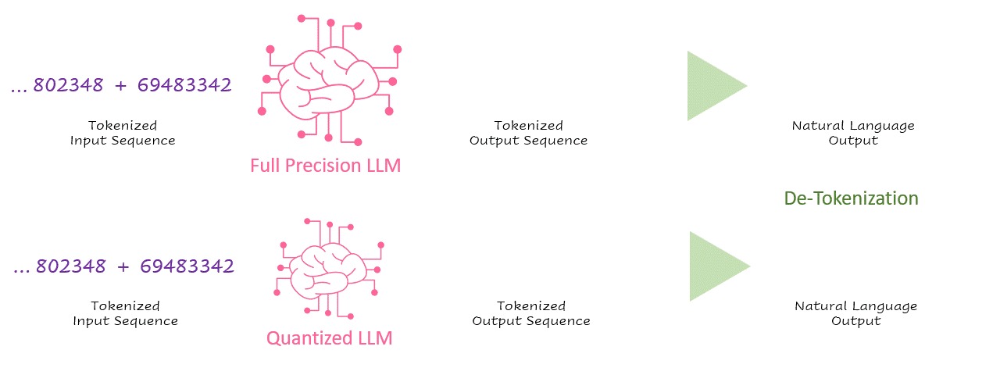

    <h1>Awesome LLM Compression</h1>
    
    
    

Awesome LLM compression research papers and tools to accelerate LLM training and inference. 

# Contents

- [📑 Papers](#papers)
  - [Survey](#survey)
  - [Quantization](#quantization)
  - [Pruning and Sparsity](#pruning-and-sparsity)
  - [Distillation](#distillation)
  - [Efficient Prompting](#efficient-prompting)
  - [KV Cache Compression](#kv-cache-compression)
  - [Other](#other)
- [🔧 Tools](#tools)
- [🙌 Contributing](#contributing)
- [🌟 Star History](#star-history)

## Papers

### Survey

- Compressed but Compromised? A Study of Jailbreaking in Compressed LLMs   NeurIPS Lock-LLM Workshop 2025 [[Paper]](https://openreview.net/pdf?id=OkNfb8SmLh) [[Blog]](https://namburisrinath.medium.com/compressed-but-compromised-a-study-of-jailbreaking-in-compressed-llms-02a6e40aaf17)

- A Survey on Model Compression for Large Language Models   TACL [[Paper]](https://arxiv.org/abs/2308.07633)

- The Cost of Compression: Investigating the Impact of Compression on Parametric Knowledge in Language Models   EMNLP 2023 [[Paper]](https://arxiv.org/abs/2312.00960) [[Code]](https://github.com/NamburiSrinath/LLMCompression)

- The Efficiency Spectrum of Large Language Models: An Algorithmic Survey   Arxiv 2023 [[Paper]](https://arxiv.org/abs/2312.00678)

- Efficient Large Language Models: A Survey   TMLR [[Paper]](https://arxiv.org/abs/2312.03863) [[GitHub Page]](https://github.com/AIoT-MLSys-Lab/Efficient-LLMs-Survey)

- Towards Efficient Generative Large Language Model Serving: A Survey from Algorithms to Systems   ICML 2024 Tutorial [[Paper]](https://arxiv.org/abs/2312.15234) [[Tutorial]](https://icml.cc/virtual/2024/tutorial/35229)

- Understanding LLMs: A Comprehensive Overview from Training to Inference   Arxiv 2024 [[Paper]](https://arxiv.org/abs/2401.02038) 

- Faster and Lighter LLMs: A Survey on Current Challenges and Way Forward   IJCAI 2024 (Survey Track) [[Paper]](https://arxiv.org/abs/2402.01799) [[GitHub Page]](https://github.com/nyunAI/Faster-LLM-Survey)

- A Survey of Resource-efficient LLM and Multimodal Foundation Models   Arxiv 2024 [[Paper]](https://arxiv.org/abs/2401.08092) 

- A Survey on Hardware Accelerators for Large Language Models   Arxiv 2024 [[Paper]](https://arxiv.org/abs/2401.09890) 

- A Comprehensive Survey of Compression Algorithms for Language Models   Arxiv 2024 [[Paper]](https://arxiv.org/abs/2401.15347)

- A Survey on Transformer Compression   Arxiv 2024 [[Paper]](https://arxiv.org/abs/2402.05964)

- Model Compression and Efficient Inference for Large Language Models: A Survey   Arxiv 2024 [[Paper]](https://arxiv.org/abs/2402.09748) 

- LLM Inference Unveiled: Survey and Roofline Model Insights   Arxiv 2024 [[Paper]](https://arxiv.org/abs/2402.16363) 

- A Survey on Knowledge Distillation of Large Language Models   Arxiv 2024 [[Paper]](https://arxiv.org/abs/2402.13116) [[GitHub Page]](https://github.com/Tebmer/Awesome-Knowledge-Distillation-of-LLMs)

- Efficient Prompting Methods for Large Language Models: A Survey   Arxiv 2024 [[Paper]](https://arxiv.org/abs/2404.01077)

- Survey on Knowledge Distillation for Large Language Models: Methods, Evaluation, and Application   Arxiv 2024 [[Paper]](https://arxiv.org/abs/2407.01885)

- On-Device Language Models: A Comprehensive Review   Arxiv 2024 [[Paper]](https://arxiv.org/abs/2409.00088) [[Download On-device LLMs]](https://nexaai.com/models)

- A Survey of Low-bit Large Language Models: Basics, Systems, and Algorithms   Arxiv 2024 [[Paper]](https://arxiv.org/abs/2409.16694) 

- Contextual Compression in Retrieval-Augmented Generation for Large Language Models: A Survey   Arxiv 2024 [[Paper]](https://arxiv.org/abs/2409.13385) 

- Prompt Compression for Large Language Models: A Survey   Arxiv 2024 [[Paper]](https://arxiv.org/abs/2410.12388) 

- A Comprehensive Study on Quantization Techniques for Large Language Models   Arxiv 2024 [[Paper]](https://arxiv.org/abs/2411.02530) 

- A Survey on Large Language Model Acceleration based on KV Cache Management   TMLR 2025 [[Paper]](https://arxiv.org/abs/2412.19442) 

- Scaling Down, Serving Fast: Compressing and Deploying Efficient LLMs for Recommendation Systems   EMNLP 2025 [[Paper]](https://arxiv.org/abs/2502.14305) 

- Key, Value, Compress: A Systematic Exploration of KV Cache Compression Techniques   CICC 2025 [[Paper]](https://arxiv.org/abs/2503.11816)

- Are We There Yet? A Measurement Study of Efficiency for LLM Applications on Mobile Devices   Arxiv 2025 [[Paper]](https://arxiv.org/abs/2504.00002) 

- Knowledge Distillation and Dataset Distillation of Large Language Models: Emerging Trends, Challenges, and Future Directions   Arxiv 2025 [[Paper]](https://arxiv.org/abs/2504.14772) 

- An Empirical Study on Prompt Compression for Large Language Models   Building Trust Workshop @ ICLR 2025 2025 [[Paper]](https://arxiv.org/abs/2505.00019) [[PCToolkit]](https://github.com/3DAgentWorld/Toolkit-for-Prompt-Compression)

- Low-Precision Training of Large Language Models: Methods, Challenges, and Opportunities   Arxiv 2025 [[Paper]](https://arxiv.org/abs/2505.01043) [[GitHub Page]](https://github.com/Hao840/Awesome-Low-Precision-Training)

- Optimizing LLMs for Resource-Constrained Environments: A Survey of Model Compression Techniques   COMPSAC 2025 [[Paper]](https://arxiv.org/abs/2505.02309) 

- A Survey on Inference Engines for Large Language Models: Perspectives on Optimization and Efficiency   Arxiv 2025 [[Paper]](https://arxiv.org/abs/2505.01658) [[GitHub Page]](https://github.com/sihyeong/Awesome-LLM-Inference-Engine)

- EfficientLLM: Efficiency in Large Language Models   Arxiv 2025 [[Paper]](https://arxiv.org/abs/2505.13840) [[Homepage]](https://dlyuangod.github.io/EfficientLLM/) [[Huggingface Page]](https://huggingface.co/Tyrannosaurus/EfficientLLM)

- KV Cache Compression for Inference Efficiency in LLMs: A Review   Arxiv 2025 [[Paper]](https://arxiv.org/abs/2508.06297)

### Quantization

- ZeroQuant: Efficient and Affordable Post-Training Quantization for Large-Scale Transformers   NeurIPS 2022 [[Paper]](https://arxiv.org/abs/2206.01861) [[Code (DeepSpeed)]](https://github.com/microsoft/DeepSpeed)

- LLM.int8(): 8-bit Matrix Multiplication for Transformers at Scale   NeurIPS 2022 [[Paper]](https://arxiv.org/abs/2208.07339) [[Code]](https://github.com/TimDettmers/bitsandbytes)

- Outlier Suppression: Pushing the Limit of Low-bit Transformer Language Models   NeurIPS 2022 [[Paper]](https://arxiv.org/abs/2209.13325) [[Code]](https://github.com/wimh966/outlier_suppression)

- LUT-GEMM: Quantized Matrix Multiplication based on LUTs for Efficient Inference in Large-Scale Generative Language Models   ICLR 2024 [[Paper]](https://arxiv.org/abs/2206.09557) 

- SmoothQuant: Accurate and Efficient Post-Training Quantization for Large Language Models   ICML 2023 [[Paper]](https://arxiv.org/abs/2211.10438) [[Code]](https://github.com/mit-han-lab/smoothquant)

- FlexRound: Learnable Rounding based on Element-wise Division for Post-Training Quantization   ICML 2023 [[Paper]](https://arxiv.org/abs/2306.00317) [[Code (DeepSpeed)]](https://github.com/microsoft/DeepSpeed)

- Understanding INT4 Quantization for Transformer Models: Latency Speedup, Composability, and Failure Cases   ICML 2023 [[Paper]](https://arxiv.org/abs/2301.12017) [[Code]](https://openreview.net/attachment?id=-tYCaP0phY_&name=supplementary_material)

- The case for 4-bit precision: k-bit Inference Scaling Laws   ICML 2023 [[Paper]](https://proceedings.mlr.press/v202/dettmers23a.html)

- GPTQ: Accurate Post-Training Quantization for Generative Pre-trained Transformers   ICLR 2023 [[Paper]](https://arxiv.org/abs/2210.17323) [[Code]](https://github.com/IST-DASLab/gptq)

- PreQuant: A Task-agnostic Quantization Approach for Pre-trained Language Models   ACL 2023 [[Paper]](https://arxiv.org/abs/2306.00014) 

- Boost Transformer-based Language Models with GPU-Friendly Sparsity and Quantization   ACL 2023 [[Paper]](https://aclanthology.org/2023.findings-acl.15.pdf) 

- QLoRA: Efficient Finetuning of Quantized LLMs   NeurIPS 2023 [[Paper]](https://arxiv.org/abs/2305.14314) [[Code]](https://github.com/artidoro/qlora)

- The Quantization Model of Neural Scaling   NeurIPS 2023 [[Paper]](https://arxiv.org/abs/2303.13506)

- Quantized Distributed Training of Large Models with Convergence Guarantees   ICML 2023 [[Paper]](https://arxiv.org/abs/2302.02390)

- RPTQ: Reorder-based Post-training Quantization for Large Language Models   Arxiv 2023 [[Paper]](https://arxiv.org/abs/2304.01089) [[Code]](https://github.com/hahnyuan/RPTQ4LLM)

- ZeroQuant-V2: Exploring Post-training Quantization in LLMs from Comprehensive Study to Low Rank Compensation   AAAI 2024 [[Paper]](https://arxiv.org/abs/2303.08302) [[Code]](https://github.com/microsoft/DeepSpeed)

- Integer or Floating Point? New Outlooks for Low-Bit Quantization on Large Language Models   ICML 2024 [[Paper]](https://arxiv.org/abs/2305.12356)

- Memory-Efficient Fine-Tuning of Compressed Large Language Models via sub-4-bit Integer Quantization   NeurIPS 2023 [[Paper]](https://arxiv.org/abs/2305.14152)

- Compress, Then Prompt: Improving Accuracy-Efficiency Trade-off of LLM Inference with Transferable Prompt   Arxiv 2023 [[Paper]](https://arxiv.org/abs/2305.11186)

- AWQ: Activation-aware Weight Quantization for LLM Compression and Acceleration   MLSys 2024 (Best Paper 🏆) [[Paper]](https://arxiv.org/abs/2306.00978) [[Code]](https://github.com/mit-han-lab/llm-awq)

- LLM-QAT: Data-Free Quantization Aware Training for Large Language Models   ACL Findings 2024 [[Paper]](https://arxiv.org/abs/2305.17888) [[Code]](https://github.com/facebookresearch/LLM-QAT)

- SpQR: A Sparse-Quantized Representation for Near-Lossless LLM Weight Compression   ICLR 2024 [[Paper]](https://arxiv.org/abs/2306.03078) [[Code]](https://github.com/Vahe1994/SpQR)

- OWQ: Outlier-Aware Weight Quantization for Efficient Fine-Tuning and Inference of Large Language Models   AAAI 2024 [[Paper]](https://arxiv.org/abs/2306.02272)

- SqueezeLLM: Dense-and-Sparse Quantization   ICML 2024 [[Paper]](https://arxiv.org/abs/2306.07629)  [[Code]](https://github.com/SqueezeAILab/SqueezeLLM)

- INT2.1: Towards Fine-Tunable Quantized Large Language Models with Error Correction through Low-Rank Adaptation   Arxiv 2023 [[Paper]](https://arxiv.org/abs/2306.08162)

- LQ-LoRA: Low-rank Plus Quantized Matrix Decomposition for Efficient Language Model Finetuning   ICLR 2024 [[Paper]](https://arxiv.org/abs/2311.12023)

- INT-FP-QSim: Mixed Precision and Formats For Large Language Models and Vision Transformers   Arxiv 2023 [[Paper]](https://arxiv.org/abs/2307.03712) [[Code]](https://github.com/lightmatter-ai/INT-FP-QSim)

- QIGen: Generating Efficient Kernels for Quantized Inference on Large Language Models   Arxiv 2023 [[Paper]](https://arxiv.org/abs/2307.03738) [[Code]](https://github.com/IST-DASLab/QIGen)

- Do Emergent Abilities Exist in Quantized Large Language Models: An Empirical Study   COLING 2024 [[Paper]](https://arxiv.org/abs/2307.08072)

- ZeroQuant-FP: A Leap Forward in LLMs Post-Training W4A8 Quantization Using Floating-Point Formats   Arxiv 2023 [[Paper]](https://arxiv.org/abs/2307.09782) [[Code (DeepSpeed)]](https://github.com/microsoft/DeepSpeed)

- OliVe: Accelerating Large Language Models via Hardware-friendly Outlier-Victim Pair Quantization   ISCA 2023 [[Paper]](https://arxiv.org/abs/2304.07493)

- NUPES : Non-Uniform Post-Training Quantization via Power Exponent Search   Arxiv 2023 [[Paper]](https://arxiv.org/abs/2308.05600)

- GPT-Zip: Deep Compression of Finetuned Large Language Models   ICML 2023 Workshop ES-FoMO [[Paper]](https://openreview.net/forum?id=hO0c2tG2xL)

- Generating Efficient Kernels for Quantized Inference on Large Language Models   ICML 2023 Workshop ES-FoMO [[Paper]](https://openreview.net/forum?id=jjazoNAf1S)

- Gradient-Based Post-Training Quantization: Challenging the Status Quo   Arxiv 2023 [[Paper]](https://arxiv.org/abs/2308.07662)

- FineQuant: Unlocking Efficiency with Fine-Grained Weight-Only Quantization for LLMs   Arxiv 2023 [[Paper]](https://arxiv.org/abs/2308.09723)

- OmniQuant: Omnidirectionally Calibrated Quantization for Large Language Models   ICLR 2024 [[Paper]](https://arxiv.org/abs/2308.13137) [[Code]](https://github.com/OpenGVLab/OmniQuant)

- FPTQ: Fine-grained Post-Training Quantization for Large Language Models   Arxiv 2023 [[Paper]](https://arxiv.org/abs/2308.15987)

- eDKM: An Efficient and Accurate Train-time Weight Clustering for Large Language Models   IEEE Computer Architecture Letters 2023 [[Paper]](https://arxiv.org/abs/2309.00964)

- QuantEase: Optimization-based Quantization for Language Models -- An Efficient and Intuitive Algorithm   Arxiv 2023 [[Paper]](https://arxiv.org/abs/2309.01885)

- Norm Tweaking: High-performance Low-bit Quantization of Large Language Models   AAAI 2024 [[Paper]](https://arxiv.org/abs/2309.02784)

- Understanding the Impact of Post-Training Quantization on Large-scale Language Models   Arxiv 2023 [[Paper]](https://arxiv.org/abs/2309.05210)

- MEMORY-VQ: Compression for Tractable Internet-Scale Memory   NAACL 2024 [[Paper]](https://arxiv.org/abs/2308.14903)

- Optimize Weight Rounding via Signed Gradient Descent for the Quantization of LLMs   EMNLP Findings 2024 [[Paper]](https://arxiv.org/abs/2309.05516) [[Code]](https://github.com/intel/auto-round)

- Efficient Post-training Quantization with FP8 Formats   MLSys 2024 [[Paper]](https://arxiv.org/abs/2309.14592) [[Code (Intel® Neural Compressor)]](https://github.com/intel/neural-compressor)

- QA-LoRA: Quantization-Aware Low-Rank Adaptation of Large Language Models   ICLR 2024 [[Paper]](https://arxiv.org/abs/2309.14717) [[Code]](https://github.com/yuhuixu1993/qa-lora)

- Rethinking Channel Dimensions to Isolate Outliers for Low-bit Weight Quantization of Large Language Models   ICLR 2024 [[Paper]](https://arxiv.org/abs/2309.15531) [[Code]](https://github.com/johnheo/adadim-llm)

- ModuLoRA: Finetuning 3-Bit LLMs on Consumer GPUs by Integrating with Modular Quantizers   TMLR (Featured Certification 🌟) [[Paper]](https://arxiv.org/abs/2309.16119) 

- PB-LLM: Partially Binarized Large Language Models   ICLR 2024 [[Paper]](https://arxiv.org/abs/2310.00034) [[Code]](https://github.com/hahnyuan/PB-LLM)

- Dual Grained Quantization: Efficient Fine-Grained Quantization for LLM   Arxiv 2023 [[Paper]](https://arxiv.org/abs/2310.04836) 

- QLLM: Accurate and Efficient Low-Bitwidth Quantization for Large Language Models   ICLR 2024 [[Paper]](https://arxiv.org/abs/2310.08041) [[Code]](https://github.com/ModelTC/QLLM)

- LoftQ: LoRA-Fine-Tuning-Aware Quantization for Large Language Models   ICLR 2024 [[Paper]](https://arxiv.org/abs/2310.08659) [[Code]](https://github.com/yxli2123/LoftQ)

- QFT: Quantized Full-parameter Tuning of LLMs with Affordable Resources   ICLR 2026 Workshop [[Paper]](https://arxiv.org/abs/2310.07147) 

- TEQ: Trainable Equivalent Transformation for Quantization of LLMs   Arxiv 2023 [[Paper]](https://arxiv.org/abs/2310.10944) [[Code (Intel® Neural Compressor)]](https://github.com/intel/neural-compressor)

- BitNet: Scaling 1-bit Transformers for Large Language Models   Arxiv 2023 [[Paper]](https://arxiv.org/abs/2310.11453)  [[Code]](https://github.com/Beomi/BitNet-Transformers)

- FP8-LM: Training FP8 Large Language Models   Arxiv 2023 [[Paper]](https://arxiv.org/abs/2310.18313) [[Code]](https://github.com/Azure/MS-AMP)

- QUIK: Towards End-to-End 4-Bit Inference on Generative Large Language Models   EMNLP 2024 [[Paper]](https://arxiv.org/abs/2310.09259) [[Code]](https://github.com/IST-DASLab/QUIK)

- AFPQ: Asymmetric Floating Point Quantization for LLMs   ACL Findings 2024 [[Paper]](https://arxiv.org/abs/2311.01792) [[Code]](https://github.com/zhangsichengsjtu/AFPQ)

- AWEQ: Post-Training Quantization with Activation-Weight Equalization for Large Language Models   Arxiv 2023 [[Paper]](https://arxiv.org/abs/2311.01305) 

- Atom: Low-bit Quantization for Efficient and Accurate LLM Serving   MLSys 2024 [[Paper]](https://arxiv.org/abs/2310.19102) [[Code]](https://github.com/efeslab/Atom)

- QMoE: Practical Sub-1-Bit Compression of Trillion-Parameter Models   Arxiv 2023 [[Paper]](https://arxiv.org/abs/2310.16795) 

- Dissecting the Runtime Performance of the Training, Fine-tuning, and Inference of Large Language Models   Arxiv 2023 [[Paper]](https://arxiv.org/abs/2311.03687) 

- On the Impact of Calibration Data in Post-training Quantization and Pruning   ACL 2024 [[Paper]](https://arxiv.org/abs/2311.09755)

- A Speed Odyssey for Deployable Quantization of LLMs   Arxiv 2023 [[Paper]](https://arxiv.org/abs/2311.09550)

- Fast and Efficient 2-bit LLM Inference on GPU: 2/4/16-bit in a Weight Matrix with Asynchronous Dequantization   Arxiv 2023 [[Paper]](https://arxiv.org/abs/2311.16442)

- Quantizable Transformers: Removing Outliers by Helping Attention Heads Do Nothing   NeurIPS 2023 [[Paper]](https://arxiv.org/abs/2306.12929) [[Code]](https://github.com/Qualcomm-AI-research/outlier-free-transformers)

- Efficient LLM Inference on CPUs   NeurIPS 2023 on Efficient Natural Language and Speech Processing [[Paper]](https://arxiv.org/abs/2311.00502) [[Code]](https://github.com/intel/intel-extension-for-transformers)

- The Cost of Compression: Investigating the Impact of Compression on Parametric Knowledge in Language Models   EMNLP Findings 2023 [[Paper]](https://arxiv.org/abs/2312.00960) 

- Zero-Shot Sharpness-Aware Quantization for Pre-trained Language Models   EMNLP 2023 [[Paper]](https://arxiv.org/abs/2310.13315) 

- Revisiting Block-based Quantisation: What is Important for Sub-8-bit LLM Inference?   EMNLP 2023 [[Paper]](https://arxiv.org/abs/2310.05079) [[Code]](https://github.com/ChengZhang-98/llm-mixed-q) 

- Outlier Suppression+: Accurate quantization of large language models by equivalent and optimal shifting and scaling   EMNLP 2023 [[Paper]](https://arxiv.org/abs/2304.09145)

- Watermarking LLMs with Weight Quantization   EMNLP 2023 [[Paper]](https://arxiv.org/abs/2310.11237) [[Code]](https://github.com/Twilight92z/Quantize-Watermark)

- Enhancing Computation Efficiency in Large Language Models through Weight and Activation Quantization   EMNLP 2023 [[Paper]](https://arxiv.org/abs/2311.05161)

- LLM-FP4: 4-Bit Floating-Point Quantized Transformers   EMNLP 2023 [[Paper]](https://arxiv.org/abs/2310.16836) [[Code]](https://github.com/nbasyl/LLM-FP4)

- Agile-Quant: Activation-Guided Quantization for Faster Inference of LLMs on the Edge   AAAI 2024 [[Paper]](https://arxiv.org/abs/2312.05693)

- SmoothQuant+: Accurate and Efficient 4-bit Post-Training WeightQuantization for LLM   Arxiv 2023 [[Paper]](https://arxiv.org/abs/2312.03788)

- CBQ: Cross-Block Quantization for Large Language Models   Arxiv 2023 [[Paper]](https://arxiv.org/abs/2312.07950)

- ZeroQuant(4+2): Redefining LLMs Quantization with a New FP6-Centric Strategy for Diverse Generative Tasks   Arxiv 2023 [[Paper]](https://arxiv.org/abs/2312.08583)

- QuIP: 2-Bit Quantization of Large Language Models With Guarantees   NeurIPS 2023 [[Paper]](https://openreview.net/pdf?id=xrk9g5vcXR) [[Code]](https://github.com/jerry-chee/QuIP)

- A Performance Evaluation of a Quantized Large Language Model on Various Smartphones   Arxiv 2023 [[Paper]](https://arxiv.org/abs/2312.12472)

- DeltaZip: Efficient Serving of Multiple Full-Model-Tuned LLMs   EuroSys 2025 [[Paper]](https://arxiv.org/abs/2312.05215) [[Code]](https://github.com/eth-easl/deltazip)

- FlightLLM: Efficient Large Language Model Inference with a Complete Mapping Flow on FPGA   FPGA 2024 [[Paper]](https://arxiv.org/abs/2401.03868)

- Extreme Compression of Large Language Models via Additive Quantization   ICML 2024 [[Paper]](https://arxiv.org/abs/2401.06118) [[Code]](https://github.com/Vahe1994/AQLM)

- Quantized Side Tuning: Fast and Memory-Efficient Tuning of Quantized Large Language Models   Arxiv 2024 [[Paper]](https://arxiv.org/abs/2401.07159)

- Inferflow: an Efficient and Highly Configurable Inference Engine for Large Language Models   Arxiv 2024 [[Paper]](https://arxiv.org/abs/2401.08294)

- FP6-LLM: Efficiently Serving Large Language Models Through FP6-Centric Algorithm-System Co-Design   USENIX ATC 2024 [[Paper]](https://arxiv.org/abs/2401.14112)

- Can Large Language Models Understand Context?   EACL Findings 2024 [[Paper]](https://arxiv.org/abs/2402.00858)

- Squat: Quant Small Language Models on the Edge   ICCAD 2025 [[Paper]](https://arxiv.org/abs/2402.10787) [[Code]](https://github.com/shawnricecake/EdgeQAT)

- LQER: Low-Rank Quantization Error Reconstruction for LLMs   ICML 2024 [[Paper]](https://arxiv.org/abs/2402.02446) 

- BiLLM: Pushing the Limit of Post-Training Quantization for LLMs   Arxiv 2024 [[Paper]](https://arxiv.org/abs/2402.04291) [[Code]](https://github.com/Aaronhuang-778/BiLLM)

- QuIP#: Even Better LLM Quantization with Hadamard Incoherence and Lattice Codebooks   ICML 2024 [[Paper]](https://arxiv.org/abs/2402.04396) [[Code]](https://github.com/Cornell-RelaxML/quip-sharp)

- L4Q: Parameter Efficient Quantization-Aware Training on Large Language Models via LoRA-wise LSQ   Arxiv 2024 [[Paper]](https://arxiv.org/abs/2402.04902) 

- TP-Aware Dequantization   Arxiv 2024 [[Paper]](https://arxiv.org/abs/2402.04925) 

- ApiQ: Finetuning of 2-Bit Quantized Large Language Model   EMNLP 2024 [[Paper]](https://arxiv.org/abs/2402.05147) 

- Accurate LoRA-Finetuning Quantization of LLMs via Information Retention   Arxiv 2024 [[Paper]](https://arxiv.org/abs/2402.05445) [[Code]](https://github.com/htqin/ir-qlora)

- BitDelta: Your Fine-Tune May Only Be Worth One Bit   NeurIPS 2024 [[Paper]](https://arxiv.org/abs/2402.10193) [[Code]](https://github.com/FasterDecoding/BitDelta)

- QDyLoRA: Quantized Dynamic Low-Rank Adaptation for Efficient Large Language Model Tuning   EMNLP 2024 Industry Track [[Paper]](https://arxiv.org/abs/2402.10462) 

- Any-Precision LLM: Low-Cost Deployment of Multiple, Different-Sized LLMs   ICML 2024 [[Paper]](https://arxiv.org/abs/2402.10517) 

- BitDistiller: Unleashing the Potential of Sub-4-Bit LLMs via Self-Distillation   ACL 2024 [[Paper]](https://arxiv.org/abs/2402.10631) [[Code]](https://github.com/DD-DuDa/BitDistiller)

- OneBit: Towards Extremely Low-bit Large Language Models   NeurIPS 2024 [[Paper]](https://arxiv.org/abs/2402.11295)

- DB-LLM: Accurate Dual-Binarization for Efficient LLMs   ACL Findings 2024 [[Paper]](https://arxiv.org/abs/2402.11960)

- WKVQuant: Quantizing Weight and Key/Value Cache for Large Language Models Gains More   Arxiv 2024 [[Paper]](https://arxiv.org/abs/2402.12065)

- GPTVQ: The Blessing of Dimensionality for LLM Quantization   Arxiv 2024 [[Paper]](https://arxiv.org/abs/2402.15319) [[Code]](https://github.com/qualcomm-ai-research/gptvq)

- APTQ: Attention-aware Post-Training Mixed-Precision Quantization for Large Language Models   DAC 2024 [[Paper]](https://arxiv.org/abs/2402.14866) 

- A Comprehensive Evaluation of Quantization Strategies for Large Language Models   ACL Findings 2024 [[Paper]](https://arxiv.org/abs/2402.16775) 

- Evaluating Quantized Large Language Models   Arxiv 2024 [[Paper]](https://arxiv.org/abs/2402.18158)

- FlattenQuant: Breaking Through the Inference Compute-bound for Large Language Models with Per-tensor Quantization   Arxiv 2024 [[Paper]](https://arxiv.org/abs/2402.17985)

- LLM-PQ: Serving LLM on Heterogeneous Clusters with Phase-Aware Partition and Adaptive Quantization   Arxiv 2024 [[Paper]](https://arxiv.org/abs/2403.01136)

- IntactKV: Improving Large Languagze Model Quantization by Keeping Pivot Tokens Intact   ACL Findings 2024 [[Paper]](https://arxiv.org/abs/2403.01241) [[Code]](https://github.com/ruikangliu/IntactKV)

- On the Compressibility of Quantized Large Language Models   Arxiv 2024 [[Paper]](https://arxiv.org/abs/2403.01384)

- EasyQuant: An Efficient Data-free Quantization Algorithm for LLMs   Arxiv 2024 [[Paper]](https://arxiv.org/abs/2403.02775)

- What Makes Quantization for Large Language Models Hard? An Empirical Study from the Lens of Perturbation   Arxiv 2024 [[Paper]](https://arxiv.org/abs/2403.06408)

- AffineQuant: Affine Transformation Quantization for Large Language Models   ICLR 2024 [[Paper]](https://arxiv.org/abs/2403.12544) [[Code]](https://github.com/bytedance/AffineQuant)

- Oh! We Freeze: Improving Quantized Knowledge Distillation via Signal Propagation Analysis for Large Language Models   ICLR Practical ML for Low Resource Settings Workshop 2024 [[Paper]](https://arxiv.org/abs/2403.18159) 

- Accurate Block Quantization in LLMs with Outliers   Arxiv 2024 [[Paper]](https://arxiv.org/abs/2403.20137)

- QuaRot: Outlier-Free 4-Bit Inference in Rotated LLMs   Arxiv 2024 [[Paper]](https://arxiv.org/abs/2404.00456) [[Code]](https://github.com/spcl/QuaRot)

- Minimize Quantization Output Error with Bias Compensation   Arxiv 2024 [[Paper]](https://arxiv.org/abs/2404.01892) [[Code]](https://github.com/GongCheng1919/bias-compensation)

- Cherry on Top: Parameter Heterogeneity and Quantization in Large Language Models   Arxiv 2024 [[Paper]](https://arxiv.org/abs/2404.02837)

- Fine-Tuning, Quantization, and LLMs: Navigating Unintended Outcomes   Arxiv 2024 [[Paper]](https://arxiv.org/abs/2404.04392)

- Quantization of Large Language Models with an Overdetermined Basis   Arxiv 2024 [[Paper]](https://arxiv.org/abs/2404.09737)

- An empirical study of LLaMA3 quantization: from LLMs to MLLMs   Arxiv 2024 [[Paper]](https://arxiv.org/abs/2404.14047) [[Code]](https://github.com/Macaronlin/LLaMA3-Quantization)

- How to Parameterize Asymmetric Quantization Ranges for Quantization-Aware Training   Arxiv 2024 [[Paper]](https://arxiv.org/abs/2404.16898)

- Mitigating the Impact of Outlier Channels for Language Model Quantization with Activation Regularization   Arxiv 2024 [[Paper]](https://arxiv.org/abs/2404.03605) [[Code]](https://github.com/aninrusimha/qat-pretrain)

- When Quantization Affects Confidence of Large Language Models?   NAACL 2024 [[Paper]](https://arxiv.org/abs/2405.00632)

- QServe: W4A8KV4 Quantization and System Co-design for Efficient LLM Serving   Arxiv 2024 [[Paper]](https://arxiv.org/abs/2405.04532) [[Code]](https://github.com/mit-han-lab/qserve)

- Learning from Students: Applying t-Distributions to Explore Accurate and Efficient Formats for LLMs   ICML 2024 [[Paper]](https://arxiv.org/abs/2405.03103)

- LLMC: Benchmarking Large Language Model Quantization with a Versatile Compression Toolkit   EMNLP 2024 [[Paper]](https://arxiv.org/abs/2405.06001) [[Code]](https://github.com/ModelTC/llmc)

- SKVQ: Sliding-window Key and Value Cache Quantization for Large Language Models   Arxiv 2024 [[Paper]](https://arxiv.org/abs/2405.06219) 

- Post Training Quantization of Large Language Models with Microscaling Formats   Arxiv 2024 [[Paper]](https://arxiv.org/abs/2405.07135) 

- Edge Intelligence Optimization for Large Language Model Inference with Batching and Quantization   Arxiv 2024 [[Paper]](https://arxiv.org/abs/2405.07140) 

- SliM-LLM: Salience-Driven Mixed-Precision Quantization for Large Language Models   Arxiv 2024 [[Paper]](https://arxiv.org/abs/2405.14917) [[Code]](https://github.com/Aaronhuang-778/SliM-LLM)

- OAC: Output-adaptive Calibration for Accurate Post-training Quantization   Arxiv 2024 [[Paper]](https://arxiv.org/abs/2405.15025) 

- PV-Tuning: Beyond Straight-Through Estimation for Extreme LLM Compression   Arxiv 2024 [[Paper]](https://arxiv.org/abs/2405.14852) 

- SpinQuant -- LLM quantization with learned rotations   ICLR 2025 [[Paper]](https://www.arxiv.org/abs/2405.16406) 

- Compressing Large Language Models using Low Rank and Low Precision Decomposition   NeurIPS 2024 [[Paper]](https://arxiv.org/abs/2405.18886) [[Code]](https://github.com/pilancilab/caldera)

- Athena: Efficient Block-Wise Post-Training Quantization for Large Language Models Using Second-Order Matrix Derivative Information   Arxiv 2024 [[Paper]](https://arxiv.org/abs/2405.17470) 

- Exploiting LLM Quantization   Arxiv 2024 [[Paper]](https://arxiv.org/abs/2405.18137) 

- One QuantLLM for ALL: Fine-tuning Quantized LLMs Once for Efficient Deployments   Arxiv 2024 [[Paper]](https://arxiv.org/abs/2405.20202) 

- LCQ: Low-Rank Codebook based Quantization for Large Language Models   Arxiv 2024 [[Paper]](https://arxiv.org/abs/2405.20973) 

- LoQT: Low Rank Adapters for Quantized Training   Arxiv 2024 [[Paper]](https://arxiv.org/abs/2405.16528) [[Code]](https://github.com/sebulo/LoQT)

- CLAQ: Pushing the Limits of Low-Bit Post-Training Quantization for LLMs   Arxiv 2024 [[Paper]](https://arxiv.org/abs/2405.17233)

- I-LLM: Efficient Integer-Only Inference for Fully-Quantized Low-Bit Large Language Models   Arxiv 2024 [[Paper]](https://arxiv.org/abs/2405.17849)

- Outliers and Calibration Sets have Diminishing Effect on Quantization of Modern LLMs   Arxiv 2024 [[Paper]](https://arxiv.org/abs/2405.20835)

- DuQuant: Distributing Outliers via Dual Transformation Makes Stronger Quantized LLMs   NeurIPS 2024 [[Paper]](https://arxiv.org/abs/2406.01721) [[Code]](https://github.com/Hsu1023/DuQuant)

- ShiftAddLLM: Accelerating Pretrained LLMs via Post-Training Multiplication-Less Reparameterization   NeurIPS 2024 [[Paper]](https://arxiv.org/abs/2406.05981) [[Code]](https://github.com/GATECH-EIC/ShiftAddLLM)

- Low-Rank Quantization-Aware Training for LLMs   Arxiv 2024 [[Paper]](https://arxiv.org/abs/2406.06385)

- TernaryLLM: Ternarized Large Language Model   Arxiv 2024 [[Paper]](https://arxiv.org/abs/2406.07177)

- Examining Post-Training Quantization for Mixture-of-Experts: A Benchmark   Arxiv 2024 [[Paper]](https://arxiv.org/abs/2406.08155) [[Code]](https://github.com/UNITES-Lab/moe-quantization)

- Delta-CoMe: Training-Free Delta-Compression with Mixed-Precision for Large Language Models   NeurIPS 2024 [[Paper]](https://arxiv.org/abs/2406.08903)

- QQQ: Quality Quattuor-Bit Quantization for Large Language Models   Arxiv 2024 [[Paper]](https://arxiv.org/abs/2406.09904) [[Code]](https://github.com/HandH1998/QQQ)

- QTIP: Quantization with Trellises and Incoherence Processing   NeurIPS 2024 [[Paper]](https://arxiv.org/abs/2406.11235) [[Code]](https://github.com/Cornell-RelaxML/qtip)

- Prefixing Attention Sinks can Mitigate Activation Outliers for Large Language Model Quantization   EMNLP 2024 [[Paper]](https://arxiv.org/abs/2406.12016) 

- Mixture of Scales: Memory-Efficient Token-Adaptive Binarization for Large Language Models   NeurIPS 2024 [[Paper]](https://arxiv.org/abs/2406.12311) 

- Tender: Accelerating Large Language Models via Tensor Decomposition and Runtime Requantization   ISCA 2024 [[Paper]](https://arxiv.org/abs/2406.12930) 

- SDQ: Sparse Decomposed Quantization for LLM Inference   Arxiv 2024 [[Paper]](https://arxiv.org/abs/2406.13868) 

- Attention-aware Post-training Quantization without Backpropagation   ICML 2025 [[Paper]](https://arxiv.org/abs/2406.13474) 

- EDGE-LLM: Enabling Efficient Large Language Model Adaptation on Edge Devices via Layerwise Unified Compression and Adaptive Layer Tuning and Voting   Arxiv 2024 [[Paper]](https://arxiv.org/abs/2406.15758) [[Code]](https://github.com/GATECH-EIC/Edge-LLM)

- Compensate Quantization Errors: Make Weights Hierarchical to Compensate Each Other   Arxiv 2024 [[Paper]](https://arxiv.org/abs/2406.16299) 

- Layer-Wise Quantization: A Pragmatic and Effective Method for Quantizing LLMs Beyond Integer Bit-Levels   Arxiv 2024 [[Paper]](https://arxiv.org/abs/2406.17415) [[Code]](https://github.com/RazvanDu/LayerwiseQuant)

- CDQuant: Greedy Coordinate Descent for Accurate LLM Quantization   Arxiv 2024 [[Paper]](https://arxiv.org/abs/2406.17542) 

- OutlierTune: Efficient Channel-Wise Quantization for Large Language Models   Arxiv 2024 [[Paper]](https://arxiv.org/abs/2406.18832) 

- T-MAC: CPU Renaissance via Table Lookup for Low-Bit LLM Deployment on Edge   EuroSys 2025 [[Paper]](https://arxiv.org/abs/2407.00088) [[Code]](https://github.com/microsoft/T-MAC)

- GPTQT: Quantize Large Language Models Twice to Push the Efficiency   ICORIS 2024 [[Paper]](https://arxiv.org/abs/2407.02891) 

- Improving Conversational Abilities of Quantized Large Language Models via Direct Preference Alignment   ACL 2024 [[Paper]](https://arxiv.org/abs/2407.03051) 

- How Does Quantization Affect Multilingual LLMs?   EMNLP Findings 2024 [[Paper]](https://arxiv.org/abs/2407.03211) 

- RoLoRA: Fine-tuning Rotated Outlier-free LLMs for Effective Weight-Activation Quantization   EMNLP Findings 2024 [[Paper]](https://arxiv.org/abs/2407.08044) [[Code]](https://github.com/HuangOwen/RoLoRA) 

- Q-GaLore: Quantized GaLore with INT4 Projection and Layer-Adaptive Low-Rank Gradients   Arxiv 2024 [[Paper]](https://arxiv.org/abs/2407.08296) [[Code]](https://github.com/VITA-Group/Q-GaLore) 

- FlashAttention-3: Fast and Accurate Attention with Asynchrony and Low-precision   Arxiv 2024 [[Paper]](https://arxiv.org/abs/2407.08608) [[Code]](https://github.com/Dao-AILab/flash-attention) 

- Accuracy is Not All You Need   Arxiv 2024 [[Paper]](https://arxiv.org/abs/2407.09141)

- BitNet b1.58 Reloaded: State-of-the-art Performance Also on Smaller Networks   Arxiv 2024 [[Paper]](https://arxiv.org/abs/2407.09527)

- LeanQuant: Accurate Large Language Model Quantization with Loss-Error-Aware Grid   ICLR 2025 [[Paper]](https://arxiv.org/abs/2407.10032)

- Fast Matrix Multiplications for Lookup Table-Quantized LLMs   EMNLP Findings 2024 [[Paper]](https://arxiv.org/abs/2407.10960) [[Code]](https://github.com/HanGuo97/flute) 

- EfficientQAT: Efficient Quantization-Aware Training for Large Language Models   ACL 2025 [[Paper]](https://arxiv.org/abs/2407.11062) [[Code]](https://github.com/OpenGVLab/EfficientQAT) 

- LRQ: Optimizing Post-Training Quantization for Large Language Models by Learning Low-Rank Weight-Scaling Matrices   NAACL 2025 [[Paper]](https://arxiv.org/abs/2407.11534) 

- Exploring Quantization for Efficient Pre-Training of Transformer Language Models   EMNLP Findings 2024 [[Paper]](https://arxiv.org/abs/2407.11722) [[Code]](https://github.com/chandar-lab/EfficientLLMs) 

- Spectra: Surprising Effectiveness of Pretraining Ternary Language Models at Scale   Arxiv 2024 [[Paper]](https://arxiv.org/abs/2407.12327) [[Code]](https://github.com/NolanoOrg/SpectraSuite) 

- Mamba-PTQ: Outlier Channels in Recurrent Large Language Models    Efficient Systems for Foundation Models Workshop @ ICML 2024 [[Paper]](https://arxiv.org/abs/2407.12397)

- Compensate Quantization Errors+: Quantized Models Are Inquisitive Learners   Arxiv 2024 [[Paper]](https://arxiv.org/abs/2407.15508)

- Accurate and Efficient Fine-Tuning of Quantized Large Language Models Through Optimal Balance   Arxiv 2024 [[Paper]](https://arxiv.org/abs/2407.17029) [[Code]](https://github.com/xiaocaigou/qbaraqahira) 

- STBLLM: Breaking the 1-Bit Barrier with Structured Binary LLMs   Arxiv 2024 [[Paper]](https://arxiv.org/abs/2408.01803)

- Advancing Multimodal Large Language Models with Quantization-Aware Scale Learning for Efficient Adaptation   ACM MM 2024 [[Paper]](https://arxiv.org/abs/2408.03735)

- ABQ-LLM: Arbitrary-Bit Quantized Inference Acceleration for Large Language Models   AAAI 2025 [[Paper]](https://arxiv.org/abs/2408.08554) 

- MARLIN: Mixed-Precision Auto-Regressive Parallel Inference on Large Language Models   Arxiv 2024 [[Paper]](https://arxiv.org/abs/2408.11743) [[Code (Marlin)]](https://github.com/IST-DASLab/marlin) [[Code (Sparse Marlin)]](https://github.com/IST-DASLab/Sparse-Marlin)

- Matmul or No Matmal in the Era of 1-bit LLMs   Arxiv 2024 [[Paper]](https://arxiv.org/abs/2408.11939)

- MobileQuant: Mobile-friendly Quantization for On-device Language Models    EMNLP Findings 2024 [[Paper]](https://arxiv.org/abs/2408.13933) [[Code]](https://github.com/saic-fi/MobileQuant) 

- GIFT-SW: Gaussian noise Injected Fine-Tuning of Salient Weights for LLMs   Arxiv 2024 [[Paper]](https://arxiv.org/abs/2408.15300) [[Code]](https://github.com/On-Point-RND/GIFT_SW-v2-Gaussian-noise-Injected-Fine-Tuning-of-Salient-Weights-for-LLMs) 

- Foundations of Large Language Model Compression -- Part 1: Weight Quantization   Arxiv 2024 [[Paper]](https://arxiv.org/abs/2409.02026) 

- OPAL: Outlier-Preserved Microscaling Quantization A ccelerator for Generative Large Language Models   DAC 2024 [[Paper]](https://arxiv.org/abs/2409.05902)

- VPTQ: Extreme Low-bit Vector Post-Training Quantization for Large Language Models   EMNLP 2024 [[Paper]](https://arxiv.org/abs/2409.17066) [[Code]](https://github.com/microsoft/VPTQ)

- Scaling FP8 training to trillion-token LLMs   Arxiv 2024 [[Paper]](https://arxiv.org/abs/2409.12517)

- Accumulator-Aware Post-Training Quantization   Arxiv 2024 [[Paper]](https://arxiv.org/abs/2409.17092)

- Efficient Arbitrary Precision Acceleration for Large Language Models on GPU Tensor Cores   ASP-DAC 2025 [[Paper]](https://arxiv.org/abs/2409.17870)

- Rotated Runtime Smooth: Training-Free Activation Smoother for accurate INT4 inference   Arxiv 2024 [[Paper]](https://arxiv.org/abs/2409.20361) [[Code]](https://github.com/Coco58323/Rotated_Runtime_Smooth)

- EXAQ: Exponent Aware Quantization For LLMs Acceleration   Arxiv 2024 [[Paper]](https://arxiv.org/abs/2410.03185) 

- ARB-LLM: Alternating Refined Binarizations for Large Language Models   Arxiv 2024 [[Paper]](https://arxiv.org/abs/2410.03129) [[Code]](https://github.com/ZHITENGLI/ARB-LLM)

- PrefixQuant: Eliminating Outliers by Prefixed Tokens for Large Language Models Quantization   Arxiv 2024 [[Paper]](https://arxiv.org/abs/2410.05265) [[Code]](https://github.com/ChenMnZ/PrefixQuant)

- Sketch to Adapt: Fine-Tunable Sketches for Efficient LLM Adaptation   ICML 2025 [[Paper]](https://arxiv.org/abs/2410.06364) 

- Scaling Laws For Mixed Quantization   Arxiv 2024 [[Paper]](https://arxiv.org/abs/2410.06722) 

- Q-VLM: Post-training Quantization for Large Vision-Language Models   NeurIPS 2024 [[Paper]](https://arxiv.org/abs/2410.08119) [[Code]](https://github.com/ChangyuanWang17/QVLM)

- CrossQuant: A Post-Training Quantization Method with Smaller Quantization Kernel for Precise Large Language Model Compression   Arxiv 2024 [[Paper]](https://arxiv.org/abs/2410.07505) 

- FlatQuant: Flatness Matters for LLM Quantization   ICML 2025 [[Paper]](https://arxiv.org/abs/2410.09426) [[Code]](https://github.com/ruikangliu/FlatQuant)

- DeltaDQ: Ultra-High Delta Compression for Fine-Tuned LLMs via Group-wise Dropout and Separate Quantization   Arxiv 2024 [[Paper]](https://arxiv.org/abs/2410.08666) 

- QEFT: Quantization for Efficient Fine-Tuning of LLMs   EMNLP Findings 2024 [[Paper]](https://arxiv.org/abs/2410.08661) [[Code]](https://github.com/xvyaward/qeft)

- Continuous Approximations for Improving Quantization Aware Training of LLMs   Arxiv 2024 [[Paper]](https://arxiv.org/abs/2410.10849) 

- DAQ: Density-Aware Post-Training Weight-Only Quantization For LLMs   Arxiv 2024 [[Paper]](https://arxiv.org/abs/2410.12187) 

- COMET: Towards Partical W4A4KV4 LLMs Serving   Arxiv 2024 [[Paper]](https://arxiv.org/abs/2410.12168) 

- Scaling laws for post-training quantized large language models   Arxiv 2024 [[Paper]](https://arxiv.org/abs/2410.12119) 

- Channel-Wise Mixed-Precision Quantization for Large Language Models   Arxiv 2024 [[Paper]](https://arxiv.org/abs/2410.13056) 

- Understanding the difficulty of low-precision post-training quantization of large language models   Arxiv 2024 [[Paper]](https://arxiv.org/abs/2410.14570) 

- QuAILoRA: Quantization-Aware Initialization for LoRA   NeurIPS Workshop on Efficient Natural Language and Speech Processing (ENLSP-IV) 2024 [[Paper]](https://arxiv.org/abs/2410.14713) 

- SDP4Bit: Toward 4-bit Communication Quantization in Sharded Data Parallelism for LLM Training   NeurIPS 2024 [[Paper]](https://arxiv.org/abs/2410.15526) 

- Pyramid Vector Quantization for LLMs   Arxiv 2024 [[Paper]](https://arxiv.org/abs/2410.16926) 

- TesseraQ: Ultra Low-Bit LLM Post-Training Quantization with Block Reconstruction   Arxiv 2024 [[Paper]](https://arxiv.org/abs/2410.19103) [[Code]](https://github.com/Intelligent-Computing-Lab-Yale/TesseraQ)

- COAT: Compressing Optimizer states and Activation for Memory-Efficient FP8 Training   ICLR 2025 [[Paper]](https://arxiv.org/abs/2410.19313) [[Code]](https://github.com/NVlabs/COAT)

- GWQ: Gradient-Aware Weight Quantization for Large Language Models   Arxiv 2024 [[Paper]](https://arxiv.org/abs/2411.00850) 

- "Give Me BF16 or Give Me Death"? Accuracy-Performance Trade-Offs in LLM Quantization   ACL 2025 [[Paper]](https://arxiv.org/abs/2411.02355) 

- Interactions Across Blocks in Post-Training Quantization of Large Language Models   Arxiv 2024 [[Paper]](https://arxiv.org/abs/2411.03934) 

- BitNet a4.8: 4-bit Activations for 1-bit LLMs   Arxiv 2024 [[Paper]](https://arxiv.org/abs/2411.04965) 

- The Super Weight in Large Language Models   Arxiv 2024 [[Paper]](https://arxiv.org/abs/2411.07191) [[Code]](https://github.com/mengxiayu/LLMSuperWeight)

- ASER: Activation Smoothing and Error Reconstruction for Large Language Model Quantization   AAAI 2025 [[Paper]](https://arxiv.org/abs/2411.07762) 

- Towards Low-bit Communication for Tensor Parallel LLM Inference   Arxiv 2024 [[Paper]](https://arxiv.org/abs/2411.07942) 

- AMXFP4: Taming Activation Outliers with Asymmetric Microscaling Floating-Point for 4-bit LLM Inference   Arxiv 2024 [[Paper]](https://arxiv.org/abs/2411.09909) [[Code]](https://github.com/aiha-lab/MX-QLLM)

- Scaling Laws for Precision   Arxiv 2024 [[Paper]](https://arxiv.org/abs/2411.04330) 

- BitMoD: Bit-serial Mixture-of-Datatype LLM Acceleration   HPCA 2025 [[Paper]](https://arxiv.org/abs/2411.11745) [[Code]](https://github.com/yc2367/BitMoD-HPCA-25)

- SageAttention2: Efficient Attention with Thorough Outlier Smoothing and Per-thread INT4 Quantization   ICML 2025 [[Paper]](https://arxiv.org/abs/2411.10958) [[Code]](https://github.com/thu-ml/SageAttention)

- AutoMixQ: Self-Adjusting Quantization for High Performance Memory-Efficient Fine-Tuning   Arxiv 2024 [[Paper]](https://arxiv.org/abs/2411.13814)

- Anda: Unlocking Efficient LLM Inference with a Variable-Length Grouped Activation Data Format   HPCA 2025 [[Paper]](https://arxiv.org/abs/2411.15982)

- MixPE: Quantization and Hardware Co-design for Efficient LLM Inference   Arxiv 2024 [[Paper]](https://arxiv.org/abs/2411.16158)

- Pushing the Limits of Large Language Model Quantization via the Linearity Theorem   Arxiv 2024 [[Paper]](https://arxiv.org/abs/2411.17525)

- Low-Bit Quantization Favors Undertrained LLMs: Scaling Laws for Quantized LLMs with 100T Training Tokens   Arxiv 2024 [[Paper]](https://arxiv.org/abs/2411.17691) [[Models]](https://huggingface.co/Xu-Ouyang)

- DFRot: Achieving Outlier-Free and Massive Activation-Free for Rotated LLMs with Refined Rotation   COLM 2025 [[Paper]](https://arxiv.org/abs/2412.00648) [[Code]](https://github.com/JingyangXiang/DFRot)

- RILQ: Rank-Insensitive LoRA-based Quantization Error Compensation for Boosting 2-bit Large Language Model Accuracy   AAAI 2025 [[Paper]](https://arxiv.org/abs/2412.01129)

- CPTQuant -- A Novel Mixed Precision Post-Training Quantization Techniques for Large Language Models   Arxiv 2024 [[Paper]](https://arxiv.org/abs/2412.03599)

- SKIM: Any-bit Quantization Pushing The Limits of Post-Training Quantization   Arxiv 2024 [[Paper]](https://arxiv.org/abs/2412.04180)

- Direct Quantized Training of Language Models with Stochastic Rounding   Arxiv 2024 [[Paper]](https://arxiv.org/abs/2412.04787) [[Code]](https://github.com/KYuuto1006/DQT)

- Taming Sensitive Weights : Noise Perturbation Fine-tuning for Robust LLM Quantization   Arxiv 2024 [[Paper]](https://arxiv.org/abs/2412.06858)

- Low-Rank Correction for Quantized LLMs   Arxiv 2024 [[Paper]](https://arxiv.org/abs/2412.07902)

- CRVQ: Channel-relaxed Vector Quantization for Extreme Compression of LLMs   Arxiv 2024 [[Paper]](https://arxiv.org/abs/2412.09282) 

- ResQ: Mixed-Precision Quantization of Large Language Models with Low-Rank Residuals   Arxiv 2024 [[Paper]](https://arxiv.org/abs/2412.14363) [[Code]](https://github.com/utkarsh-dmx/project-resq)

- MixLLM: LLM Quantization with Global Mixed-precision between Output-features and Highly-efficient System Design   MLSys 2026 [[Paper]](https://arxiv.org/abs/2412.14590)

- GQSA: Group Quantization and Sparsity for Accelerating Large Language Model Inference   Arxiv 2024 [[Paper]](https://arxiv.org/abs/2412.17560)

- LSAQ: Layer-Specific Adaptive Quantization for Large Language Model Deployment   Arxiv 2024 [[Paper]](https://arxiv.org/abs/2412.18135)

- DecDEC: A Systems Approach to Advancing Low-Bit LLM Quantization   OSDI 2025 [[Paper]](https://arxiv.org/abs/2412.20185)

- HALO: Hadamard-Assisted Lower-Precision Optimization for LLMs   Arxiv 2025 [[Paper]](https://arxiv.org/abs/2501.02625)

- RaZeR: Pushing the Limits of NVFP4 Quantization with Redundant Zero Remapping   Arxiv 2025 [[Paper]](https://arxiv.org/abs/2501.04052)

- FlexQuant: Elastic Quantization Framework for Locally Hosted LLM on Edge Devices   Arxiv 2025 [[Paper]](https://arxiv.org/abs/2501.07139)

- Rethinking Post-Training Quantization: Introducing a Statistical Pre-Calibration Approach   Arxiv 2025 [[Paper]](https://arxiv.org/abs/2501.09107)

- Qrazor: Reliable and effortless 4-bit llm quantization by significant data razoring   Arxiv 2025 [[Paper]](https://arxiv.org/abs/2501.13331)

- OstQuant: Refining Large Language Model Quantization with Orthogonal and Scaling Transformations for Better Distribution Fitting   ICLR 2025 [[Paper]](https://arxiv.org/abs/2501.13987) [[Code]](https://github.com/BrotherHappy/OSTQuant)

- SwiftPrune: Hessian-Free Weight Pruning for Large Language Models   Arxiv 2025 [[Paper]](https://arxiv.org/abs/2501.16376)

- Progressive Binarization with Semi-Structured Pruning for LLMs   Arxiv 2025 [[Paper]](https://arxiv.org/abs/2502.01705) [[Code]](https://github.com/XIANGLONGYAN/PBS2P)

- Physics-Inspired Binary Neural Networks: Interpretable Compression with Theoretical Guarantees   Arxiv 2025 [[Paper]](https://arxiv.org/abs/2502.01908)

- QuEST: Stable Training of LLMs with 1-Bit Weights and Activations   Arxiv 2025 [[Paper]](https://arxiv.org/abs/2502.05003)

- ParetoQ: Scaling Laws in Extremely Low-bit LLM Quantization   NeurIPS 2025 [[Paper]](https://arxiv.org/abs/2502.02631)

- Systematic Outliers in Large Language Models   ICLR 2025 [[Paper]](https://arxiv.org/abs/2502.06415) [[Code]](https://github.com/an-yongqi/systematic-outliers)

- Can Post-Training Quantization Benefit from an Additional QLoRA Integration?   NAACL 2025 [[Paper]](https://arxiv.org/abs/2502.10202)

- 1bit-Merging: Dynamic Quantized Merging for Large Language Models   Arxiv 2025 [[Paper]](https://arxiv.org/abs/2502.10743)

- Towards Efficient Pre-training: Exploring FP4 Precision in Large Language Models   Arxiv 2025 [[Paper]](https://arxiv.org/abs/2502.11458)

- Continual Quantization-Aware Pre-Training: When to transition from 16-bit to 1.58-bit pre-training for BitNet language models?   Arxiv 2025 [[Paper]](https://arxiv.org/abs/2502.11895)

- QuZO: Quantized Zeroth-Order Fine-Tuning for Large Language Models   Arxiv 2025 [[Paper]](https://arxiv.org/abs/2502.12346)

- Benchmarking Post-Training Quantization in LLMs: Comprehensive Taxonomy, Unified Evaluation, and Comparative Analysis   Arxiv 2025 [[Paper]](https://arxiv.org/abs/2502.13178)

- Compression Scaling Laws:Unifying Sparsity and Quantization   Arxiv 2025 [[Paper]](https://arxiv.org/abs/2502.16440)

- M-ANT: Efficient Low-bit Group Quantization for LLMs via Mathematically Adaptive Numerical Type   Arxiv 2025 [[Paper]](https://arxiv.org/abs/2502.18755)

- Identifying Sensitive Weights via Post-quantization Integral   Arxiv 2025 [[Paper]](https://arxiv.org/abs/2503.01901)

- RSQ: Learning from Important Tokens Leads to Better Quantized LLMs   Arxiv 2025 [[Paper]](https://arxiv.org/abs/2503.01820) [[Code]](https://github.com/ylsung/rsq)

- VQ-LLM: High-performance Code Generation for Vector Quantization Augmented LLM Inference   HPCA 2025 [[Paper]](https://arxiv.org/abs/2503.02236)

- Universality of Layer-Level Entropy-Weighted Quantization Beyond Model Architecture and Size   Arxiv 2025 [[Paper]](https://arxiv.org/abs/2503.04704)

- Towards Superior Quantization Accuracy: A Layer-sensitive Approach   Arxiv 2025 [[Paper]](https://arxiv.org/abs/2503.06518)

- MergeQuant: Accurate 4-bit Static Quantization of Large Language Models by Channel-wise Calibration   Arxiv 2025 [[Paper]](https://arxiv.org/abs/2503.07654)

- ClusComp: A Simple Paradigm for Model Compression and Efficient Finetuning   Arxiv 2025 [[Paper]](https://arxiv.org/abs/2503.13089)

- DynaMo: Runtime Switchable Quantization for MoE with Cross-Dataset Adaptation   DATE 2026 [[Paper]](https://arxiv.org/abs/2503.21135)

- Cocktail: Chunk-Adaptive Mixed-Precision Quantization for Long-Context LLM Inference   DATE 2025 [[Paper]](https://arxiv.org/abs/2503.23294)

- GPTQv2: Efficient Finetuning-Free Quantization for Asymmetric Calibration   ICML 2025 [[Paper]](https://arxiv.org/abs/2504.02692) [[Code]](https://github.com/Intelligent-Computing-Lab-Yale/GPTQv2)

- Task-Circuit Quantization: Leveraging Knowledge Localization and Interpretability for Compression   COLM 2025 [[Paper]](https://arxiv.org/abs/2504.07389) [[Code]](https://github.com/The-Inscrutable-X/TACQ)

- Quantization Error Propagation: Revisiting Layer-Wise Post-Training Quantization   NeurIPS 2025 [[Paper]](https://arxiv.org/abs/2504.09629) [[Code]](https://github.com/FujitsuResearch/qep)

- RaanA: A Fast, Flexible, and Data-Efficient Post-Training Quantization Algorithm   Arxiv 2025 [[Paper]](https://arxiv.org/abs/2504.03717) [[Code]](https://github.com/FFTYYY/RaanA)

- Achieving binary weight and activation for LLMs using Post-Training Quantization   Arxiv 2025 [[Paper]](https://arxiv.org/abs/2504.05352)

- DL-QAT: Weight-Decomposed Low-Rank Quantization-Aware Training for Large Language Models   EMNLP 2024 [[Paper]](https://arxiv.org/abs/2504.09223)

- Gradual Binary Search and Dimension Expansion : A general method for activation quantization in LLMs   Arxiv 2025 [[Paper]](https://arxiv.org/abs/2504.13989)

- FGMP: Fine-Grained Mixed-Precision Weight and Activation Quantization for Hardware-Accelerated LLM Inference   Arxiv 2025 [[Paper]](https://arxiv.org/abs/2504.14152)

- BitNet v2: Native 4-bit Activations with Hadamard Transformation for 1-bit LLMs   Arxiv 2025 [[Paper]](https://arxiv.org/abs/2504.18415)

- FineQ: Software-Hardware Co-Design for Low-Bit Fine-Grained Mixed-Precision Quantization of LLMs   DATE 2025 [[Paper]](https://arxiv.org/abs/2504.19746)

- Precision Where It Matters: A Novel Spike Aware Mixed-Precision Quantization Strategy for LLaMA-based Language Models   Arxiv 2025 [[Paper]](https://arxiv.org/abs/2504.21553)

- ICQuant: Index Coding enables Low-bit LLM Quantization   Arxiv 2025 [[Paper]](https://arxiv.org/abs/2505.00850)

- Radio: Rate-Distortion Optimization for Large Language Model Compression   ICML 2025 [[Paper]](https://arxiv.org/abs/2505.03031)

- Balancing Fidelity and Plasticity: Aligning Mixed-Precision Fine-Tuning with Linguistic Hierarchies   Arxiv 2025 [[Paper]](https://arxiv.org/abs/2505.03802)

- MoEQuant: Enhancing Quantization for Mixture-of-Experts Large Language Models via Expert-Balanced Sampling and Affinity Guidance   ICML 2025 [[Paper]](https://arxiv.org/abs/2505.03804)

- Grouped Sequency-arranged Rotation: Optimizing Rotation Transformation for Quantization for Free   Arxiv 2025 [[Paper]](https://arxiv.org/abs/2505.03810)

- Improving Block-Wise LLM Quantization by 4-bit Block-Wise Optimal Float (BOF4): Analysis and Variations   Arxiv 2025 [[Paper]](https://arxiv.org/abs/2505.06653)

- GuidedQuant: Large Language Model Quantization via Exploiting End Loss Guidance   ICML 2025 [[Paper]](https://arxiv.org/abs/2505.07004) [[Code]](https://github.com/snu-mllab/GuidedQuant)

- QuantX: A Framework for Hardware-Aware Quantization of Generative AI Workloads   Arxiv 2025 [[Paper]](https://arxiv.org/abs/2505.07531)

- An Extra RMSNorm is All You Need for Fine Tuning to 1.58 Bits   Arxiv 2025 [[Paper]](https://arxiv.org/abs/2505.08823)

- ITERA-LLM: Boosting Sub-8-Bit Large Language Model Inference via Iterative Tensor Decomposition   Arxiv 2025 [[Paper]](https://arxiv.org/abs/2505.08981)

- Fine-tuning Quantized Neural Networks with Zeroth-order Optimization   ICLR 2026 [[Paper]](https://arxiv.org/abs/2505.13430)

- Scaling Law for Quantization-Aware Training   Arxiv 2025 [[Paper]](https://arxiv.org/abs/2505.14302)

- Quaff: Quantized Parameter-Efficient Fine-Tuning under Outlier Spatial Stability Hypothesis   ACL 2025 [[Paper]](https://arxiv.org/abs/2505.14742) [[Code]](https://github.com/Little0o0/Quaff)

- Is (Selective) Round-To-Nearest Quantization All You Need?   Arxiv 2025 [[Paper]](https://arxiv.org/abs/2505.15909)

- NeUQI: Near-Optimal Uniform Quantization Parameter Initialization   ICML 2026 [[Paper]](https://arxiv.org/abs/2505.17595)

- LoTA-QAF: Lossless Ternary Adaptation for Quantization-Aware Fine-Tuning   Arxiv 2025 [[Paper]](https://arxiv.org/abs/2505.18724) [[Code]](https://github.com/KingdalfGoodman/LoTA-QAF)

- FP4 All the Way: Fully Quantized Training of LLMs   Arxiv 2025 [[Paper]](https://arxiv.org/abs/2505.19115) [[Code]](https://github.com/Anonymous1252022/fp4-all-the-way)

- FireQ: Fast INT4-FP8 Kernel and RoPE-aware Quantization for LLM Inference Acceleration   Arxiv 2025 [[Paper]](https://arxiv.org/abs/2505.20839)

- Rethinking the Outlier Distribution in Large Language Models: An In-depth Study   Arxiv 2025 [[Paper]](https://arxiv.org/abs/2505.21670)

- Assigning Distinct Roles to Quantized and Low-Rank Matrices Toward Optimal Weight Decomposition   ACL Findings 2025 [[Paper]](https://arxiv.org/abs/2506.02077)

- Unifying Uniform and Binary-coding Quantization for Accurate Compression of Large Language Models   ACL 2025 [[Paper]](https://arxiv.org/abs/2506.03781)

- FPTQuant: Function-Preserving Transforms for LLM Quantization   ICML 2026 [[Paper]](https://arxiv.org/abs/2506.04985) 

- BAQ: Efficient Bit Allocation Quantization for Large Language Models   Arxiv 2025 [[Paper]](https://arxiv.org/abs/2506.05664) [[Code]](https://github.com/CSU-ModelCompression/BAQ)

- MoQAE: Mixed-Precision Quantization for Long-Context LLM Inference via Mixture of Quantization-Aware Experts   ACL 2025 [[Paper]](https://arxiv.org/abs/2506.07533)

- Unifying Block-wise PTQ and Distillation-based QAT for Progressive Quantization toward 2-bit Instruction-Tuned LLMs   Arxiv 2025 [[Paper]](https://arxiv.org/abs/2506.09104) 

- Boost Post-Training Quantization via Null Space Optimization for Large Language Models   Arxiv 2025 [[Paper]](https://arxiv.org/abs/2506.11044) [[Code]](https://github.com/zjq0455/q2n)

- FlexQuant: A Flexible and Efficient Dynamic Precision Switching Framework for LLM Quantization   Arxiv 2025 [[Paper]](https://arxiv.org/abs/2506.12024)

- BTC-LLM: Efficient Sub-1-Bit LLM Quantization via Learnable Transformation and Binary Codebook   Arxiv 2025 [[Paper]](https://arxiv.org/abs/2506.12040)

- ROSAQ: Rotation-based Saliency-Aware Weight Quantization for Efficiently Compressing Large Language Models   Arxiv 2025 [[Paper]](https://arxiv.org/abs/2506.13472)

- LittleBit: Ultra Low-Bit Quantization via Latent Factorization   NeurIPS 2025 [[Paper]](https://arxiv.org/abs/2506.13771)

- BASE-Q: Bias and Asymmetric Scaling Enhanced Rotational Quantization for Large Language Models   Arxiv 2025 [[Paper]](https://arxiv.org/abs/2506.15689) [[Code]](https://github.com/Heliulu/BASE-Q)

- UltraSketchLLM: Sub-1-Bit LLM Compression via Sketch and Hardware-Friendly Operators   DAC 2026 [[Paper]](https://arxiv.org/abs/2506.17255) 

- DBellQuant: Breaking the Bell with Double-Bell Transformation for LLMs Post Training Binarization   Arxiv 2025 [[Paper]](https://arxiv.org/abs/2507.01027) 

- any4: Learned 4-bit Numeric Representation for LLMs   ICML 2025 [[Paper]](https://arxiv.org/abs/2507.04610) 

- CCQ: Convolutional Code for Extreme Low-bit Quantization in LLMs   Arxiv 2025 [[Paper]](https://arxiv.org/abs/2507.07145) 

- First-Order Error Matters: Accurate Compensation for Quantized Large Language Models   AAAI 2026 [[Paper]](https://arxiv.org/abs/2507.11017) 

- PoTPTQ: A Two-step Power-of-Two Post-training for LLMs   ECAI 2025 [[Paper]](https://arxiv.org/abs/2507.11959)

- EAC-MoE: Expert-Selection Aware Compressor for Mixture-of-Experts Large Language Models   ACL 2025 [[Paper]](https://arxiv.org/abs/2508.01625)

- MicroMix: Efficient Mixed-Precision Quantization with Microscaling Formats for Large Language Models   Arxiv 2025 [[Paper]](https://arxiv.org/abs/2508.02343) [[Code]](https://github.com/lwy2020/MicroMix)

- VLMQ: Token Saliency-Driven Post-Training Quantization for Vision-language Models   Arxiv 2025 [[Paper]](https://arxiv.org/abs/2508.03351)

- FlashCommunication V2: Bit Splitting and Spike Reserving for Any Bit Communication   Arxiv 2025 [[Paper]](https://arxiv.org/abs/2508.03760)

- FlexQ: Efficient Post-training INT6 Quantization for LLM Serving via Algorithm-System Co-Design   Arxiv 2025 [[Paper]](https://arxiv.org/abs/2508.04405) [[Code]](https://github.com/FlyFoxPlayer/FlexQ)

- Provable Post-Training Quantization: Theoretical Analysis of OPTQ and Qronos   Arxiv 2025 [[Paper]](https://arxiv.org/abs/2508.04853)

- iFairy: the First 2-bit Complex LLM with All Parameters in $\{\pm1, \pm i\}$   Arxiv 2025 [[Paper]](https://arxiv.org/abs/2508.05571)

- Pushing the Envelope of LLM Inference on AI-PC and Intel GPUs   Arxiv 2025 [[Paper]](https://arxiv.org/abs/2508.06753)

- Rethinking 1-bit Optimization Leveraging Pre-trained Large Language Models   Arxiv 2025 [[Paper]](https://arxiv.org/abs/2508.06974)

- Efficient Edge LLMs Deployment via HessianAware Quantization and CPU GPU Collaborative   Arxiv 2025 [[Paper]](https://arxiv.org/abs/2508.07329)

- Profiling Large Language Model Inference on Apple Silicon: A Quantization Perspective   Arxiv 2025 [[Paper]](https://arxiv.org/abs/2508.08531)

- LLM Compression: How Far Can We Go in Balancing Size and Performance?   RANLP 2025 [[Paper]](https://arxiv.org/abs/2508.11318)

- DLLMQuant: Quantizing Diffusion-based Large Language Models   Arxiv 2025 [[Paper]](https://arxiv.org/abs/2508.14090)

- Quantization Meets dLLMs: A Systematic Study of Post-training Quantization for Diffusion LLMs   Machine Intelligence Research 2025 [[Paper]](https://arxiv.org/abs/2508.14896)

- Systematic Characterization of LLM Quantization: A Performance, Energy, and Quality Perspective   Arxiv 2025 [[Paper]](https://arxiv.org/abs/2508.16712)

- Interpreting the Effects of Quantization on LLMs   AACL 2025 [[Paper]](https://arxiv.org/abs/2508.16785)

- Task-Stratified Knowledge Scaling Laws for Post-Training Quantized Large Language Models   ACL Findings 2026 [[Paper]](https://arxiv.org/abs/2508.18609)

- APT-LLM: Exploiting Arbitrary-Precision Tensor Core Computing for LLM Acceleration   TCAD 2025 [[Paper]](https://arxiv.org/abs/2508.19087)

- Quantized but Deceptive? A Multi-Dimensional Truthfulness Evaluation of Quantized LLMs   EMNLP 2025 [[Paper]](https://arxiv.org/abs/2508.19432)

- The Uneven Impact of Post-Training Quantization in Machine Translation   Arxiv 2025 [[Paper]](https://arxiv.org/abs/2508.20893)

- BitROM: Weight Reload-Free CiROM Architecture Towards Billion-Parameter 1.58-bit LLM Inference   ASP-DAC 2026 [[Paper]](https://arxiv.org/abs/2509.08542)

- AMQ: Enabling AutoML for Mixed-precision Weight-Only Quantization of Large Language Models   EMNLP 2025 [[Paper]](https://arxiv.org/abs/2509.12019)

- Fair-GPTQ: Bias-Aware Quantization for Large Language Models   Arxiv 2025 [[Paper]](https://arxiv.org/abs/2509.15206)

- QWHA: Quantization-Aware Walsh-Hadamard Adaptation for Parameter-Efficient Fine-Tuning on Large Language Models   ICLR 2026 [[Paper]](https://arxiv.org/abs/2509.17428)

- Q-Palette: Fractional-Bit Quantizers Toward Optimal Bit Allocation for Efficient LLM Deployment   NeurIPS 2025 [[Paper]](https://arxiv.org/abs/2509.20214)

- AnyBCQ: Hardware Efficient Flexible Binary-Coded Quantization for Multi-Precision LLMs   ICLR 2026 [[Paper]](https://arxiv.org/abs/2510.10467)

- QeRL: Beyond Efficiency -- Quantization-enhanced Reinforcement Learning for LLMs   Arxiv 2025 [[Paper]](https://arxiv.org/abs/2510.11696) [[Code]](https://github.com/NVlabs/QeRL)

- F-BFQ: Flexible Block Floating-Point Quantization Accelerator for LLMs   ISCA 2025 Workshop [[Paper]](https://arxiv.org/abs/2510.13401)

- Learning Grouped Lattice Vector Quantizers for Low-Bit LLM Compression   NeurIPS 2025 [[Paper]](https://arxiv.org/abs/2510.20984)

- A Convergence Analysis of Adaptive Optimizers under Floating-point Quantization   ICLR 2026 [[Paper]](https://arxiv.org/abs/2510.21314)

- FALQON: Accelerating LoRA Fine-tuning with Low-Bit Floating-Point Arithmetic   NeurIPS 2025 [[Paper]](https://arxiv.org/abs/2510.24061)

- TetraJet-v2: Accurate NVFP4 Training for Large Language Models with Oscillation Suppression and Outlier Control   ICML 2026 [[Paper]](https://arxiv.org/abs/2510.27527)

- DartQuant: Efficient Rotational Distribution Calibration for LLM Quantization   NeurIPS 2025 [[Paper]](https://arxiv.org/abs/2511.04063)

- You Had One Job: Per-Task Quantization Using LLMs' Hidden Representations   ICML 2026 Workshop [[Paper]](https://arxiv.org/abs/2511.06516)

- P3-LLM: An Integrated NPU-PIM Accelerator for Edge LLM Inference Using Hybrid Numerical Formats   ISCA 2026 [[Paper]](https://arxiv.org/abs/2511.06838)

- ParoQuant: Pairwise Rotation Quantization for Efficient Reasoning LLM Inference   ICLR 2026 [[Paper]](https://arxiv.org/abs/2511.10645) [[Code]](https://github.com/z-lab/paroquant)

- SpecQuant: Spectral Decomposition and Adaptive Truncation for Ultra-Low-Bit LLMs Quantization   AAAI 2026 [[Paper]](https://arxiv.org/abs/2511.11663)

- T-SAR: A Full-Stack Co-design for CPU-Only Ternary LLM Inference via In-Place SIMD ALU Reorganization   DATE 2026 [[Paper]](https://arxiv.org/abs/2511.13676)

- Enhancing Trustworthiness with Mixed Precision: Benchmarks, Opportunities, and Challenges   ASP-DAC 2026 [[Paper]](https://arxiv.org/abs/2511.22483)

- SignRoundV2: Toward Closing the Performance Gap in Extremely Low-Bit Post-Training Quantization for LLMs   Arxiv 2025 [[Paper]](https://arxiv.org/abs/2512.04746) [[Code]](https://github.com/intel/auto-round)

- CodeGEMM: A Codebook-Centric Approach to Efficient GEMM in Quantized LLMs   NeurIPS 2025 [[Paper]](https://arxiv.org/abs/2512.17970)

- Can Large Language Models Still Explain Themselves? Investigating the Impact of Quantization on Self-Explanations   EMNLP Findings 2026 [[Paper]](https://arxiv.org/abs/2601.00282)

- QSLM: A Performance- and Memory-aware Quantization Framework with Tiered Search Strategy for Spike-driven Language Models   DATE 2026 [[Paper]](https://arxiv.org/abs/2601.00679)

- HAS-VQ: Hessian-Adaptive Sparse Vector Quantization for High-Fidelity LLM Compression   Arxiv 2026 [[Paper]](https://arxiv.org/abs/2601.06959) [[Code]](https://github.com/VladimerKhasia/HASVQ)

- ARCQuant: Boosting NVFP4 Quantization with Augmented Residual Channels for LLMs   ACL 2026 [[Paper]](https://arxiv.org/abs/2601.07475)

- Sherry: Hardware-Efficient 1.25-Bit Ternary Quantization via Fine-grained Sparsification   Arxiv 2026 [[Paper]](https://arxiv.org/abs/2601.07892) [[Code]](https://github.com/Tencent/AngelSlim)

- Calibrating Beyond English: Language Diversity for Better Quantized Multilingual LLM   EACL 2026 [[Paper]](https://arxiv.org/abs/2601.18306)

- M2XFP: A Metadata-Augmented Microscaling Data Format for Efficient Low-bit Quantization   ASPLOS 2026 [[Paper]](https://arxiv.org/abs/2601.19213)

- Quartet II: Accurate LLM Pre-Training in NVFP4 by Improved Unbiased Gradient Estimation   Arxiv 2026 [[Paper]](https://arxiv.org/abs/2601.22813) [[Code]](https://github.com/IST-DASLab/Quartet-II)

- Two-Stage Grid Optimization for Group-wise Quantization of LLMs   ICASSP 2026 [[Paper]](https://arxiv.org/abs/2602.02126)

- Quantized Evolution Strategies: High-precision Fine-tuning of Quantized LLMs at Low-precision Cost   Arxiv 2026 [[Paper]](https://arxiv.org/abs/2602.03120) [[Code]](https://github.com/dibbla/Quantized-Evolution-Strategies)

- QVLA: Not All Channels Are Equal in Vision-Language-Action Model's Quantization   ICLR 2026 [[Paper]](https://arxiv.org/abs/2602.03782)

- TurboBoA: Faster and Exact Attention-aware Quantization without Backpropagation   ICLR 2026 [[Paper]](https://arxiv.org/abs/2602.04929)

- RaBiT: Residual-Aware Binarization Training for Accurate and Efficient LLMs   ICML 2026 [[Paper]](https://arxiv.org/abs/2602.05367)

- NanoQuant: Efficient Sub-1-Bit Quantization of Large Language Models   ICML 2026 [[Paper]](https://arxiv.org/abs/2602.06694)

- On the Importance of a Multi-Scale Calibration for Quantization   ICASSP 2026 [[Paper]](https://arxiv.org/abs/2602.07465)

- QTALE: Quantization-Robust Token-Adaptive Layer Execution for LLMs   ICML 2026 [[Paper]](https://arxiv.org/abs/2602.10431)

- QuRL: Efficient Reinforcement Learning with Quantized Rollout   ICLR 2026 [[Paper]](https://arxiv.org/abs/2602.13953)

- SPQ: An Ensemble Technique for Large Language Model Compression   LREC 2026 [[Paper]](https://arxiv.org/abs/2602.18420) [[Code]](https://github.com/JiaminYao/SPQ_LLM_Compression)

- Quant Experts: Token-aware Adaptive Error Reconstruction with Mixture of Experts for Large Vision-Language Models Quantization   CVPR 2026 [[Paper]](https://arxiv.org/abs/2602.24059)

- MASQuant: Modality-Aware Smoothing Quantization for Multimodal Large Language Models   CVPR 2026 [[Paper]](https://arxiv.org/abs/2603.04800)

- SliderQuant: Accurate Post-Training Quantization for LLMs   ICLR 2026 [[Paper]](https://arxiv.org/abs/2603.25284) [[Code]](https://github.com/deep-optimization/SliderQuant)

- OneComp: One-Line Revolution for Generative AI Model Compression   Arxiv 2026 [[Paper]](https://arxiv.org/abs/2603.28845) [[Code]](https://github.com/FujitsuResearch/OneCompression)

- Fast NF4 Dequantization Kernels for Large Language Model Inference   ASPLOS 2026 Workshop [[Paper]](https://arxiv.org/abs/2604.02556)

- RUQuant: Towards Refining Uniform Quantization for Large Language Models   KDD 2026 [[Paper]](https://arxiv.org/abs/2604.04013)

- SEPTQ: A Simple and Effective Post-Training Quantization Paradigm for Large Language Models   KDD 2025 [[Paper]](https://arxiv.org/abs/2604.10091)

- ReSpinQuant: Efficient Layer-Wise LLM Quantization via Subspace Residual Rotation Approximation   ICML 2026 [[Paper]](https://arxiv.org/abs/2604.11080)

- Robust Ultra Low-Bit Post-Training Quantization via Stable Diagonal Curvature Estimate   MLSys 2026 [[Paper]](https://arxiv.org/abs/2604.13806)

- AQPIM: Breaking the PIM Capacity Wall for LLMs with In-Memory Activation Quantization   HPCA 2026 [[Paper]](https://arxiv.org/abs/2604.18137)

- From Signal Degradation to Computation Collapse: Uncovering the Two Failure Modes of LLM Quantization   ACL Findings 2026 [[Paper]](https://arxiv.org/abs/2604.19884)

- EdgeRazor: A Lightweight Framework for Large Language Models via Mixed-Precision Quantization-Aware Distillation   Arxiv 2026 [[Paper]](https://arxiv.org/abs/2605.04062) [[Code]](https://github.com/zhangsq-nju/EdgeRazor) [[Model]](https://huggingface.co/collections/zhangsq-nju/edgerazor-nbit) [[Playground]](https://huggingface.co/spaces/zhangsq-nju/EdgeRazor-PlayGround)

### Pruning and Sparsity

- The Lazy Neuron Phenomenon: On Emergence of Activation Sparsity in Transformers   ICLR 2023 [[Paper]](https://openreview.net/forum?id=TJ2nxciYCk-)

- Deja Vu: Contextual Sparsity for Efficient LLMs at Inference Time   ICML 2023 [[Paper]](https://proceedings.mlr.press/v202/liu23am.html)  [[Code]](https://github.com/FMInference/DejaVu)

- LoSparse: Structured Compression of Large Language Models based on Low-Rank and Sparse Approximation   ICML 2023 [[Paper]](https://arxiv.org/abs/2306.11222)  [[Code]](https://github.com/yxli2123/LoSparse)

- LLM-Pruner: On the Structural Pruning of Large Language Models   NeurIPS 2023 [[Paper]](https://arxiv.org/abs/2305.11627) [[Code]](https://github.com/horseee/LLM-Pruner)

- ZipLM: Inference-Aware Structured Pruning of Language Models   NeurIPS 2023  [[Paper]](https://arxiv.org/abs/2302.04089) [[Code]](https://github.com/IST-DASLab/ZipLM)

- H2O: Heavy-Hitter Oracle for Efficient Generative Inference of Large Language Models   NeurIPS 2023 [[Paper]](https://arxiv.org/abs/2306.14048) [[Code]](https://github.com/FMInference/H2O)

- The Emergence of Essential Sparsity in Large Pre-trained Models: The Weights that Matter   NeurIPS 2023 [[Paper]](https://openreview.net/pdf?id=bU9hwbsVcy) [[Code]](https://github.com/VITA-Group/essential_sparsity)

- Learning to Compress Prompts with Gist Tokens   NeurIPS 2023 [[Paper]](https://arxiv.org/abs/2304.08467)

- Dynamic Context Pruning for Efficient and Interpretable Autoregressive Transformers   NeurIPS 2023 [[Paper]](https://openreview.net/pdf?id=uvdJgFFzby)

- Prune and Tune: Improving Efficient Pruning Techniques for Massive Language Models   ICLR 2023 TinyPapers [[Paper]](https://openreview.net/pdf?id=cKlgcx7nSZ)

- SparseGPT: Massive Language Models Can Be Accurately Pruned in One-Shot   ICML 2023 [[Paper]](https://arxiv.org/abs/2301.00774) [[Code]](https://github.com/IST-DASLab/sparsegpt)

- AdaLoRA: Adaptive Budget Allocation for Parameter-Efficient Fine-Tuning   ICLR 2023 [[Paper]](https://arxiv.org/abs/2303.10512)

- Rethinking the Role of Scale for In-Context Learning: An Interpretability-based Case Study at 66 Billion Scale   ACL 2023 [[Paper]](https://arxiv.org/abs/2212.09095) [[Code]](https://github.com/amazon-science/llm-interpret)

- Structured Pruning for Efficient Generative Pre-trained Language Models   ACL 2023 [[Paper]](https://aclanthology.org/2023.findings-acl.692.pdf)

- A Simple and Effective Pruning Approach for Large Language Models   ICLR 2024 [[Paper]](https://arxiv.org/abs/2306.11695) [[Code]](https://github.com/locuslab/wanda)

- Pruning Meets Low-Rank Parameter-Efficient Fine-Tuning   ACL Findings 2024 [[Paper]](https://arxiv.org/abs/2305.18403) 

- Structural pruning of large language models via neural architecture search   AutoML 2023 [[Paper]](https://www.amazon.science/publications/structural-pruning-of-large-language-models-via-neural-architecture-search) 

- Pruning Large Language Models via Accuracy Predictor   ICASSP 2024 [[Paper]](https://arxiv.org/abs/2309.09507) 

- Flash-LLM: Enabling Cost-Effective and Highly-Efficient Large Generative Model Inference with Unstructured Sparsity   VLDB 2024 [[Paper]](https://arxiv.org/abs/2309.10285) [[Cde]](https://github.com/AlibabaResearch/flash-llm)

- Compressing LLMs: The Truth is Rarely Pure and Never Simple   ICLR 2024 [[Paper]](https://arxiv.org/abs/2310.01382) 

- Pruning Small Pre-Trained Weights Irreversibly and Monotonically Impairs "Difficult" Downstream Tasks in LLMs   ICML 2024 [[Paper]](https://arxiv.org/abs/2310.02277)  [[Code]](https://github.com/VITA-Group/Junk_DNA_Hypothesis)

- Compresso: Structured Pruning with Collaborative Prompting Learns Compact Large Language Models   Arxiv 2023 [[Paper]](https://arxiv.org/abs/2310.05015) [[Code]](https://github.com/microsoft/Moonlit/tree/main/Compresso)

- Outlier Weighed Layerwise Sparsity (OWL): A Missing Secret Sauce for Pruning LLMs to High Sparsity   ICML 2024 [[Paper]](https://arxiv.org/abs/2310.05175) [[Code]](https://github.com/luuyin/OWL)

- Sheared LLaMA: Accelerating Language Model Pre-training via Structured Pruning   Arxiv 2023 [[Paper]](https://arxiv.org/abs/2310.06694) [[Code]](https://github.com/princeton-nlp/LLM-Shearing)

- Dynamic Sparse No Training: Training-Free Fine-tuning for Sparse LLMs   ICLR 2024 [[Paper]](https://arxiv.org/abs/2310.08915) [[Code]](https://github.com/zyxxmu/DSnoT)

- One-Shot Sensitivity-Aware Mixed Sparsity Pruning for Large Language Models   ICASSP 2024 [[Paper]](https://arxiv.org/abs/2310.09499) 

- Survival of the Most Influential Prompts: Efficient Black-Box Prompt Search via Clustering and Pruning   EMNLP Findings 2023 [[Paper]](https://arxiv.org/abs/2310.12774) 

- The Cost of Compression: Investigating the Impact of Compression on Parametric Knowledge in Language Models   EMNLP Findings 2023 [[Paper]](https://arxiv.org/abs/2312.00960) 

- Divergent Token Metrics: Measuring degradation to prune away LLM components -- and optimize quantization   Arxiv 2023 [[Paper]](https://arxiv.org/abs/2311.01544) 

- LoRAShear: Efficient Large Language Model Structured Pruning and Knowledge Recovery   Arxiv 2023 [[Paper]](https://arxiv.org/abs/2310.18356) 

- ReLU Strikes Back: Exploiting Activation Sparsity in Large Language Models   Arxiv 2023 [[Paper]](https://arxiv.org/abs/2310.04564) 

- E-Sparse: Boosting the Large Language Model Inference through Entropy-based N:M Sparsity   Arxiv 2023 [[Paper]](https://arxiv.org/abs/2310.15929)

- Beyond Size: How Gradients Shape Pruning Decisions in Large Language Models   Arxiv 2023 [[Paper]](https://arxiv.org/abs/2311.04902) [[Code]](https://github.com/RocktimJyotiDas/GBLM-Pruner)

- On the Impact of Calibration Data in Post-training Quantization and Pruning   ACL 2024 [[Paper]](https://arxiv.org/abs/2311.09755)

- BESA: Pruning Large Language Models with Blockwise Parameter-Efficient Sparsity Allocation   OpenReview [[Paper]](https://openreview.net/pdf?id=gC6JTEU3jl) [[Code]](https://github.com/LinkAnonymous/BESA)

- PUSHING GRADIENT TOWARDS ZERO: A NOVEL PRUNING METHOD FOR LARGE LANGUAGE MODELS   OpenReview 2023 [[Paper]](https://openreview.net/attachment?id=IU4L7wiwxw&name=pdf)

- Plug-and-Play: An Efficient Post-training Pruning Method for Large Language Models   ICLR 2024 [[Paper]](https://openreview.net/forum?id=Tr0lPx9woF) [[Code]](https://github.com/biomedical-cybernetics/Relative-importance-and-activation-pruning)

- Lighter, yet More Faithful: Investigating Hallucinations in Pruned Large Language Models for Abstractive Summarization   TACL 2024 [[Paper]](https://arxiv.org/abs/2311.09335) [[Code]](https://github.com/casszhao/PruneHall)

- Mini-GPTs: Efficient Large Language Models through Contextual Pruning   Arxiv 2023 [[Paper]](https://arxiv.org/abs/2312.12682) [[Code]](https://github.com/tval2/contextual-pruning)

- The LLM Surgeon   Arxiv 2023 [[Paper]](https://arxiv.org/abs/2312.17244)

- Fluctuation-based Adaptive Structured Pruning for Large Language Models   AAAI 2024 [[Paper]](https://arxiv.org/abs/2312.11983)

- How to Prune Your Language Model: Recovering Accuracy on the "Sparsity May Cry'' Benchmark   CPAL 2024 [[Paper]](https://arxiv.org/abs/2312.13547)

- PERP: Rethinking the Prune-Retrain Paradigm in the Era of LLMs   Arxiv 2023 [[Paper]](https://arxiv.org/abs/2312.15230)

- Fast and Optimal Weight Update for Pruned Large Language Models   Arxiv 2024 [[Paper]](https://arxiv.org/abs/2401.02938)

- APT: Adaptive Pruning and Tuning Pretrained Language Models for Efficient Training and Inference   ICML 2024 [[Paper]](https://arxiv.org/abs/2401.12200)

- Scaling Sparse Fine-Tuning to Large Language Models   Arxiv 2024 [[Paper]](https://arxiv.org/abs/2401.16405)

- SliceGPT: Compress Large Language Models by Deleting Rows and Columns   ICLR 2024 [[Paper]](https://arxiv.org/abs/2401.15024) [[Code]](https://github.com/microsoft/TransformerCompression)

- Shortened LLaMA: Depth Pruning for Large Language Models with Comparison of Retraining Methods   ICLR 2024 Workshop [[Paper]](https://arxiv.org/abs/2402.02834)

- Everybody Prune Now: Structured Pruning of LLMs with only Forward Passes   Arxiv 2024 [[Paper]](https://arxiv.org/abs/2402.05406) [[Code]](https://github.com/ldery/Bonsai)

- NutePrune: Efficient Progressive Pruning with Numerous Teachers for Large Language Models   Arxiv 2024 [[Paper]](https://arxiv.org/abs/2402.09773)

- LaCo: Large Language Model Pruning via Layer Collapse   EMNLP Findings 2024 [[Paper]](https://arxiv.org/abs/2402.11187) 

- Why Lift so Heavy? Slimming Large Language Models by Cutting Off the Layers   Arxiv 2024 [[Paper]](https://arxiv.org/abs/2402.11700)

- EBFT: Effective and Block-Wise Fine-Tuning for Sparse LLMs   Arxiv 2024 [[Paper]](https://arxiv.org/abs/2402.12419) [[Code]](https://github.com/sunggo/EBFT)

- Data-free Weight Compress and Denoise for Large Language Models   Arxiv 2024 [[Paper]](https://arxiv.org/abs/2402.16319)

- Gradient-Free Adaptive Global Pruning for Pre-trained Language Models   NeurIPS 2024 [[Paper]](https://arxiv.org/abs/2402.17946)

- ShortGPT: Layers in Large Language Models are More Redundant Than You Expect   Arxiv 2024 [[Paper]](https://arxiv.org/abs/2403.03853)

- LLaVA-PruMerge: Adaptive Token Reduction for Efficient Large Multimodal Models   ICCV 2025 [[Paper]](https://arxiv.org/abs/2403.15388) [[Code]](https://github.com/42Shawn/LLaVA-PruMerge)

- Streamlining Redundant Layers to Compress Large Language Models   Arxiv 2024 [[Paper]](https://arxiv.org/abs/2403.19135)

- LoRAP: Transformer Sub-Layers Deserve Differentiated Structured Compression for Large Language Models   Arxiv 2024 [[Paper]](https://arxiv.org/abs/2404.09695)

- LoNAS: Elastic Low-Rank Adapters for Efficient Large Language Models   COLING 2024 [[Paper]](https://aclanthology.org/2024.lrec-main.940) [[Code]](https://github.com/IntelLabs/Hardware-Aware-Automated-Machine-Learning/tree/main/LoNAS)

- Shears: Unstructured Sparsity with Neural Low-rank Adapter Search   NAACL 2024 [[Paper]](https://arxiv.org/abs/2404.10934) [[Code]](https://github.com/IntelLabs/Hardware-Aware-Automated-Machine-Learning/tree/main/Shears)

- Eigenpruning: an Interpretability-Inspired PEFT Method   NAACL 2024 Abstract [[Paper]](https://arxiv.org/abs/2404.03147)

- OpenBA-V2: Reaching 77.3% High Compression Ratio with Fast Multi-Stage Pruning   Arxiv 2024 [[Paper]](https://arxiv.org/abs/2405.05957)

- Pruning as a Domain-specific LLM Extractor   NAACL 2024 Findings [[Paper]](https://arxiv.org/abs/2405.06275) [[Code]](https://github.com/psunlpgroup/D-Pruner)

- Differentiable Model Scaling using Differentiable Topk   ICML 2024 [[Paper]](https://arxiv.org/abs/2405.07194)

- COPAL: Continual Pruning in Large Language Generative Models   ICML 2024 [[Paper]](https://arxiv.org/abs/2405.02347)

- Pruner-Zero: Evolving Symbolic Pruning Metric from scratch for Large Language Models    ICML 2024 [[Paper]](https://arxiv.org/abs/2406.02924) [[Code]](https://github.com/pprp/Pruner-Zero)

- Feature-based Low-Rank Compression of Large Language Models via Bayesian Optimization   ACL Findings 2024 [[Paper]](https://arxiv.org/abs/2405.10616)

- Surgical Feature-Space Decomposition of LLMs: Why, When and How?   ACL 2024 [[Paper]](https://arxiv.org/abs/2405.13039)

- Pruning Large Language Models to Intra-module Low-rank Architecture with Transitional Activations   ACL Findings 2024 [[Paper]](https://arxiv.org/abs/2407.05690)

- Light-PEFT: Lightening Parameter-Efficient Fine-Tuning via Early Pruning   ACL Findings 2024 [[Paper]](https://arxiv.org/abs/2406.03792) [[Code]](https://github.com/gccnlp/Light-PEFT)

- Quest: Query-Aware Sparsity for Efficient Long-Context LLM Inference   ICML 2024 [[Paper]](https://arxiv.org/abs/2406.10774) [[Code]](https://github.com/mit-han-lab/Quest)

- MoreauPruner: Robust Pruning of Large Language Models against Weight Perturbations   Arxiv 2024 [[Paper]](https://arxiv.org/abs/2406.07017) [[Code]](https://github.com/ShiningSord/MoreauPruner)

- ALPS: Improved Optimization for Highly Sparse One-Shot Pruning for Large Language Models   Arxiv 2024 [[Paper]](https://arxiv.org/abs/2406.07831)

- A Training-free Sub-quadratic Cost Transformer Model Serving Framework With Hierarchically Pruned Attention   Arxiv 2024 [[Paper]](https://arxiv.org/abs/2406.09827)

- Bypass Back-propagation: Optimization-based Structural Pruning for Large Language Models via Policy Gradient   ACL 2025 [[Paper]](https://arxiv.org/abs/2406.10576)

- BlockPruner: Fine-grained Pruning for Large Language Models   ACL Findings 2025 [[Paper]](https://arxiv.org/abs/2406.10594) [[Code]](https://github.com/MrGGLS/BlockPruner)

- Rethinking Pruning Large Language Models: Benefits and Pitfalls of Reconstruction Error Minimization   EMNLP 2024 [[Paper]](https://arxiv.org/abs/2406.15524) 

- RankAdaptor: Hierarchical Rank Allocation for Efficient Fine-Tuning Pruned LLMs via Performance Model   Arxiv 2024 [[Paper]](https://arxiv.org/abs/2406.15734) 

- What Matters in Transformers? Not All Attention is Needed   Arxiv 2024 [[Paper]](https://arxiv.org/abs/2406.15786) [[Code]](https://github.com/Shwai-He/LLM-Drop)

- Pruning via Merging: Compressing LLMs via Manifold Alignment Based Layer Merging   EMNLP 2024 [[Paper]](https://arxiv.org/abs/2406.16330) 

- ShadowLLM: Predictor-based Contextual Sparsity for Large Language Models   EMNLP 2024 [[Paper]](https://arxiv.org/abs/2406.16635) [[Code]](https://github.com/abdelfattah-lab/shadow_llm/)

- Finding Transformer Circuits with Edge Pruning   NeurIPS 2024 [[Paper]](https://arxiv.org/abs/2406.16778) [[Code]](https://github.com/princeton-nlp/Edge-Pruning)

- Efficient Expert Pruning for Sparse Mixture-of-Experts Language Models: Enhancing Performance and Reducing Inference Costs   Arxiv 2024 [[Paper]](https://arxiv.org/abs/2407.00945) [[Code]](https://github.com/imagination-research/EEP)

- MINI-LLM: Memory-Efficient Structured Pruning for Large Language Models   Arxiv 2024 [[Paper]](https://arxiv.org/abs/2407.11681) 

- Reconstruct the Pruned Model without Any Retraining    Arxiv 2024 [[Paper]](https://arxiv.org/abs/2407.13331) 

- A deeper look at depth pruning of LLMs   ICML TF2M Workshop 2024 [[Paper]](https://arxiv.org/abs/2407.16286) [[Code]](https://github.com/shoaibahmed/llm_depth_pruning)

- Greedy Output Approximation: Towards Efficient Structured Pruning for LLMs Without Retraining   Arxiv 2024 [[Paper]](https://arxiv.org/abs/2407.19126) 

- Pruning Large Language Models with Semi-Structural Adaptive Sparse Training   Arxiv 2024 [[Paper]](https://arxiv.org/abs/2407.20584) 

- A Convex-optimization-based Layer-wise Post-training Pruner for Large Language Models   Arxiv 2024 [[Paper]](https://arxiv.org/abs/2408.03728) 

- ThinK: Thinner Key Cache by Query-Driven Pruning   ICLR 2025 [[Paper]](https://arxiv.org/abs/2407.21018) 

- MoDeGPT: Modular Decomposition for Large Language Model Compression   ICLR 2025 [[Paper]](https://www.arxiv.org/abs/2408.09632) 

- LLM-Barber: Block-Aware Rebuilder for Sparsity Mask in One-Shot for Large Language Models   ICCAD 2025 [[Paper]](https://arxiv.org/abs/2408.10631) [[Code]](https://github.com/YupengSu/LLM-Barber)

- LLM Pruning and Distillation in Practice: The Minitron Approach   Arxiv 2024 [[Paper]](https://arxiv.org/abs/2408.11796) [[Models]](https://huggingface.co/nvidia/Mistral-NeMo-Minitron-8B-Base)

- Training-Free Activation Sparsity in Large Language Models   ICLR 2025 [[Paper]](https://arxiv.org/abs/2408.14690) 

- Enhancing One-shot Pruned Pre-trained Language Models through Sparse-Dense-Sparse Mechanism   COLING 2025 [[Paper]](https://arxiv.org/abs/2408.10473)

- PAT: Pruning-Aware Tuning for Large Language Models   AAAI 2025 [[Paper]](https://arxiv.org/abs/2408.14721) [[Code]](https://github.com/kriskrisliu/PAT_Pruning-Aware-Tuning)

- Sirius: Contextual Sparsity with Correction for Efficient LLMs   Arxiv 2024 [[Paper]](https://arxiv.org/abs/2409.03856) [[Code]](https://github.com/Infini-AI-Lab/Sirius)

- STUN: Structured-Then-Unstructured Pruning for Scalable MoE Pruning   ACL 2025 [[Paper]](https://arxiv.org/abs/2409.06211)

- DISP-LLM: Dimension-Independent Structural Pruning for Large Language Models   NeurIPS 2024 [[Paper]](https://arxiv.org/abs/2410.11988)

- Search for Efficient Large Language Models   NeurIPS 2024 [[Paper]](https://arxiv.org/abs/2409.17372)

- SlimGPT: Layer-wise Structured Pruning for Large Language Models   NeurIPS 2024 [[Paper]](https://nips.cc/virtual/2024/poster/95477)

- Learn To be Efficient: Build Structured Sparsity in Large Language Models   NeurIPS 2024 [[Paper]](https://arxiv.org/abs/2402.06126)

- ALS: Adaptive Layer Sparsity for Large Language Models via Activation Correlation Assessment   NeurIPS 2024 [[Paper]](https://nips.cc/virtual/2024/poster/95693)

- Getting Free Bits Back from Rotational Symmetries in LLMs   Arxiv 2024 [[Paper]](https://arxiv.org/abs/2410.01309)

- SLiM: One-shot Quantization and Sparsity with Low-rank Approximation for LLM Weight Compression   ICML 2025 [[Paper]](https://arxiv.org/abs/2410.09615) [[Code]](https://github.com/Mohammad-Mozaffari/slim)

- Self-Data Distillation for Recovering Quality in Pruned Large Language Models   MLSys 2025 [[Paper]](https://arxiv.org/abs/2410.09982) 

- EvoPress: Towards Optimal Dynamic Model Compression via Evolutionary Search   Arxiv 2024 [[Paper]](https://arxiv.org/abs/2410.14649) [[Code]](https://github.com/IST-DASLab/EvoPress)

- Pruning Foundation Models for High Accuracy without Retraining   EMNLP Findings 2024 [[Paper]](https://arxiv.org/abs/2410.15567) [[Code]](https://github.com/piuzha/APT)

- Beware of Calibration Data for Pruning Large Language Models   ICLR 2025 [[Paper]](https://arxiv.org/abs/2410.17711)

- SQFT: Low-cost Model Adaptation in Low-precision Sparse Foundation Models   EMNLP Findings 2024 [[Paper]](https://arxiv.org/abs/2410.03750) [[Code]](https://github.com/IntelLabs/Hardware-Aware-Automated-Machine-Learning/tree/main/SQFT)

- Change Is the Only Constant: Dynamic LLM Slicing based on Layer Redundancy   EMNLP Findings 2024 [[Paper]](https://arxiv.org/abs/2411.03513) [[Code]](https://github.com/RazvanDu/DynamicSlicing)

- Zeroth-Order Adaptive Neuron Alignment Based Pruning without Retraining   Arxiv 2025 [[Paper]](https://arxiv.org/abs/2411.07066) [[Code]](https://github.com/eliacunegatti/NeuroAL)

- Scaling Law for Post-training after Model Pruning   ACL 2025 [[Paper]](https://arxiv.org/abs/2411.10272)

- LEMON: Reviving Stronger and Smaller LMs from Larger LMs with Linear Parameter Fusion   ACL 2024 [[Paper]](https://aclanthology.org/2024.acl-long.434/)

- TrimLLM: Progressive Layer Dropping for Domain-Specific LLMs   Arxiv 2024 [[Paper]](https://arxiv.org/abs/2412.11242)

- FTP: A Fine-grained Token-wise Pruner for Large Language Models via Token Routing   Arxiv 2024 [[Paper]](https://arxiv.org/abs/2412.11494)

- Activation Sparsity Opportunities for Compressing General Large Language Models   Arxiv 2024 [[Paper]](https://arxiv.org/abs/2412.12178)

- FASP: Fast and Accurate Structured Pruning of Large Language Models   Arxiv 2025 [[Paper]](https://arxiv.org/abs/2501.09412)

- MultiPruner: Balanced Structure Removal in Foundation Models   Arxiv 2025 [[Paper]](https://arxiv.org/abs/2501.09949) [[Code]](https://github.com/IntelLabs/Hardware-Aware-Automated-Machine-Learning/tree/main/MultiPruner)

- Mamba-Shedder: Post-Transformer Compression for Efficient Selective Structured State Space Models   NAACL 2025 [[Paper]](https://arxiv.org/abs/2501.17088) [[Code]](https://github.com/IntelLabs/Hardware-Aware-Automated-Machine-Learning/tree/main/Mamba-Shedder)

- 2SSP: A Two-Stage Framework for Structured Pruning of LLMs   Arxiv 2025 [[Paper]](https://arxiv.org/abs/2501.17771) [[Code]](https://github.com/FabrizioSandri/2SSP)

- You Only Prune Once: Designing Calibration-Free Model Compression With Policy Learning   ICLR 2025 [[Paper]](https://arxiv.org/abs/2501.15296)

- SwiftPrune: Hessian-Free Weight Pruning for Large Language Models   Arxiv 2025 [[Paper]](https://arxiv.org/abs/2501.16376)

- Pivoting Factorization: A Compact Meta Low-Rank Representation of Sparsity for Efficient Inference in Large Language Models   ICML 2025 [[Paper]](https://arxiv.org/abs/2501.19090)

- Twilight: Adaptive Attention Sparsity with Hierarchical Top-p Pruning   NeurIPS 2025 [[Paper]](https://arxiv.org/abs/2502.02770)

- Adapt-Pruner: Adaptive Structural Pruning for Efficient Small Language Model Training   Arxiv 2025 [[Paper]](https://arxiv.org/abs/2502.03460)

- Dobi-SVD: Differentiable SVD for LLM Compression and Some New Perspectives   ICLR 2025 [[Paper]](https://arxiv.org/abs/2502.02723) [[Homepage]](https://ah-miu.github.io/Dobi-SVD.page/)

- EfficientLLM: Scalable Pruning-Aware Pretraining for Architecture-Agnostic Edge Language Models   Arxiv 2025 [[Paper]](https://arxiv.org/abs/2502.06663) [[Code]](https://github.com/Xingrun-Xing2/EfficientLLM)

- DarwinLM: Evolutionary Structured Pruning of Large Language Models   COLM 2026 [[Paper]](https://arxiv.org/abs/2502.07780)

- MaskPrune: Mask-based LLM Pruning for Layer-wise Uniform Structures   Arxiv 2025 [[Paper]](https://arxiv.org/abs/2502.14008)

- Determining Layer-wise Sparsity for Large Language Models Through a Theoretical Perspective   Arxiv 2025 [[Paper]](https://arxiv.org/abs/2502.14770)

- PPC-GPT: Federated Task-Specific Compression of Large Language Models via Pruning and Chain-of-Thought Distillation   Arxiv 2025 [[Paper]](https://arxiv.org/abs/2502.15857)

- Compression Scaling Laws: Unifying Sparsity and Quantization   Arxiv 2025 [[Paper]](https://arxiv.org/abs/2502.16440)

- PASER: Post-Training Data Selection for Efficient Pruned Large Language Model Recovery   ICLR 2026 [[Paper]](https://arxiv.org/abs/2502.12594)

- Týr-the-Pruner: Unlocking Accurate 50% Structural Pruning for LLMs via Global Sparsity Distribution Optimization   Arxiv 2025 [[Paper]](https://arxiv.org/abs/2503.09657)

- Thanos: A Block-wise Pruning Algorithm for Efficient Large Language Model Compression   Arxiv 2025 [[Paper]](https://arxiv.org/abs/2504.05346)

- Efficient LLMs with AMP: Attention Heads and MLP Pruning   IJCNN 2025 [[Paper]](https://arxiv.org/abs/2504.21174)

- ReplaceMe: Network Simplification via Layer Pruning and Linear Transformations   NeurIPS 2025 [[Paper]](https://arxiv.org/abs/2505.02819) [[Code]](https://github.com/mts-ai/ReplaceMe)

- Large Language Model Compression with Global Rank and Sparsity Optimization   Arxiv 2025 [[Paper]](https://arxiv.org/abs/2505.03801)

- TRIM: Achieving Extreme Sparsity with Targeted Row-wise Iterative Metric-driven Pruning   Arxiv 2025 [[Paper]](https://arxiv.org/abs/2505.16743) [[Code]](https://github.com/flobk/TRIM)

- RAP: Runtime-Adaptive Pruning for LLM Inference   Arxiv 2025 [[Paper]](https://arxiv.org/abs/2505.17138)

- Two-Stage Regularization-Based Structured Pruning for LLMs   ACL 2026 [[Paper]](https://arxiv.org/abs/2505.18232)

- Pangu Light: Weight Re-Initialization for Pruning and Accelerating LLMs   Arxiv 2025 [[Paper]](https://arxiv.org/abs/2505.20155)

- Sparsified State-Space Models are Efficient Highway Networks   TMLR 2025 [[Paper]](https://arxiv.org/abs/2505.20698) [[Code]](https://github.com/woominsong/Simba)

- SDMPrune: Self-Distillation MLP Pruning for Efficient Large Language Models   Arxiv 2025 [[Paper]](https://arxiv.org/abs/2506.11120) [[Code]](https://github.com/visresearch/SDMPrune)

- FineGates: LLMs Finetuning with Compression using Stochastic Gates   Arxiv 2025 [[Paper]](https://arxiv.org/abs/2412.12951)

- Amber Pruner: Leveraging N:M Activation Sparsity for Efficient Prefill in Large Language Models   Arxiv 2025 [[Paper]](https://arxiv.org/abs/2508.02128)

- Beyond Manually Designed Pruning Policies with Second-Level Performance Prediction: A Pruning Framework for LLMs   Arxiv 2025 [[Paper]](https://arxiv.org/abs/2508.02381) [[Code]](https://github.com/Ma-zx/PPF)

- Pruning Large Language Models by Identifying and Preserving Functional Networks   Arxiv 2025 [[Paper]](https://arxiv.org/abs/2508.05239) [[Code]](https://github.com/WhatAboutMyStar/LLM_ACTIVATION)

- SlimInfer: Accelerating Long-Context LLM Inference via Dynamic Token Pruning   Arxiv 2025 [[Paper]](https://arxiv.org/abs/2508.06447) [[Code]](https://github.com/Longxmas/SlimInfer)

- EGGS-PTP: An Expander-Graph Guided Structured Post-training Pruning Method for Large Language Models   Arxiv 2025 [[Paper]](https://arxiv.org/abs/2508.09471)

- Z-Pruner: Post-Training Pruning of Large Language Models for Efficiency without Retraining   AICCSA 2025 [[Paper]](https://arxiv.org/abs/2508.15828) [[Code]](https://github.com/sazzadadib/Z-Pruner)

- H2EAL: Hybrid-Bonding Architecture with Hybrid Sparse Attention for Efficient Long-Context LLM Inference   ICCAD 2025 [[Paper]](https://arxiv.org/abs/2508.16653)

- Less Is More? Examining Fairness in Pruned Large Language Models for Summarising Opinions   EMNLP 2025 [[Paper]](https://arxiv.org/abs/2508.17610) [[Code]](https://github.com/amberhuang01/HGLA)

- DualSparse-MoE: Coordinating Tensor/Neuron-Level Sparsity with Expert Partition and Reconstruction   Arxiv 2025 [[Paper]](https://arxiv.org/abs/2508.18376)

- Optimal Sparsity of Mixture-of-Experts Language Models for Reasoning Tasks   ICLR 2026 [[Paper]](https://arxiv.org/abs/2508.18672) [[Code]](https://github.com/rioyokotalab/optimal-sparsity)

- Spatio-Temporal Pruning for Compressed Spiking Large Language Models   Arxiv 2025 [[Paper]](https://arxiv.org/abs/2508.20122)

- Dropping Experts, Recombining Neurons: Retraining-Free Pruning for Sparse Mixture-of-Experts LLMs   EMNLP 2025 [[Paper]](https://arxiv.org/abs/2509.10377)

- Reasoning Models Can be Accurately Pruned Via Chain-of-Thought Reconstruction   Arxiv 2025 [[Paper]](https://arxiv.org/abs/2509.12464) [[Code]](https://github.com/RyanLucas3/RAC)

- NIRVANA: Structured Pruning Reimagined for Large Language Model Compression   COLM 2026 [[Paper]](https://arxiv.org/abs/2509.14230)

- HEAPr: Hessian-based Efficient Atomic Expert Pruning in Output Space   ICLR 2026 [[Paper]](https://arxiv.org/abs/2509.22299) [[Code]](https://github.com/LLIKKE/HEAPr)

- ProxyAttn: Guided Sparse Attention via Representative Heads   ICLR 2026 [[Paper]](https://arxiv.org/abs/2509.24745)

- Effective Model Pruning: Measure The Redundancy of Model Components   ICML 2026 [[Paper]](https://arxiv.org/abs/2509.25606)

- The Unseen Frontier: Pushing the Limits of LLM Sparsity with Surrogate-Free ADMM   ICLR 2026 [[Paper]](https://arxiv.org/abs/2510.01650)

- ARMOR: High-Performance Semi-Structured Pruning via Adaptive Matrix Factorization   ICLR 2026 [[Paper]](https://arxiv.org/abs/2510.05528) [[Code]](https://github.com/LawrenceRLiu/ARMOR)

- RCPU: Rotation-Constrained Error Compensation for Structured Pruning of Large Language Models   ICLR 2026 [[Paper]](https://arxiv.org/abs/2510.07782)

- Fewer Weights, More Problems: A Practical Attack on LLM Pruning   ICLR 2026 [[Paper]](https://arxiv.org/abs/2510.07985) [[Code]](https://github.com/eth-sri/llm-pruning-attack)

- From Local to Global: Revisiting Structured Pruning Paradigms for Large Language Models   ACL 2026 [[Paper]](https://arxiv.org/abs/2510.18030)

- Sparser Block-Sparse Attention via Token Permutation   ICML 2026 [[Paper]](https://arxiv.org/abs/2510.21270) [[Code]](https://github.com/xinghaow99/pbs-attn)

- Restoring Pruned Large Language Models via Lost Component Compensation   NeurIPS 2025 [[Paper]](https://arxiv.org/abs/2510.21834)

- When Fewer Layers Break More Chains: Layer Pruning Harms Test-Time Scaling in LLMs   Arxiv 2025 [[Paper]](https://arxiv.org/abs/2510.22228) [[Code]](https://github.com/keyu-wang-2002/Layer-Pruning-Harms-Inference-Scaling)

- 1+1>2: A Synergistic Sparse and Low-Rank Compression Method for Large Language Models   EMNLP Findings 2025 [[Paper]](https://arxiv.org/abs/2510.26446)

- SpecAttn: Speculating Sparse Attention   NeurIPS 2025 Workshop [[Paper]](https://arxiv.org/abs/2510.27641)

- IG-Pruning: Input-Guided Block Pruning for Large Language Models   EMNLP 2025 [[Paper]](https://arxiv.org/abs/2511.02213) [[Code]](https://github.com/ictnlp/IG-Pruning)

- MACKO: Sparse Matrix-Vector Multiplication for Low Sparsity   Arxiv 2025 [[Paper]](https://arxiv.org/abs/2511.13061) [[Code]](https://github.com/vlejd/macko_spmv)

- Understanding and Harnessing Sparsity in Unified Multimodal Models   Arxiv 2025 [[Paper]](https://arxiv.org/abs/2512.02351) [[Code]](https://github.com/Shwai-He/SparseUnifiedModel)

- Resting Neurons, Active Insights: Robustifying Activation Sparsity in LLMs via Spontaneity   ICML 2026 [[Paper]](https://arxiv.org/abs/2512.12744)

- Adaptive Layer Selection for Layer-Wise Token Pruning in LLM Inference   ACL Findings 2026 [[Paper]](https://arxiv.org/abs/2601.07667) [[Code]](https://github.com/TANIGUCHIREI/ASL)

- Streaming-dLLM: Accelerating Diffusion LLMs via Suffix Pruning and Dynamic Decoding   Arxiv 2026 [[Paper]](https://arxiv.org/abs/2601.17917) [[Code]](https://github.com/xiaoshideta/Streaming-dLLM)

- GradPruner: Gradient-Guided Layer Pruning Enabling Efficient Fine-Tuning and Inference for LLMs   ICLR 2026 [[Paper]](https://arxiv.org/abs/2601.19503)

- FASA: Frequency-aware Sparse Attention   ICLR 2026 [[Paper]](https://arxiv.org/abs/2602.03152)

- Compressing LLMs with MoP: Mixture of Pruners   Arxiv 2026 [[Paper]](https://arxiv.org/abs/2602.06127) [[Code]](https://github.com/c2d-usp/Efficient-LLMs-with-MoP)

- Pruning as a Cooperative Game: Surrogate-Assisted Layer Contribution Estimation for Large Language Models   ICLR 2026 [[Paper]](https://arxiv.org/abs/2602.07804)

- Sink-Aware Pruning for Diffusion Language Models   Arxiv 2026 [[Paper]](https://arxiv.org/abs/2602.17664) [[Code]](https://github.com/VILA-Lab/Sink-Aware-Pruning)

- Curvature-Weighted Capacity Allocation: A Minimum Description Length Framework for Layer-Adaptive Large Language Model Optimization   UAI 2026 [[Paper]](https://arxiv.org/abs/2603.00910) [[Code]](https://github.com/TKAI-LAB-Mali/Curvature-Weighted-Capacity-Allocation)

- Sparse-BitNet: 1.58-bit LLMs are Naturally Friendly to Semi-Structured Sparsity   Arxiv 2026 [[Paper]](https://arxiv.org/abs/2603.05168) [[Code]](https://github.com/AAzdi/Sparse-BitNet)

- Stem: Rethinking Causal Information Flow in Sparse Attention   ICML 2026 [[Paper]](https://arxiv.org/abs/2603.06274)

- High-Fidelity Pruning for Large Language Models   Arxiv 2026 [[Paper]](https://arxiv.org/abs/2603.08083) [[Code]](https://github.com/visresearch/HFPrune)

- LLMs can Compress LLMs: Adaptive Pruning by Agents   Arxiv 2026 [[Paper]](https://arxiv.org/abs/2601.09694)

- Fragile Knowledge, Robust Instruction-Following: The Width Pruning Dichotomy in Llama-3.2   Arxiv 2025 [[Paper]](https://arxiv.org/abs/2512.22671) [[Code]](https://github.com/peremartra/llama-glu-expansion-pruning)

- Sparser, Faster, Lighter Transformer Language Models   Arxiv 2026 [[Paper]](https://arxiv.org/abs/2603.23198) [[Code]](https://github.com/SakanaAI/sparser-faster-llms)

- REAM: Merging Improves Pruning of Experts in LLMs   Arxiv 2026 [[Paper]](https://arxiv.org/abs/2604.04356) [[Code]](https://github.com/SamsungSAILMontreal/ream)

- GRASPrune: Global Gating for Budgeted Structured Pruning of Large Language Models   ACL 2026 [[Paper]](https://arxiv.org/abs/2604.19398)

- Revisiting the Effectiveness of LLM Pruning for Test-Time Scaling   EMNLP Findings 2026 [[Paper]](https://arxiv.org/abs/2604.25098)

### Distillation

- Lifting the Curse of Capacity Gap in Distilling Language Models   ACL 2023 [[Paper]](https://arxiv.org/abs/2305.12129) [[Code]](https://github.com/GeneZC/MiniMoE)

- Symbolic Chain-of-Thought Distillation: Small Models Can Also "Think" Step-by-Step   ACL 2023 [[Paper]](https://arxiv.org/abs/2306.14050) 

- Distilling Step-by-Step! Outperforming Larger Language Models with Less Training Data and Smaller Model Sizes   ACL 2023 [[Paper]](https://arxiv.org/abs/2305.02301) 

- SCOTT: Self-Consistent Chain-of-Thought Distillation   ACL 2023 [[Paper]](https://arxiv.org/abs/2305.01879) 

- DISCO: Distilling Counterfactuals with Large Language Models   ACL 2023 [[Paper]](https://arxiv.org/abs/2212.10534) [[Code]](https://github.com/eric11eca/disco)

- LaMini-LM: A Diverse Herd of Distilled Models from Large-Scale Instructions   EACL 2024 [[Paper]](https://arxiv.org/abs/2304.14402) [[Code]](https://github.com/mbzuai-nlp/LaMini-LM)

- Just CHOP: Embarrassingly Simple LLM Compression   Arxiv 2023 [[Paper]](https://arxiv.org/abs/2305.14864) 

- The False Promise of Imitating Proprietary LLMs   Arxiv 2023 [[Paper]](https://arxiv.org/abs/2305.15717)

- GPT4All: Training an Assistant-style Chatbot with Large Scale Data Distillation from GPT-3.5-Turbo   Arxiv 2023 [[Paper]](https://s3.amazonaws.com/static.nomic.ai/gpt4all/2023_GPT4All_Technical_Report.pdf) [[Code]](https://github.com/nomic-ai/gpt4all)

- PaD: Program-aided Distillation Can Teach Small Models Reasoning Better than Chain-of-thought Fine-tuning   NAACL 2024 [[Paper]](https://arxiv.org/abs/2305.13888) 

- MiniLLM: Knowledge Distillation of Large Language Models   ICLR 2024 [[Paper]](https://arxiv.org/abs/2306.08543) [[Code]](https://github.com/microsoft/LMOps/tree/main/minillm)

- On-Policy Distillation of Language Models: Learning from Self-Generated Mistakes   ICLR 2024 [[Paper]](https://arxiv.org/abs/2306.13649)

- Chain-of-Thought Prompt Distillation for Multimodal Named Entity and Multimodal Relation Extraction   Arxiv 2023 [[Paper]](https://arxiv.org/abs/2306.14122)

- Task-agnostic Distillation of Encoder-Decoder Language Models   Arxiv 2023 [[Paper]](https://arxiv.org/abs/2305.12330)

- Sci-CoT: Leveraging Large Language Models for Enhanced Knowledge Distillation in Small Models for Scientific QA   Arxiv 2023 [[Paper]](https://arxiv.org/abs/2308.04679)

- Baby Llama: knowledge distillation from an ensemble of teachers trained on a small dataset with no performance penalty   CoNLL 2023 [[Paper]](https://arxiv.org/abs/2308.02019) [[Code]](https://github.com/timinar/BabyLlama)

- Can a student Large Language Model perform as well as it's teacher?   Arxiv 2023 [[Paper]](https://arxiv.org/abs/2310.02421)

- Multistage Collaborative Knowledge Distillation from Large Language Models   ACL 2024 [[Paper]](https://arxiv.org/abs/2311.08640) [[Code]](https://github.com/andotalao24/Multistage-Collaborative-Knowledge-Distillation)

- Lion: Adversarial Distillation of Closed-Source Large Language Model   EMNLP 2023 [[Paper]](https://arxiv.org/abs/2305.12870) [[Code]](https://github.com/YJiangcm/Lion)

- MCC-KD: Multi-CoT Consistent Knowledge Distillation   EMNLP 2023 [[Paper]](https://arxiv.org/abs/2310.14747)

- PromptMix: A Class Boundary Augmentation Method for Large Language Model Distillation   EMNLP 2023 [[Paper]](https://arxiv.org/abs/2310.14192)

- YODA: Teacher-Student Progressive Learning for Language Models   Arxiv 2023 [[Paper]](https://arxiv.org/abs/2401.15670)

- Knowledge Fusion of Large Language Models   ICLR 2024 [[Paper]](https://arxiv.org/abs/2401.10491) [[Code]](https://github.com/fanqiwan/FuseLLM)

- Knowledge Distillation for Closed-Source Language Models   Arxiv 2024 [[Paper]](https://arxiv.org/abs/2401.07013)

- Beyond Answers: Transferring Reasoning Capabilities to Smaller LLMs Using Multi-Teacher Knowledge Distillation   WSDM 2025 [[Paper]](https://arxiv.org/abs/2402.04616)

- Towards Cross-Tokenizer Distillation: the Universal Logit Distillation Loss for LLMs    Arxiv 2024 [[Paper]](https://arxiv.org/abs/2402.12030)

- Revisiting Knowledge Distillation for Autoregressive Language Models   ACL 2024 [[Paper]](https://arxiv.org/abs/2402.11890)

- Sinkhorn Distance Minimization for Knowledge Distillation   COLING 2024 [[Paper]](https://arxiv.org/abs/2402.17110) 

- Divide-or-Conquer? Which Part Should You Distill Your LLM?   EMNLP Findings 2024 [[Paper]](https://arxiv.org/abs/2402.15000)

- Learning to Maximize Mutual Information for Chain-of-Thought Distillation   ACL 2024 Findings [[Paper]](https://arxiv.org/abs/2403.03348)

- DistiLLM: Towards Streamlined Distillation for Large Language Models   ICML 2024 [[Paper]](https://arxiv.org/abs/2402.03898) [[Code]](https://github.com/jongwooko/distillm)

- Efficiently Distilling LLMs for Edge Applications   NAACL 2024 [[Paper]](https://arxiv.org/abs/2404.01353)

- Rethinking Kullback-Leibler Divergence in Knowledge Distillation for Large Language Models   COLING 2025 [[Paper]](https://arxiv.org/abs/2404.02657)

- Distilling Algorithmic Reasoning from LLMs via Explaining Solution Programs   Arxiv 2024 [[Paper]](https://arxiv.org/abs/2404.08148)

- Direct Preference Knowledge Distillation for Large Language Models   Arxiv 2024 [[Paper]](https://arxiv.org/abs/2406.19774) [[Codes]](https://github.com/microsoft/LMOps/tree/main/dpkd)

- Dual-Space Knowledge Distillation for Large Language Models   EMNLP 2024 [[Paper]](https://arxiv.org/abs/2406.17328) [[Codes]](https://github.com/songmzhang/DSKD)

- DDK: Distilling Domain Knowledge for Efficient Large Language Models   Arxiv 2024 [[Paper]](https://arxiv.org/abs/2407.16154)

- Compact Language Models via Pruning and Knowledge Distillation   Arxiv 2024 [[Paper]](https://arxiv.org/abs/2407.14679) [[Code]](https://github.com/NVlabs/Minitron)

- LLM Pruning and Distillation in Practice: The Minitron Approach   Arxiv 2024 [[Paper]](https://arxiv.org/abs/2408.11796) [[Models]](https://huggingface.co/nvidia/Mistral-NeMo-Minitron-8B-Base)

- The Mamba in the Llama: Distilling and Accelerating Hybrid Models    NeurIPS 2024 [[Paper]](https://arxiv.org/abs/2408.15237) 

- DocKD: Knowledge Distillation from LLMs for Open-World Document Understanding Models   EMNLP 2024 [[Paper]](https://arxiv.org/abs/2410.03061) 

- SWITCH: Studying with Teacher for Knowledge Distillation of Large Language Models   NAACL Findings 2025 [[Paper]](https://arxiv.org/abs/2410.19503)

- Mentor-KD: Making Small Language Models Better Multi-step Reasoners   EMNLP 2024 [[Paper]](https://arxiv.org/abs/2410.09037) [[Code]](https://github.com/2hojae/mentor-kd)

- Exploring and Enhancing the Transfer of Distribution in Knowledge Distillation for Autoregressive Language Models   Arxiv 2024 [[Paper]](https://arxiv.org/abs/2409.12512) 

- LLM-Neo: Parameter Efficient Knowledge Distillation for Large Language Models   Arxiv 2024 [[Paper]](https://arxiv.org/abs/2411.06839) [[Code]](https://huggingface.co/collections/yang31210999/llm-neo-66e3c882f5579b829ff57eba)

- Enhancing Knowledge Distillation for LLMs with Response-Priming Prompting   Arxiv 2024 [[Paper]](https://arxiv.org/abs/2412.17846) [[Code]](https://github.com/alonso130r/knowledge-distillation)

- Feature Alignment-Based Knowledge Distillation for Efficient Compression of Large Language Models   Arxiv 2024 [[Paper]](https://arxiv.org/abs/2412.19449) 

- Large Language Models Compression via Low-Rank Feature Distillation   Arxiv 2024 [[Paper]](https://arxiv.org/abs/2412.16719) 

- Lillama: Large Language Models Compression via Low-Rank Feature Distillation   NAACL 2025 [[Paper]](https://arxiv.org/abs/2412.16719) [[Code]](https://github.com/yaya-sy/lillama)

- Multi-Level Optimal Transport for Universal Cross-Tokenizer Knowledge Distillation on Language Models   AAAI 2025 [[Paper]](https://arxiv.org/abs/2412.14528) 

- Chunk-Distilled Language Modeling   Arxiv 2025 [[Paper]](https://arxiv.org/abs/2501.00343) 

- CODI: Compressing Chain-of-Thought into Continuous Space via Self-Distillation   Arxiv 2025 [[Paper]](https://arxiv.org/abs/2502.21074) 

- Every Expert Matters: Towards Effective Knowledge Distillation for Mixture-of-Experts Language Models   Arxiv 2025 [[Paper]](https://arxiv.org/abs/2502.12947) 

- TinyR1-32B-Preview: Boosting Accuracy with Branch-Merge Distillation   Arxiv 2025 [[Paper]](https://arxiv.org/abs/2503.04872) 

- UNDO: Understanding Distillation as Optimization   Arxiv 2025 [[Paper]](https://arxiv.org/abs/2504.02521) 

- A Token is Worth over 1,000 Tokens: Efficient Knowledge Distillation through Low-Rank Clone   NeurIPS 2025 [[Paper]](https://arxiv.org/abs/2505.12781) [[Code]](https://github.com/CURRENTF/LowRankClone)

- SDMPrune: Self-Distillation MLP Pruning for Efficient Large Language Models   Arxiv 2025 [[Paper]](https://arxiv.org/abs/2506.11120) [[Code]](https://github.com/visresearch/SDMPrune)

- Less is More: Selective Reflection for Compatible and Efficient Knowledge Distillation in Large Language Models   Arxiv 2025 [[Paper]](https://arxiv.org/abs/2508.06135)

- Membership and Memorization in LLM Knowledge Distillation   Arxiv 2025 [[Paper]](https://arxiv.org/abs/2508.07054)

- Slow Tuning and Low-Entropy Masking for Safe Chain-of-Thought Distillation   Arxiv 2025 [[Paper]](https://arxiv.org/abs/2508.09666)

- Beyond Scaling Law: A Data-Efficient Distillation Framework for Reasoning   Arxiv 2025 [[Paper]](https://arxiv.org/abs/2508.09883)

- Can Large Models Teach Student Models to Solve Mathematical Problems Like Human Beings? A Reasoning Distillation Method via Multi-LoRA Interaction   IJCAI 2025 [[Paper]](https://arxiv.org/abs/2508.13037)

- Learning from Diverse Reasoning Paths with Routing and Collaboration   Arxiv 2025 [[Paper]](https://arxiv.org/abs/2508.16861) [[Code]](https://github.com/LzyFischer/Distill)

- Student-Centered Distillation Narrows the Agentic Gap Between Small and Large LLMs   ICML 2026 [[Paper]](https://arxiv.org/abs/2509.14257)

- ORPO-Distill: Mixed-Policy Preference Optimization for Cross-Architecture LLM Distillation   NeurIPS 2025 Workshop [[Paper]](https://arxiv.org/abs/2509.25100)

- Distillation of Large Language Models via Concrete Score Matching   ICLR 2026 [[Paper]](https://arxiv.org/abs/2509.25837)

- SpikingMamba: Towards Energy-Efficient Large Language Models via Knowledge Distillation from Mamba   Arxiv 2025 [[Paper]](https://arxiv.org/abs/2510.04595) [[Code]](https://github.com/HuuYuLong/SpikingMamba)

- Boomerang Distillation Enables Zero-Shot Model Size Interpolation   ICLR 2026 [[Paper]](https://arxiv.org/abs/2510.05064)

- The Valley of Code Reasoning: Scaling Knowledge Distillation of Large Language Models   NeurIPS 2025 Workshop [[Paper]](https://arxiv.org/abs/2510.06101)

- AMiD: Knowledge Distillation for LLMs with $α$-mixture Assistant Distribution   ICLR 2026 [[Paper]](https://arxiv.org/abs/2510.15982)

- Few-Shot Knowledge Distillation of LLMs With Counterfactual Explanations   NeurIPS 2025 [[Paper]](https://arxiv.org/abs/2510.21631)

- Two Heads are Better than One: Distilling Large Language Model Features Into Small Models with Feature Decomposition and Mixture   AAAI 2026 [[Paper]](https://arxiv.org/abs/2511.07110)

- EM-KD: Distilling Efficient Multimodal Large Language Model with Unbalanced Vision Tokens   AAAI 2026 [[Paper]](https://arxiv.org/abs/2511.21106)

- d3LLM: Ultra-Fast Diffusion LLM using Pseudo-Trajectory Distillation   ICML 2026 [[Paper]](https://arxiv.org/abs/2601.07568)

- RM-Distiller: Exploiting Generative LLM for Reward Model Distillation   ECAI 2026 [[Paper]](https://arxiv.org/abs/2601.14032)

- Self-Distilled Reasoner: On-Policy Self-Distillation for Large Language Models   Arxiv 2026 [[Paper]](https://arxiv.org/abs/2601.18734) [[Code]](https://github.com/siyan-zhao/OPSD)

- Thinking Broad, Acting Fast: Latent Reasoning Distillation from Multi-Perspective Chain-of-Thought for E-Commerce Relevance   WWW 2026 [[Paper]](https://arxiv.org/abs/2601.21611)

- Exploring Knowledge Purification in Multi-Teacher Knowledge Distillation for LLMs   ICLR 2026 [[Paper]](https://arxiv.org/abs/2602.01064)

- FutureMind: Equipping Small Language Models with Strategic Thinking-Pattern Priors via Adaptive Knowledge Distillation   ICLR 2026 [[Paper]](https://arxiv.org/abs/2602.01222)

- Making Expert Reasoning Learnable with Self-Distillation   ICML 2026 [[Paper]](https://arxiv.org/abs/2602.02405)

- Pedagogically-Inspired Data Synthesis for Language Model Knowledge Distillation   ICLR 2026 [[Paper]](https://arxiv.org/abs/2602.12172)

- BRIDGE: Bridging Reasoning In Distillation Gap Elimination via Structure-Aware Masking   Arxiv 2026 [[Paper]](https://arxiv.org/abs/2602.17686) [[Code]](https://github.com/Applied-Machine-Learning-Lab/SDM2026_BRIDGE)

- Surgical Post-Training: Proximal On-Policy Distillation for Reasoning with Knowledge Retention   Arxiv 2026 [[Paper]](https://arxiv.org/abs/2603.01683) [[Code]](https://github.com/Visual-AI/SPoT)

- KDFlow: A User-Friendly and Efficient Knowledge Distillation Framework for Large Language Models   Arxiv 2026 [[Paper]](https://arxiv.org/abs/2603.01875) [[Code]](https://github.com/songmzhang/KDFlow)

- Dual-Space Knowledge Distillation with Key-Query Matching for Large Language Models with Vocabulary Mismatch   ICASSP 2026 [[Paper]](https://arxiv.org/abs/2603.22056)

- Why Does Self-Distillation (Sometimes) Degrade the Reasoning Capability of LLMs?   COLM 2026 [[Paper]](https://arxiv.org/abs/2603.24472) [[Code]](https://github.com/beanie00/self-distillation-analysis)

- Hybrid Policy Distillation for LLMs   ICML 2026 [[Paper]](https://arxiv.org/abs/2604.20244)

- Turning the TIDE: Cross-Architecture Distillation for Diffusion Large Language Models   Arxiv 2026 [[Paper]](https://arxiv.org/abs/2604.26951) [[Code]](https://github.com/PKU-YuanGroup/TIDE)

- SRA: Span Representation Alignment for Large Language Model Distillation   ACL 2026 [[Paper]](https://arxiv.org/abs/2605.01205)

### Efficient Prompting

- Did You Read the Instructions? Rethinking the Effectiveness of Task Definitions in Instruction Learning   ACL 2023 [[Paper]](https://arxiv.org/abs/2306.01150) [[Code]](https://github.com/fanyin3639/Rethinking-instruction-effectiveness)

- Batch Prompting: Efficient Inference with Large Language Model APIs   EMNLP 2023 [[Paper]](https://arxiv.org/abs/2301.08721) [[Code]](https://github.com/HKUNLP/batch-prompting) 

- Adapting Language Models to Compress Contexts   EMNLP 2023 [[Paper]](https://arxiv.org/abs/2305.14788) [[Code]](https://github.com/princeton-nlp/AutoCompressors)

- Compressing Context to Enhance Inference Efficiency of Large Language Models   EMNLP 2023 [[Paper]](https://arxiv.org/abs/2310.06201) [[Code]](https://github.com/liyucheng09/Selective_Context)

- LLMLingua: Compressing Prompts for Accelerated Inference of Large Language Models   EMNLP 2023 [[Paper]](https://arxiv.org/abs/2310.05736) [[Code]](https://github.com/microsoft/LLMLingua)

- Vector-Quantized Prompt Learning for Paraphrase Generation   EMNLP Findings 2023 [[Paper]](https://arxiv.org/abs/2311.14949)

- Efficient Prompting via Dynamic In-Context Learning   Arxiv 2023 [[Paper]](https://arxiv.org/abs/2305.11170)

- Learning to Compress Prompts with Gist Tokens   NeurIPS 2023 [[Paper]](https://arxiv.org/abs/2304.08467) [[Code]](https://github.com/jayelm/gisting)

- In-context Autoencoder for Context Compression in a Large Language Model   ICLR 2024 [[Paper]](https://arxiv.org/abs/2307.06945) 

- Discrete Prompt Compression with Reinforcement Learning   Arxiv 2023 [[Paper]](https://arxiv.org/abs/2308.08758) [[Code]](https://github.com/nenomigami/PromptCompressor)

- BatchPrompt: Accomplish more with less   Arxiv 2023 [[Paper]](https://arxiv.org/abs/2309.00384) 

- Do Compressed LLMs Forget Knowledge? An Experimental Study with Practical Implications   Arxiv 2023 [[Paper]](https://arxiv.org/abs/2310.00867) 

- RECOMP: Improving Retrieval-Augmented LMs with Compression and Selective Augmentation   Arxiv 2023 [[Paper]](https://arxiv.org/abs/2310.04408) [[Code]](https://github.com/carriex/recomp)

- LongLLMLingua: Accelerating and Enhancing LLMs in Long Context Scenarios via Prompt Compression   ACL 2024 [[Paper]](https://arxiv.org/abs/2310.06839) [[Code]](https://github.com/microsoft/LLMLingua)

- Extending Context Window of Large Language Models via Semantic Compression   Arxiv 2023 [[Paper]](https://arxiv.org/abs/2312.09571)

- Fewer is More: Boosting LLM Reasoning with Reinforced Context Pruning   EMNLP 2024 [[Paper]](https://arxiv.org/abs/2312.08901) [[Code]](https://github.com/HuangOwen/CoT-Influx)

- The Impact of Reasoning Step Length on Large Language Models   ACL 2024 Findings [[Paper]](https://arxiv.org/abs/2401.04925)

- Compressed Context Memory For Online Language Model Interaction   ICLR 2024 [[Paper]](https://arxiv.org/abs/2312.03414) [[Code]](https://github.com/snu-mllab/context-memory)

- Learning to Compress Prompt in Natural Language Formats   Arxiv 2024 [[Paper]](https://arxiv.org/abs/2402.18700)

- Say More with Less: Understanding Prompt Learning Behaviors through Gist Compression   Arxiv 2024 [[Paper]](https://arxiv.org/abs/2402.16058) [[Code]](https://github.com/OpenMatch/Gist-COCO)

- StreamingDialogue: Prolonged Dialogue Learning via Long Context Compression with Minimal Losses   Arxiv 2024 [[Paper]](https://arxiv.org/abs/2403.08312) 

- LLMLingua-2: Data Distillation for Efficient and Faithful Task-Agnostic Prompt Compression   ACL Findings 2024 [[Paper]](https://arxiv.org/abs/2403.12968)  [[Code]](https://github.com/microsoft/LLMLingua)

- PCToolkit: A Unified Plug-and-Play Prompt Compression Toolkit of Large Language Models   Arxiv 2024 [[Paper]](https://arxiv.org/abs/2403.17411)  [[Code]](https://github.com/3DAgentWorld/Toolkit-for-Prompt-Compression)

- PROMPT-SAW: Leveraging Relation-Aware Graphs for Textual Prompt Compression   Arxiv 2024 [[Paper]](https://arxiv.org/abs/2404.00489) 

- Prompts As Programs: A Structure-Aware Approach to Efficient Compile-Time Prompt Optimization   Arxiv 2024 [[Paper]](https://arxiv.org/abs/2404.02319) [[Code]](https://github.com/microsoft/sammo)

- Adapting LLMs for Efficient Context Processing through Soft Prompt Compression   IPCA 2024 [[Paper]](https://arxiv.org/abs/2404.04997) 

- Compressing Long Context for Enhancing RAG with AMR-based Concept Distillation   Arxiv 2024 [[Paper]](https://arxiv.org/abs/2405.03085) 

- UniICL: An Efficient Unified Framework Unifying Compression, Selection, and Generation   ACL 2025 [[Paper]](https://arxiv.org/abs/2405.17062) 

- SelfCP: Compressing Long Prompt to 1/12 Using the Frozen Large Language Model Itself   Arxiv 2024 [[Paper]](https://arxiv.org/abs/2405.17052) 

- Fundamental Limits of Prompt Compression: A Rate-Distortion Framework for Black-Box Language Models   NeurIPS 2024 [[Paper]](https://arxiv.org/abs/2407.15504) 

- QUITO: Accelerating Long-Context Reasoning through Query-Guided Context Compression   Arxiv 2024 [[Paper]](https://arxiv.org/abs/2408.00274) [[Code]](https://github.com/Wenshansilvia/attention_compressor)

- 500xCompressor: Generalized Prompt Compression for Large Language Models   Arxiv 2024 [[Paper]](https://arxiv.org/abs/2408.03094)

- Enhancing and Accelerating Large Language Models via Instruction-Aware Contextual Compression   Arxiv 2024 [[Paper]](https://arxiv.org/abs/2408.15491)

- Prompt Compression with Context-Aware Sentence Encoding for Fast and Improved LLM Inference   Arxiv 2024 [[Paper]](https://arxiv.org/abs/2409.01227) [[Code]](https://github.com/Workday/cpc)

- Learning to Compress Contexts for Efficient Knowledge-based Visual Question Answering   Arxiv 2024 [[Paper]](https://arxiv.org/abs/2409.07331)

- Parse Trees Guided LLM Prompt Compression   Arxiv 2024 [[Paper]](https://arxiv.org/abs/2409.15395)

- AlphaZip: Neural Network-Enhanced Lossless Text Compression   Arxiv 2024 [[Paper]](https://arxiv.org/abs/2409.15046)

- Discovering the Gems in Early Layers: Accelerating Long-Context LLMs with 1000x Input Token Reduction   Arxiv 2024 [[Paper]](https://arxiv.org/abs/2409.17422) [[Code]](https://github.com/SalesforceAIResearch/GemFilter)

- Perception Compressor:A training-free prompt compression method in long context scenarios   NAACL Findings 2025 [[Paper]](https://arxiv.org/abs/2409.19272)

- From Reading to Compressing: Exploring the Multi-document Reader for Prompt Compression   EMNLP Findings 2024 [[Paper]](https://arxiv.org/abs/2410.04139) [[Code]](https://github.com/eunseongc/R2C)

- Selection-p: Self-Supervised Task-Agnostic Prompt Compression for Faithfulness and Transferability   EMNLP Findings 2024 [[Paper]](https://arxiv.org/abs/2410.11786)

- Style-Compress: An LLM-Based Prompt Compression Framework Considering Task-Specific Styles   EMNLP Findings 2024 [[Paper]](https://arxiv.org/abs/2410.14042)

- ICPC: In-context Prompt Compression with Faster Inference   Arxiv 2025 [[Paper]](https://arxiv.org/abs/2501.01625)

- Efficient Prompt Compression with Evaluator Heads for Long-Context Transformer Inference   Arxiv 2025 [[Paper]](https://arxiv.org/abs/2501.12959)

- LCIRC: A Recurrent Compression Approach for Efficient Long-form Context and Query Dependent Modeling in LLMs   NAACL 2025 [[Paper]](https://arxiv.org/abs/2502.06139)

- TokenSkip: Controllable Chain-of-Thought Compression in LLMs   EMNLP 2025 [[Paper]](https://arxiv.org/abs/2502.12067)

- Task-agnostic Prompt Compression with Context-aware Sentence Embedding and Reward-guided Task Descriptor   Arxiv 2025 [[Paper]](https://arxiv.org/abs/2502.13374)

- LightThinker: Thinking Step-by-Step Compression   EMNLP 2025 [[Paper]](https://arxiv.org/abs/2502.15589) [[Code]](https://github.com/zjunlp/LightThinker)

- BatchGEMBA: Token-Efficient Machine Translation Evaluation with Batched Prompting and Prompt Compression   Arxiv 2025 [[Paper]](https://arxiv.org/abs/2503.02756) [[Code]](https://github.com/NL2G/batchgemba)

- EFPC: Towards Efficient and Flexible Prompt Compression   Arxiv 2025 [[Paper]](https://arxiv.org/abs/2503.07956)

- KV-Distill: Nearly Lossless Learnable Context Compression for LLMs   Arxiv 2025 [[Paper]](https://arxiv.org/abs/2503.10337)

- Text Compression for Efficient Language Generation   NAACL Student Research Workshop (SRW) 2025 [[Paper]](https://arxiv.org/abs/2503.11426)

- Understanding and Improving Information Preservation in Prompt Compression for LLMs   EMNLP Findings 2025 [[Paper]](https://arxiv.org/abs/2503.19114)

- Dynamic Compressing Prompts for Efficient Inference of Large Language Models   Arxiv 2025 [[Paper]](https://arxiv.org/abs/2504.11004) [[Code]](https://github.com/Fhujinwu/DCP)

- PIS: Linking Importance Sampling and Attention Mechanisms for Efficient Prompt Compression   Arxiv 2025 [[Paper]](https://arxiv.org/abs/2504.16574)

- ProCut: LLM Prompt Compression via Attribution Estimation   Arxiv 2025 [[Paper]](https://arxiv.org/abs/2508.02053)

- SCOPE: A Generative Approach for LLM Prompt Compression   COLM 2026 [[Paper]](https://arxiv.org/abs/2508.15813)

- ILRe: Intermediate Layer Retrieval for Context Compression in Causal Language Models   Arxiv 2025 [[Paper]](https://arxiv.org/abs/2508.17892)

- AttnComp: Attention-Guided Adaptive Context Compression for Retrieval-Augmented Generation   EMNLP Findings 2025 [[Paper]](https://arxiv.org/abs/2509.17486)

- Distilling Many-Shot In-Context Learning into a Cheat Sheet   EMNLP Findings 2025 [[Paper]](https://arxiv.org/abs/2509.20820)

- ACON: Optimizing Context Compression for Long-horizon LLM Agents   ICML 2026 [[Paper]](https://arxiv.org/abs/2510.00615)

- Autoencoding-Free Context Compression for LLMs via Contextual Semantic Anchors   Arxiv 2025 [[Paper]](https://arxiv.org/abs/2510.08907) [[Code]](https://github.com/lx-Meteors/SAC)

- SWE-Pruner: Self-Adaptive Context Pruning for Coding Agents   Arxiv 2026 [[Paper]](https://arxiv.org/abs/2601.16746) [[Code]](https://github.com/Ayanami1314/swe-pruner)

- COMI: Coarse-to-fine Context Compression via Marginal Information Gain   ICLR 2026 [[Paper]](https://arxiv.org/abs/2602.01719)

- Cross-Family Speculative Prefill: Training-Free Long-Context Compression with Small Draft Models   ICLR 2026 [[Paper]](https://arxiv.org/abs/2603.02631)

- Structured Distillation for Personalized Agent Memory: 11x Token Reduction with Retrieval Preservation   Arxiv 2026 [[Paper]](https://arxiv.org/abs/2603.13017) [[Code]](https://github.com/Process-Point-Technologies-Corporation/searchat)

- Density-aware Soft Context Compression with Semi-Dynamic Compression Ratio   Arxiv 2026 [[Paper]](https://arxiv.org/abs/2603.25926) [[Code]](https://github.com/yuyijiong/semi-dynamic-context-compress)

- LensVLM: Selective Context Expansion for Compressed Visual Representation of Text   Arxiv 2026 [[Paper]](https://arxiv.org/abs/2605.07019)

### KV Cache Compression

- Scissorhands: Exploiting the Persistence of Importance Hypothesis for LLM KV Cache Compression at Test Time   NeurIPS 2023 [[Paper]](https://arxiv.org/abs/2305.17118)

- Model Tells You What to Discard: Adaptive KV Cache Compression for LLMs   ICLR 2024 [[Paper]](https://arxiv.org/abs/2310.01801)  

- KVQuant: Towards 10 Million Context Length LLM Inference with KV Cache Quantization   NeurIPS 2024 [[Paper]](https://arxiv.org/abs/2401.18079)

- KIVI: A Tuning-Free Asymmetric 2bit Quantization for KV Cache   ICML 2024 [[Paper]](https://arxiv.org/abs/2402.02750) [[Code]](https://github.com/jy-yuan/KIVI)

- No Token Left Behind: Reliable KV Cache Compression via Importance-Aware Mixed Precision Quantization   Arxiv 2024 [[Paper]](https://arxiv.org/abs/2402.18096)

- Keyformer: KV Cache Reduction through Key Tokens Selection for Efficient Generative Inference   MLSys 2024 [[Paper]](https://arxiv.org/abs/2403.09054)

- GEAR: An Efficient KV Cache Compression Recipefor Near-Lossless Generative Inference of LLM   Arxiv 2024 [[Paper]](https://arxiv.org/abs/2403.05527)

- QAQ: Quality Adaptive Quantization for LLM KV Cache   Arxiv 2024 [[Paper]](https://arxiv.org/abs/2403.04643) [[Code]](https://github.com/ClubieDong/QAQ-KVCacheQuantization)

- KV Cache is 1 Bit Per Channel: Efficient Large Language Model Inference with Coupled Quantization   Arxiv 2024 [[Paper]](https://arxiv.org/abs/2405.03917)

- PyramidInfer: Pyramid KV Cache Compression for High-throughput LLM Inference   ACL 2024 [[Paper]](https://arxiv.org/abs/2405.12532) 

- Unlocking Data-free Low-bit Quantization with Matrix Decomposition for KV Cache Compression   Arxiv 2024 [[Paper]](https://arxiv.org/abs/2405.12591) 

- ZipCache: Accurate and Efficient KV Cache Quantization with Salient Token Identification   Arxiv 2024 [[Paper]](https://arxiv.org/abs/2405.14256)

- MiniCache: KV Cache Compression in Depth Dimension for Large Language Models   Arxiv 2024 [[Paper]](https://arxiv.org/abs/2405.14366)

- PyramidKV: Dynamic KV Cache Compression based on Pyramidal Information Funneling   Arxiv 2024 [[Paper]](http://arxiv.org/abs/2406.02069)

- QJL: 1-Bit Quantized JL Transform for KV Cache Quantization with Zero Overhead   Arxiv 2024 [[Paper]](https://arxiv.org/abs/2406.03482) [[Code]](https://github.com/amirzandieh/QJL)

- Effectively Compress KV Heads for LLM   Arxiv 2024 [[Paper]](https://arxiv.org/abs/2406.07056)

- A Simple and Effective L2 Norm-Based Strategy for KV Cache Compression   EMNLP 2024 [[Paper]](https://arxiv.org/abs/2406.11430)

- PQCache: Product Quantization-based KVCache for Long Context LLM Inference   Arxiv 2024 [[Paper]](https://arxiv.org/abs/2407.12820)

- Palu: Compressing KV-Cache with Low-Rank Projection   Arxiv 2024 [[Paper]](https://arxiv.org/abs/2407.21118) [[Code]](https://github.com/shadowpa0327/Palu)

- RazorAttention: Efficient KV Cache Compression Through Retrieval Heads   Arxiv 2024 [[Paper]](https://arxiv.org/abs/2407.15891)

- Finch: Prompt-guided Key-Value Cache Compression   Arxiv 2024 [[Paper]](https://arxiv.org/abs/2408.00167)

- FDC: Fast KV Dimensionality Compression for Efficient LLM Inference   Arxiv 2024 [[Paper]](https://arxiv.org/abs/2408.04107)

- Eigen Attention: Attention in Low-Rank Space for KV Cache Compression   EMNLP Findings 2024 [[Paper]](https://arxiv.org/abs/2408.05646) [[Code]](https://github.com/UtkarshSaxena1/EigenAttn/tree/main)

- CSKV: Training-Efficient Channel Shrinking for KV Cache in Long-Context Scenarios   Arxiv 2024 [[Paper]](https://arxiv.org/abs/2409.10593) [[Code]](https://github.com/wln20/CSKV)

- LoRC: Low-Rank Compression for LLMs KV Cache with a Progressive Compression Strategy   Arxiv 2024 [[Paper]](https://arxiv.org/abs/2410.03111)

- LightTransfer: Your Long-Context LLM is Secretly a Hybrid Model with Effortless Adaptation   TMLR 2025 [[Paper]](https://arxiv.org/abs/2410.13846) [[Code]](https://github.com/sail-sg/SimLayerKV)

- MatryoshkaKV: Adaptive KV Compression via Trainable Orthogonal Projection   Arxiv 2024 [[Paper]](https://arxiv.org/abs/2410.14731)

- AsymKV: Enabling 1-Bit Quantization of KV Cache with Layer-Wise Asymmetric Quantization Configurations   Arxiv 2024 [[Paper]](https://arxiv.org/abs/2410.13212) 

- Residual vector quantization for KV cache compression in large language model   Arxiv 2024 [[Paper]](https://arxiv.org/abs/2410.15704) [[Code]](https://github.com/iankur/vqllm)

- Lossless KV Cache Compression to 2%   Arxiv 2024 [[Paper]](https://arxiv.org/abs/2410.15252)

- KVSharer: Efficient Inference via Layer-Wise Dissimilar KV Cache Sharing   Arxiv 2024 [[Paper]](https://arxiv.org/abs/2410.18517) [[Code]](https://github.com/yangyifei729/KVSharer)

- Not All Heads Matter: A Head-Level KV Cache Compression Method with Integrated Retrieval and Reasoning   ICLR 2025 [[Paper]](https://arxiv.org/abs/2410.19258) [[Code]](https://github.com/Clement25/SharedLLM)

- NACL: A General and Effective KV Cache Eviction Framework for LLMs at Inference Time   ACL 2024 [[Paper]](https://arxiv.org/abs/2408.03675) [[Code]](https://github.com/PaddlePaddle/Research/tree/master/NLP/ACL2024-NACL)

- DHA: Learning Decoupled-Head Attention from Transformer Checkpoints via Adaptive Heads Fusion   NeurIPS 2024 [[Paper]](https://arxiv.org/abs/2406.06567)

- MiniKV: Pushing the Limits of LLM Inference via 2-Bit Layer-Discriminative KV Cache   Arxiv 2024 [[Paper]](https://arxiv.org/abs/2411.18077) 

- Compressing KV Cache for Long-Context LLM Inference with Inter-Layer Attention Similarity   Arxiv 2024 [[Paper]](https://arxiv.org/abs/2412.02252) 

- DiffKV: Differentiated Memory Management for Large Language Models with Parallel KV Compaction   SOSP 2025 [[Paper]](https://arxiv.org/abs/2412.03131) 

- ClusterKV: Manipulating LLM KV Cache in Semantic Space for Recallable Compression   Arxiv 2024 [[Paper]](https://arxiv.org/abs/2412.03213) 

- Lexico: Extreme KV Cache Compression via Sparse Coding over Universal Dictionaries   Arxiv 2024 [[Paper]](https://arxiv.org/abs/2412.08890) [[Code]](https://github.com/krafton-ai/lexico)

- ZigZagkv: Dynamic KV Cache Compression for Long-context Modeling based on Layer Uncertainty   Arxiv 2024 [[Paper]](https://arxiv.org/abs/2412.09036) 

- SepLLM: Accelerate Large Language Models by Compressing One Segment into One Separator   ICML 2025 [[Paper]](https://arxiv.org/abs/2412.12094) [[Code]](https://github.com/HKUDS/SepLLM)

- More Tokens, Lower Precision: Towards the Optimal Token-Precision Trade-off in KV Cache Compression   Arxiv 2024 [[Paper]](https://arxiv.org/abs/2412.12706) 

- SCOPE: Optimizing Key-Value Cache Compression in Long-context Generation   ACL 2025 [[Paper]](https://arxiv.org/abs/2412.13649) [[Code]](https://github.com/Linking-ai/SCOPE)

- DynamicKV: Task-Aware Adaptive KV Cache Compression for Long Context LLMs   Arxiv 2024 [[Paper]](https://arxiv.org/abs/2412.14838) 

- Hierarchical Context Merging: Better Long Context Understanding for Pre-trained LLMs   ICLR 2024 [[Paper]](https://arxiv.org/abs/2404.10308) [[Code]](https://github.com/alinlab/HOMER)

- TreeKV: Smooth Key-Value Cache Compression with Tree Structures   Arxiv 2025 [[Paper]](https://arxiv.org/abs/2501.04987) 

- RotateKV: Accurate and Robust 2-Bit KV Cache Quantization for LLMs via Outlier-Aware Adaptive Rotations   Arxiv 2025 [[Paper]](https://arxiv.org/abs/2501.16383) 

- Cache Me If You Must: Adaptive Key-Value Quantization for Large Language Models   Arxiv 2025 [[Paper]](https://arxiv.org/abs/2501.19392) 

- ChunkKV: Semantic-Preserving KV Cache Compression for Efficient Long-Context LLM Inference   NeurIPS 2025 [[Paper]](https://arxiv.org/abs/2502.00299) 

- FastKV: Decoupling of Context Reduction and KV Cache Compression for Prefill-Decoding Acceleration   ACL Findings 2026 [[Paper]](https://arxiv.org/abs/2502.01068) [[Code]](https://github.com/dongwonjo/FastKV)

- Semantic Integrity Matters: Benchmarking and Preserving High-Density Reasoning in KV Cache Compression   ICML 2026 [[Paper]](https://arxiv.org/abs/2502.01941) 

- PolarQuant: Quantizing KV Caches with Polar Transformation   Arxiv 2025 [[Paper]](https://arxiv.org/abs/2502.02617) 

- Streaming Attention Approximation via Discrepancy Theory   Arxiv 2025 [[Paper]](https://arxiv.org/abs/2502.07861) 

- Unshackling Context Length: An Efficient Selective Attention Approach through Query-Key Compression   Arxiv 2025 [[Paper]](https://arxiv.org/abs/2502.14477) 

- RocketKV: Accelerating Long-Context LLM Inference via Two-Stage KV Cache Compression   ICML 2025 [[Paper]](https://arxiv.org/abs/2502.14051) 

- Quantize What Counts: More for Keys, Less for Values   ACL 2026 [[Paper]](https://arxiv.org/abs/2502.15075)

- SVDq: 1.25-bit and 410x Key Cache Compression for LLM Attention   Arxiv 2025 [[Paper]](https://arxiv.org/abs/2502.15304) 

- ReFreeKV: Towards Threshold-Free KV Cache Compression   ACL Findings 2026 [[Paper]](https://arxiv.org/abs/2502.16886) 

- BaKlaVa -- Budgeted Allocation of KV cache for Long-context Inference   Arxiv 2025 [[Paper]](https://arxiv.org/abs/2502.13176) 

- WeightedKV: Attention Scores Weighted Key-Value Cache Merging for Large Language Models   ICASSP 2025 [[Paper]](https://arxiv.org/abs/2503.01330) 

- KVCrush: Key value cache size-reduction using similarity in head-behaviour   Arxiv 2025 [[Paper]](https://arxiv.org/abs/2503.00022) 

- Q-Filters: Leveraging QK Geometry for Efficient KV Cache Compression   Arxiv 2025 [[Paper]](https://arxiv.org/abs/2503.02812) [[Code]](https://github.com/NathanGodey/qfilters)

- Beyond RAG: Task-Aware KV Cache Compression for Comprehensive Knowledge Reasoning   Arxiv 2025 [[Paper]](https://arxiv.org/abs/2503.04973)

- FastCache: Optimizing Multimodal LLM Serving through Lightweight KV-Cache Compression Framework   Arxiv 2025 [[Paper]](https://arxiv.org/abs/2503.08461)

- LLMs Know What to Drop: Self-Attention Guided KV Cache Eviction for Efficient Long-Context Inference   ICLR 2025 [[Paper]](https://arxiv.org/abs/2503.08879)

- ZeroMerge: Parameter-Free KV Cache Compression for Memory-Efficient Long-Context LLMs   Arxiv 2025 [[Paper]](https://arxiv.org/abs/2503.10714) [[Code]](https://github.com/SusCom-Lab/ZeroMerge)

- Time and Memory Trade-off of KV-Cache Compression in Tensor Transformer Decoding   Arxiv 2025 [[Paper]](https://arxiv.org/abs/2503.11108)

- Plug-and-Play 1.x-Bit KV Cache Quantization for Video Large Language Models   Arxiv 2025 [[Paper]](https://arxiv.org/abs/2503.16257) [[Code]](https://github.com/KD-TAO/VidKV)

- OmniKV: Dynamic Context Selection for Efficient Long-Context LLMs   ICLR 2025 [[Paper]](https://openreview.net/forum?id=ulCAPXYXfa)

- WindowKV: Task-Adaptive Group-Wise KV Cache Window Selection for Efficient LLM Inference   Arxiv 2025 [[Paper]](https://arxiv.org/abs/2503.17922) [[Code]](https://github.com/optim996/WindowKV)

- xKV: Cross-Layer KV-Cache Compression via Aligned Singular Vector Extraction   ICML 2026 [[Paper]](https://arxiv.org/abs/2503.18893) [[Code]](https://github.com/abdelfattah-lab/xKV)

- LogQuant: Log-Distributed 2-Bit Quantization of KV Cache with Superior Accuracy Preservation   ICLR 2025 Workshop on Sparsity in LLMs (SLLM) [[Paper]](https://arxiv.org/abs/2503.19950) [[Code]](https://github.com/Concyclics/LogQuantKV)

- AirCache: Activating Inter-modal Relevancy KV Cache Compression for Efficient Large Vision-Language Model Inference   Arxiv 2025 [[Paper]](https://arxiv.org/abs/2503.23956)

- Rethinking Key-Value Cache Compression Techniques for Large Language Model Serving   MLSys 2025 [[Paper]](https://arxiv.org/abs/2503.24000) [[Code]](https://github.com/LLMkvsys/rethink-kv-compression)

- MILLION: Mastering Long-Context LLM Inference Via Outlier-Immunized KV Product Quantization   DAC 2025 [[Paper]](https://arxiv.org/abs/2504.03661) [[Code]](https://github.com/ZongwuWang/MILLION)

- KeepKV: Eliminating Output Perturbation in KV Cache Compression for Efficient LLMs Inference   Arxiv 2025 [[Paper]](https://arxiv.org/abs/2504.09936)

- FreqKV: Key-Value Compression in Frequency Domain for Context Window Extension   ICLR 2026 [[Paper]](https://arxiv.org/abs/2505.00570)

- Accurate KV Cache Quantization with Outlier Tokens Tracing   ACL 2025 [[Paper]](https://arxiv.org/abs/2505.10938) [[Code]](https://github.com/yisunlp/OTT)

- NQKV: A KV Cache Quantization Scheme Based on Normal Distribution Characteristics   Arxiv 2025 [[Paper]](https://arxiv.org/abs/2505.16210)

- Titanus: Enabling KV Cache Pruning and Quantization On-the-Fly for LLM Acceleration   GLSVLSI 2025 [[Paper]](https://arxiv.org/abs/2505.17787) [[Code]](https://github.com/peilin-chen/Titanus-for-LLM-acceleration)

- NSNQuant: A Double Normalization Approach for Calibration-Free Low-Bit Vector Quantization of KV Cache   Arxiv 2025 [[Paper]](https://arxiv.org/abs/2505.18231)

- PM-KVQ: Progressive Mixed-precision KV Cache Quantization for Long-CoT LLMs   ICLR 2026 [[Paper]](https://arxiv.org/abs/2505.18610) [[Code]](https://github.com/thu-nics/PM-KVQ)

- KVzip: Query-Agnostic KV Cache Compression with Context Reconstruction   NeurIPS 2025 [[Paper]](https://arxiv.org/abs/2505.23416) [[Code]](https://github.com/snu-mllab/KVzip)

- CommVQ: Commutative Vector Quantization for KV Cache Compression   ICML 2025 [[Paper]](https://arxiv.org/abs/2506.18879) [[Code]](https://github.com/UMass-Embodied-AGI/CommVQ)

- LeanK: Learnable K Cache Channel Pruning for Efficient Decoding   Arxiv 2025 [[Paper]](https://arxiv.org/abs/2508.02215)

- CompressKV: Semantic Retrieval Heads Know What Tokens are Not Important Before Generation   Arxiv 2025 [[Paper]](https://arxiv.org/abs/2508.02401) [[Code]](https://github.com/TUDa-HWAI/CompressKV)

- Sparse-dLLM: Accelerating Diffusion LLMs with Dynamic Cache Eviction   Arxiv 2025 [[Paper]](https://arxiv.org/abs/2508.02558) [[Code]](https://github.com/OpenMOSS/Sparse-dLLM)

- SmallKV: Small Model Assisted Compensation of KV Cache Compression for Efficient LLM Inference   Arxiv 2025 [[Paper]](https://arxiv.org/abs/2508.02751)

- KVSink: Understanding and Enhancing the Preservation of Attention Sinks in KV Cache Quantization for LLMs   COLM 2025 [[Paper]](https://arxiv.org/abs/2508.04257)

- PiKV: KV Cache Management System for Mixture of Experts   Arxiv 2025 [[Paper]](https://arxiv.org/abs/2508.06526) [[Code]](https://github.com/NoakLiu/PiKV)

- Retrospective Sparse Attention for Efficient Long-Context Generation   Arxiv 2025 [[Paper]](https://arxiv.org/abs/2508.09001)

- XQuant: Breaking the Memory Wall for LLM Inference with KV Cache Rematerialization   Arxiv 2025 [[Paper]](https://arxiv.org/abs/2508.10395)

- ZigzagAttention: Efficient Long-Context Inference with Exclusive Retrieval and Streaming Heads   Arxiv 2025 [[Paper]](https://arxiv.org/abs/2508.12407)

- Accelerating LLM Inference via Dynamic KV Cache Placement in Heterogeneous Memory System   IEEE CAL 2025 [[Paper]](https://arxiv.org/abs/2508.13231)

- SparK: Query-Aware Unstructured Sparsity with Recoverable KV Cache Channel Pruning   AAAI 2026 [[Paper]](https://arxiv.org/abs/2508.15212) [[Code]](https://github.com/Xnhyacinth/SparK)

- StreamMem: Query-Agnostic KV Cache Memory for Streaming Video Understanding   Arxiv 2025 [[Paper]](https://arxiv.org/abs/2508.15717)

- CommonKV: Compressing KV Cache with Cross-layer Parameter Sharing   Arxiv 2025 [[Paper]](https://arxiv.org/abs/2508.16134)

- Learned Structure in Cartridges: Keys as Shareable Routers in Self-Studied Representations   Arxiv 2025 [[Paper]](https://arxiv.org/abs/2508.17032)

- Spotlight Attention: Towards Efficient LLM Generation via Non-linear Hashing-based KV Cache Retrieval   Arxiv 2025 [[Paper]](https://arxiv.org/abs/2508.19740)

- Judge Q: Trainable Queries for Optimized Information Retention in KV Cache Eviction   AAAI 2026 [[Paper]](https://arxiv.org/abs/2509.10798)

- EpiCache: Episodic KV Cache Management for Long-Term Conversation on Resource-Constrained Environments   ICML 2026 [[Paper]](https://arxiv.org/abs/2509.17396)

- KaVa: Latent Reasoning via Compressed KV-Cache Distillation   ICLR 2026 [[Paper]](https://arxiv.org/abs/2510.02312)

- OBCache: Optimal Brain KV Cache Pruning for Efficient Long-Context LLM Inference   ICML 2026 [[Paper]](https://arxiv.org/abs/2510.07651)

- Mask Tokens as Prophet: Fine-Grained Cache Eviction for Efficient dLLM Inference   Arxiv 2025 [[Paper]](https://arxiv.org/abs/2510.09309) [[Code]](https://github.com/jianuo-huang/MaskKV)

- XQuant: Achieving Ultra-Low Bit KV Cache Quantization with Cross-Layer Compression   EMNLP 2025 [[Paper]](https://arxiv.org/abs/2510.11236)

- KVCOMM: Online Cross-context KV-cache Communication for Efficient LLM-based Multi-agent Systems   NeurIPS 2025 [[Paper]](https://arxiv.org/abs/2510.12872) [[Code]](https://github.com/FastMAS/KVCOMM)

- Attention Is All You Need for KV Cache in Diffusion LLMs   Arxiv 2025 [[Paper]](https://arxiv.org/abs/2510.14973) [[Code]](https://github.com/VILA-Lab/Elastic-Cache)

- StreamingTOM: Streaming Token Compression for Efficient Video Understanding   CVPR 2026 [[Paper]](https://arxiv.org/abs/2510.18269)

- Mixing Importance with Diversity: Joint Optimization for KV Cache Compression in Large Vision-Language Models   ICLR 2026 [[Paper]](https://arxiv.org/abs/2510.20707) [[Code]](https://github.com/xuyang-liu16/MixKV)

- FlexiCache: Leveraging Temporal Stability of Attention Heads for Efficient KV Cache Management   MLSys 2026 [[Paper]](https://arxiv.org/abs/2511.00868)

- KV Cache Transform Coding for Compact Storage in LLM Inference   ICLR 2026 [[Paper]](https://arxiv.org/abs/2511.01815)

- Reconstructing KV Caches with Cross-layer Fusion For Enhanced Transformers   ICLR 2026 [[Paper]](https://arxiv.org/abs/2512.03870)

- V-Rex: Real-Time Streaming Video LLM Acceleration via Dynamic KV Cache Retrieval   HPCA 2026 [[Paper]](https://arxiv.org/abs/2512.12284)

- PackKV: Reducing KV Cache Memory Footprint through LLM-Aware Lossy Compression   Arxiv 2025 [[Paper]](https://arxiv.org/abs/2512.24449) [[Code]](https://github.com/BoJiang03/PackKV)

- Joint Encoding of KV-Cache Blocks for Scalable LLM Serving   Arxiv 2026 [[Paper]](https://arxiv.org/abs/2601.03067) [[Code]](https://github.com/sef1/kv_fast_fusion)

- OrbitFlow: SLO-Aware Long-Context LLM Serving with Fine-Grained KV Cache Reconfiguration   VLDB 2026 [[Paper]](https://arxiv.org/abs/2601.10729)

- HeteroCache: A Dynamic Retrieval Approach to Heterogeneous KV Cache Compression for Long-Context LLM Inference   ACL 2026 [[Paper]](https://arxiv.org/abs/2601.13684)

- LRAgent: Efficient KV Cache Sharing for Multi-LoRA LLM Agents   ICML 2026 [[Paper]](https://arxiv.org/abs/2602.01053)

- ForesightKV: Optimizing KV Cache Eviction for Reasoning Models by Learning Long-Term Contribution   ICML 2026 [[Paper]](https://arxiv.org/abs/2602.03203)

- ParisKV: Fast and Drift-Robust KV-Cache Retrieval for Long-Context LLMs   ICML 2026 [[Paper]](https://arxiv.org/abs/2602.07721) [[Code]](https://github.com/amy-77/ParisKV)

- Learning to Evict from Key-Value Cache   ICML 2026 [[Paper]](https://arxiv.org/abs/2602.10238) [[Code]](https://github.com/apple/ml-learning-to-evict)

- KEEP: A KV-Cache-Centric Memory Management System for Efficient Embodied Planning   DAC 2026 [[Paper]](https://arxiv.org/abs/2602.23592)

- LookaheadKV: Fast and Accurate KV Cache Eviction by Glimpsing into the Future without Generation   ICLR 2026 [[Paper]](https://arxiv.org/abs/2603.10899)

- ScoutAttention: Efficient KV Cache Offloading via Layer-Ahead CPU Pre-computation for LLM Inference   DAC 2026 [[Paper]](https://arxiv.org/abs/2603.27138)

- Don't Waste Bits! Adaptive KV-Cache Quantization for Lightweight On-Device LLMs   CVPR 2026 [[Paper]](https://arxiv.org/abs/2604.04722)

- TriAttention: Efficient Long Reasoning with Trigonometric KV Compression   Arxiv 2026 [[Paper]](https://arxiv.org/abs/2604.04921) [[Code]](https://github.com/WeianMao/triattention)

- Latent-Condensed Transformer for Efficient Long Context Modeling   ACL 2026 [[Paper]](https://arxiv.org/abs/2604.12452)

- Open-TQ-Metal: Fused Compressed-Domain Attention for Long-Context LLM Inference on Apple Silicon   Arxiv 2026 [[Paper]](https://arxiv.org/abs/2604.16957) [[Code]](https://github.com/svv232/gemma4metal)

- River-LLM: Large Language Model Seamless Exit Based on KV Share   ACL 2026 [[Paper]](https://arxiv.org/abs/2604.18396)

- PolyKV: A Shared Asymmetrically-Compressed KV Cache Pool for Multi-Agent LLM Inference   Arxiv 2026 [[Paper]](https://arxiv.org/abs/2604.24971) [[Code]](https://github.com/ishan1410/PolyKV)

- Rethinking KV Cache Eviction via a Unified Information-Theoretic Objective   Arxiv 2026 [[Paper]](https://arxiv.org/abs/2604.25975) [[Code]](https://github.com/jiamingyy/CapKV)

- Make Your LVLM KV Cache More Lightweight   TMLR 2026 [[Paper]](https://arxiv.org/abs/2605.00789)

### Other

- FlashAttention: Fast and Memory-Efficient Exact Attention with IO-Awareness   NeurIPS 2022 [[Paper]](https://arxiv.org/abs/2205.14135) [[Code]](https://github.com/Dao-AILab/flash-attention)

- TensorGPT: Efficient Compression of the Embedding Layer in LLMs based on the Tensor-Train Decomposition   Arxiv 2023 [[Paper]](https://arxiv.org/abs/2307.00526)

- Dynamic Context Pruning for Efficient and Interpretable Autoregressive Transformers   NeurIPS 2023 [[Paper]](https://arxiv.org/abs/2305.15805)

- SkipDecode: Autoregressive Skip Decoding with Batching and Caching for Efficient LLM Inference   Arxiv 2023 [[Paper]](https://arxiv.org/abs/2307.02628)

- Scaling In-Context Demonstrations with Structured Attention   Arxiv 2023 [[Paper]](https://arxiv.org/abs/2307.02690)

- Response Length Perception and Sequence Scheduling: An LLM-Empowered LLM Inference Pipeline   Arxiv 2023 [[Paper]](https://arxiv.org/abs/2305.13144) [[Code]](https://github.com/zhengzangw/Sequence-Scheduling)

- CA-LoRA: Adapting Existing LoRA for Compressed LLMs to Enable Efficient Multi-Tasking on Personal Devices   Arxiv 2023 [[Paper]](https://arxiv.org/abs/2307.07705)

- Ternary Singular Value Decomposition as a Better Parameterized Form in Linear Mapping   Arxiv 2023 [[Paper]](https://arxiv.org/abs/2308.07641)

- LLMCad: Fast and Scalable On-device Large Language Model Inference   Arxiv 2023 [[Paper]](https://arxiv.org/abs/2309.04255)

- vLLM: Efficient Memory Management for Large Language Model Serving with PagedAttention   SOSP 2023 [[Paper]](https://arxiv.org/abs/2309.06180)

- LongLoRA: Efficient Fine-tuning of Long-Context Large Language Models   Arxiv 2023 [[Paper]](https://arxiv.org/abs/2309.12307) [[Code]](https://github.com/dvlab-research/LongLoRA)

- LORD: Low Rank Decomposition Of Monolingual Code LLMs For One-Shot Compression   Arxiv 2023 [[Paper]](https://arxiv.org/abs/2309.14021) [[Code]](https://huggingface.co/nolanoAI)

- Mixture of Tokens: Efficient LLMs through Cross-Example Aggregation   Arxiv 2023 [[Paper]](https://arxiv.org/abs/2310.15961) 

- Efficient Streaming Language Models with Attention Sinks   ICLR 2024 [[Paper]](https://arxiv.org/abs/2309.17453) [[Code]](https://github.com/mit-han-lab/streaming-llm)

- Efficient Large Language Models Fine-Tuning On Graphs   Arxiv 2023 [[Paper]](https://arxiv.org/abs/2312.04737)

- SparQ Attention: Bandwidth-Efficient LLM Inference   Arxiv 2023 [[Paper]](https://arxiv.org/abs/2312.04985)

- Rethinking Compression: Reduced Order Modelling of Latent Features in Large Language Models   Arxiv 2023 [[Paper]](https://arxiv.org/abs/2312.07046) 

- PowerInfer: Fast Large Language Model Serving with a Consumer-grade GPU   SOSP 2024 [[Paper]](https://arxiv.org/abs/2312.12456)  [[Code]](https://github.com/SJTU-IPADS/PowerInfer)

- Dataset Quantization   ICCV 2023 [[Paper]](https://arxiv.org/abs/2308.10524) [[Code]](https://github.com/magic-research/Dataset_Quantization)

- Text Alignment Is An Efficient Unified Model for Massive NLP Tasks   NeurIPS 2023 [[Paper]](https://arxiv.org/abs/2307.02729) [[Code]](https://github.com/yuh-zha/Align)

- Context Compression for Auto-regressive Transformers with Sentinel Tokens   EMNLP 2023 [[Paper]](https://arxiv.org/abs/2310.08152) [[Code]](https://github.com/DRSY/KV_Compression)

- TCRA-LLM: Token Compression Retrieval Augmented Large Language Model for Inference Cost Reduction   EMNLP Findings 2023 [[Paper]](https://arxiv.org/abs/2310.15556)

- Retrieval-based Knowledge Transfer: An Effective Approach for Extreme Large Language Model Compression   EMNLP Findings 2023 [[Paper]](https://arxiv.org/abs/2310.15594)

- FFSplit: Split Feed-Forward Network For Optimizing Accuracy-Efficiency Trade-off in Language Model Inference   Arxiv 2024 [[Paper]](https://arxiv.org/abs/2401.04044)

- LoMA: Lossless Compressed Memory Attention   Arxiv 2024 [[Paper]](https://arxiv.org/abs/2401.09486)

- Medusa: Simple LLM Inference Acceleration Framework with Multiple Decoding Heads   Arxiv 2024 [[Paper]](https://arxiv.org/abs/2401.10774) [[Code]](https://github.com/FasterDecoding/Medusa)

- BiTA: Bi-Directional Tuning for Lossless Acceleration in Large Language Models   Arxiv 2024 [[Paper]](https://arxiv.org/abs/2401.12522) [[Code]](https://github.com/linfeng93/BiTA)

- CompactifAI: Extreme Compression of Large Language Models using Quantum-Inspired Tensor Networks   Arxiv 2024 [[Paper]](https://arxiv.org/abs/2401.14109)

- MobileLLM: Optimizing Sub-billion Parameter Language Models for On-Device Use Cases   ICML 2024 [[Paper]](https://arxiv.org/abs/2402.14905) [[Code]](https://github.com/facebookresearch/MobileLLM)

- BAdam: A Memory Efficient Full Parameter Training Method for Large Language Models   Arxiv 2024 [[Paper]](https://arxiv.org/abs/2404.02827) [[Code]](https://github.com/Ledzy/BAdam)

- NoMAD-Attention: Efficient LLM Inference on CPUs Through Multiply-add-free Attention   Arxiv 2024 [[Paper]](https://arxiv.org/abs/2403.01273)

- Not all Layers of LLMs are Necessary during Inference   Arxiv 2024 [[Paper]](https://arxiv.org/abs/2403.02181)

- GaLore: Memory-Efficient LLM Training by Gradient Low-Rank Projection   ICML 2024 [[Paper]](https://arxiv.org/abs/2403.03507)

- Dynamic Memory Compression: Retrofitting LLMs for Accelerated Inference   Arxiv 2024 [[Paper]](https://arxiv.org/abs/2403.09636)

- Smart-Infinity: Fast Large Language Model Training using Near-Storage Processing on a Real System   HPCA 2024 [[Paper]](https://arxiv.org/abs/2403.06664)

- ALoRA: Allocating Low-Rank Adaptation for Fine-tuning Large Language Models   NAACL 2024 [[Paper]](https://arxiv.org/abs/2403.16187)

- SVD-LLM: Truncation-aware Singular Value Decomposition for Large Language Model Compression   ICLR 2025 [[Paper]](https://arxiv.org/abs/2403.07378) [[Code]](https://github.com/AIoT-MLSys-Lab/SVD-LLM)

- Parameter Efficient Quasi-Orthogonal Fine-Tuning via Givens Rotation   ICML 2024 [[Paper]](https://arxiv.org/abs/2404.04316)

- Training LLMs over Neurally Compressed Text   Arxiv 2024 [[Paper]](https://arxiv.org/abs/2404.03626)

- TriForce: Lossless Acceleration of Long Sequence Generation with Hierarchical Speculative Decoding   COLM 2024 [[Paper]](https://arxiv.org/abs/2404.11912) [[Code]](https://github.com/Infini-AI-Lab/TriForce)

- SnapKV: LLM Knows What You are Looking for Before Generation   Arxiv 2024 [[Paper]](https://arxiv.org/abs/2404.14469) [[Code]](https://github.com/FasterDecoding/SnapKV)

- Characterizing the Accuracy - Efficiency Trade-off of Low-rank Decomposition in Language Models   Arxiv 2024 [[Paper]](https://arxiv.org/abs/2405.06626)

- KV-Runahead: Scalable Causal LLM Inference by Parallel Key-Value Cache Generation   ICML 2024 [[Paper]](https://arxiv.org/abs/2405.05329)

- Token-wise Influential Training Data Retrieval for Large Language Models   ACL 2024 [[Paper]](https://arxiv.org/abs/2405.11724) [[Code]](https://github.com/huawei-lin/RapidIn)

- Basis Selection: Low-Rank Decomposition of Pretrained Large Language Models for Target Applications   TMLR 2025 [[Paper]](https://arxiv.org/abs/2405.15877)

- Towards Efficient Mixture of Experts: A Holistic Study of Compression Techniques   Arxiv 2024 [[Paper]](https://arxiv.org/abs/2406.02500) [[Code]](https://github.com/CASE-Lab-UMD/Unified-MoE-Compression)

- LazyLLM: Dynamic Token Pruning for Efficient Long Context LLM Inference   Arxiv 2024 [[Paper]](https://arxiv.org/abs/2407.14057)

- AdaCoder: Adaptive Prompt Compression for Programmatic Visual Question Answering   Arxiv 2024 [[Paper]](https://arxiv.org/abs/2407.19410)

- CaM: Cache Merging for Memory-efficient LLMs Inference   ICML 2024 [[Paper]](https://openreview.net/forum?id=LCTmppB165) [[Code]](https://github.com/zyxxmu/cam)

- CLLMs: Consistency Large Language Models   ICML 2024 [[Paper]](https://arxiv.org/abs/2403.00835) [[Code]](https://github.com/hao-ai-lab/Consistency_LLM)

- MoDeGPT: Modular Decomposition for Large Language Model Compression    ICLR 2025 [[Paper]](https://arxiv.org/abs/2408.09632)

- Accelerating Large Language Model Training with Hybrid GPU-based Compression    Arxiv 2024 [[Paper]](https://arxiv.org/abs/2409.02423)

- Language Models as Zero-shot Lossless Gradient Compressors: Towards General Neural Parameter Prior Models   NeurIPS 2024 [[Paper]](https://arxiv.org/abs/2409.17836)

- KV-Compress: Paged KV-Cache Compression with Variable Compression Rates per Attention Head   Arxiv 2024 [[Paper]](https://arxiv.org/abs/2410.00161)

- InfiniPot: Infinite Context Processing on Memory-Constrained LLMs   EMNLP 2024 [[Paper]](https://arxiv.org/abs/2410.01518)

- SageAttention: Accurate 8-Bit Attention for Plug-and-play Inference Acceleration   ICLR 2025 [[Paper]](https://arxiv.org/abs/2410.02367) [[Code]](https://github.com/thu-ml/SageAttention)

- UNComp: Can Matrix Entropy Uncover Sparsity? -- A Compressor Design from an Uncertainty-Aware Perspective   EMNLP 2025 [[Paper]](https://arxiv.org/abs/2410.03090)

- Basis Sharing: Cross-Layer Parameter Sharing for Large Language Model Compression   Arxiv 2024 [[Paper]](https://arxiv.org/abs/2410.03765) [[Code]](https://arxiv.org/abs/2410.03765)

- Rodimus*: Breaking the Accuracy-Efficiency Trade-Off with Efficient Attentions   ICLR 2025 [[Paper]](https://arxiv.org/abs/2410.06577)

- DuoAttention: Efficient Long-Context LLM Inference with Retrieval and Streaming Heads   Arxiv 2024 [[Paper]](https://arxiv.org/abs/2410.10819) [[Code]](https://github.com/mit-han-lab/duo-attention)

- Progressive Mixed-Precision Decoding for Efficient LLM Inference   Arxiv 2024 [[Paper]](https://arxiv.org/abs/2410.13461)

- EoRA: Training-free Compensation for Compressed LLM with Eigenspace Low-Rank Approximation   ICLR 2026 Workshop [[Paper]](https://arxiv.org/abs/2410.21271)

- LLMCBench: Benchmarking Large Language Model Compression for Efficient Deployment   NeurIPS 2024 Datasets and Benchmarks Track [[Paper]](https://arxiv.org/abs/2410.21352) [[Code]](https://github.com/AboveParadise/LLMCBench)

- NeuZip: Memory-Efficient Training and Inference with Dynamic Compression of Neural Networks   Arxiv 2024 [[paper]](https://arxiv.org/abs/2410.20650) [[Code]](https://github.com/BorealisAI/neuzip)

- BitStack: Any-Size Compression of Large Language Models in Variable Memory Environments   ICLR 2025 [[Paper]](https://arxiv.org/abs/2410.23918) [[Code]](https://github.com/xinghaow99/BitStack)

- LLM Vocabulary Compression for Low-Compute Environments   Machine Learning and Compression Workshop @ NeurIPS 2024 [[paper]](https://arxiv.org/abs/2411.06371)

- SWSC: Shared Weight for Similar Channel in LLM   Arxiv 2025 [[paper]](https://arxiv.org/abs/2501.08631) 

- Sigma: Differential Rescaling of Query, Key and Value for Efficient Language Models   Arxiv 2025 [[paper]](https://arxiv.org/abs/2501.13629) 

- FlexiGPT: Pruning and Extending Large Language Models with Low-Rank Weight Sharing   NAACL 2025 [[paper]](https://arxiv.org/abs/2501.14713) 

- AdaSVD: Adaptive Singular Value Decomposition for Large Language Models   Arxiv 2025 [[paper]](https://arxiv.org/abs/2502.01403) [[Code]](https://github.com/ZHITENGLI/AdaSVD)

- HASSLE-free: A unified Framework for Sparse plus Low-Rank Matrix Decomposition for LLMs   Arxiv 2025 [[paper]](https://arxiv.org/abs/2502.00899) 

- Choose Your Model Size: Any Compression of Large Language Models Without Re-Computation   Arxiv 2025 [[paper]](https://arxiv.org/abs/2502.01717) 

- Delta Decompression for MoE-based LLMs Compression   Arxiv 2025 [[paper]](https://arxiv.org/abs/2502.17298) [[Code]](https://github.com/lliai/D2MoE)

- ByteScale: Efficient Scaling of LLM Training with a 2048K Context Length on More Than 12,000 GPUs   Arxiv 2025 [[paper]](https://arxiv.org/abs/2502.21231) 

- SVD-LLM V2: Optimizing Singular Value Truncation for Large Language Model Compression   NAACL 2025 [[paper]](https://arxiv.org/abs/2503.12340) [[Code]](https://github.com/AIoT-MLSys-Lab/SVD-LLM)

- Large Language Model Compression via the Nested Activation-Aware Decomposition   Arxiv 2025 [[paper]](https://arxiv.org/abs/2503.17101) 

- PromptDistill: Query-based Selective Token Retention in Intermediate Layers for Efficient Large Language Model Inference   Arxiv 2025 [[paper]](https://arxiv.org/abs/2503.23274) [[Code]](https://github.com/declare-lab/PromptDistill)

- When Reasoning Meets Compression: Understanding the Effects of LLMs Compression on Large Reasoning Models   ICLR 2026 [[Paper]](https://arxiv.org/abs/2504.02010) 

- Compression Laws for Large Language Models   Arxiv 2025 [[Paper]](https://arxiv.org/abs/2504.04342) 

- Mosaic: Composite Projection Pruning for Resource-efficient LLMs   Arxiv 2025 [[Paper]](https://arxiv.org/abs/2504.06323) 

- SD2: Self-Distilled Sparse Drafters   Arxiv 2025 [[Paper]](https://arxiv.org/abs/2504.08838) 

- 70% Size, 100% Accuracy: Lossless LLM Compression for Efficient GPU Inference via Dynamic-Length Float   Arxiv 2025 [[paper]](https://arxiv.org/abs/2504.11651) [[Code]](https://github.com/LeanModels/DFloat11)

- ImPart: Importance-Aware Delta-Sparsification for Improved Model Compression and Merging in LLMs   Arxiv 2025 [[Paper]](https://arxiv.org/abs/2504.13237) 

- From Large to Super-Tiny: End-to-End Optimization for Cost-Efficient LLMs   Arxiv 2025 [[Paper]](https://arxiv.org/abs/2504.13471) 

- NoWag: A Unified Framework for Shape Preserving Compression of Large Language Models   Arxiv 2025 [[Paper]](https://arxiv.org/abs/2504.14569) [[Code]](https://github.com/LawrenceRLiu/NoWag)

- On-Device Qwen2.5: Efficient LLM Inference with Model Compression and Hardware Acceleration   Arxiv 2025 [[Paper]](https://arxiv.org/abs/2504.17376)

- GaLore 2: Large-Scale LLM Pre-Training by Gradient Low-Rank Projection   Arxiv 2025 [[Paper]](https://arxiv.org/abs/2504.20437) 

- Compress, Gather, and Recompute: REFORMing Long-Context Processing in Transformers   NeurIPS 2025 [[Paper]](https://arxiv.org/abs/2506.01215)

- FlashSVD: Memory-Efficient Inference with Streaming for Low-Rank Models   Arxiv 2025 [[Paper]](https://arxiv.org/abs/2508.01506)

- CAMERA: Multi-Matrix Joint Compression for MoE Models via Micro-Expert Redundancy Analysis   AAAI 2026 [[Paper]](https://arxiv.org/abs/2508.02322)

- LOST: Low-rank and Sparse Pre-training for Large Language Models   Arxiv 2025 [[Paper]](https://arxiv.org/abs/2508.02668) [[Code]](https://github.com/JiaxiLi1/LOST-Low-rank-and-Sparse-Training-for-Large-Language-Models)

- OverFill: Two-Stage Models for Efficient Language Model Decoding   COLM 2025 [[Paper]](https://arxiv.org/abs/2508.08446) [[Code]](https://github.com/friendshipkim/overfill)

- SpecVLM: Enhancing Speculative Decoding of Video LLMs via Verifier-Guided Token Pruning   EMNLP 2025 [[Paper]](https://arxiv.org/abs/2508.16201) [[Code]](https://github.com/zju-jiyicheng/SpecVLM)

- CALR: Corrective Adaptive Low-Rank Decomposition for Efficient Large Language Model Layer Compression   Arxiv 2025 [[Paper]](https://arxiv.org/abs/2508.16680)

- Lossless Compression of Neural Network Components: Weights, Checkpoints, and K/V Caches in Low-Precision Formats   Arxiv 2025 [[Paper]](https://arxiv.org/abs/2508.19263)

- ViSpec: Accelerating Vision-Language Models with Vision-Aware Speculative Decoding   NeurIPS 2025 [[Paper]](https://arxiv.org/abs/2509.15235)

- SnipSnap: A Joint Compression Format and Dataflow Co-Optimization Framework for Efficient Sparse LLM Accelerator Design   ASP-DAC 2026 [[Paper]](https://arxiv.org/abs/2509.17072)

- Structuring The Future: Diffusion LLM Speculative Decoding via Calibrated Draft Graphs   ICML 2026 Workshop [[Paper]](https://arxiv.org/abs/2509.18085)

- Speculate Deep and Accurate: Lossless and Training-Free Acceleration for Offloaded LLMs via Substitute Speculative Decoding   NeurIPS 2025 [[Paper]](https://arxiv.org/abs/2509.18344)

- FLRC: Fine-grained Low-Rank Compressor for Efficient LLM Inference   EMNLP 2025 [[Paper]](https://arxiv.org/abs/2510.09332)

- Conformal Sparsification for Bandwidth-Efficient Edge-Cloud Speculative Decoding   NeurIPS 2025 Workshop [[Paper]](https://arxiv.org/abs/2510.09942)

- QSVD: Efficient Low-rank Approximation for Unified Query-Key-Value Weight Compression in Low-Precision Vision-Language Models   NeurIPS 2025 [[Paper]](https://arxiv.org/abs/2510.16292) [[Code]](https://github.com/SAI-Lab-NYU/QSVD)

- CAS-Spec: Cascade Adaptive Self-Speculative Decoding for On-the-Fly Lossless Inference Acceleration of LLMs   NeurIPS 2025 [[Paper]](https://arxiv.org/abs/2510.26843)

- Scaling LLM Speculative Decoding: Non-Autoregressive Forecasting in Large-Batch Scenarios   AAAI 2026 [[Paper]](https://arxiv.org/abs/2511.20340)

- Decomposed Trust: Privacy, Adversarial Robustness, Ethics, and Fairness in Low-Rank LLMs   ACL 2026 [[Paper]](https://arxiv.org/abs/2511.22099)

- Low-Rank Prehab: Preparing Neural Networks for SVD Compression   Arxiv 2025 [[Paper]](https://arxiv.org/abs/2512.01980) [[Code]](https://github.com/niqretnuh/PREHAB-SVD)

- SkipCat: Rank-Maximized Low-Rank Compression of Large Language Models via Shared Projection and Block Skipping   AAAI 2026 [[Paper]](https://arxiv.org/abs/2512.13494)

- ZipMoE: Efficient On-Device MoE Serving via Lossless Compression and Cache-Affinity Scheduling   ICML 2026 [[Paper]](https://arxiv.org/abs/2601.21198)

- Zero Sum SVD: Balancing Loss Sensitivity for Low Rank LLM Compression   Arxiv 2026 [[Paper]](https://arxiv.org/abs/2602.02848) [[Code]](https://github.com/mint-vu/Zero-Sum-SVD)

- MineDraft: A Framework for Batch Parallel Speculative Decoding   ICML 2026 [[Paper]](https://arxiv.org/abs/2603.18016) [[Code]](https://github.com/electron-shaders/MineDraft)

- TIDE: Token-Informed Depth Execution for Per-Token Early Exit in LLM Inference   Arxiv 2026 [[Paper]](https://arxiv.org/abs/2603.21365) [[Code]](https://github.com/RightNow-AI/TIDE)

- Swift-SVD: Theoretical Optimality Meets Practical Efficiency in Low-Rank LLM Compression   ICML 2026 [[Paper]](https://arxiv.org/abs/2604.01609)

## Tools

- BMCook: Model Compression for Big Models [[Code]](https://github.com/OpenBMB/BMCook)
  
- llama.cpp: Inference of LLaMA model in pure C/C++ [[Code]](https://github.com/ggerganov/llama.cpp)

- LangChain: Building applications with LLMs through composability [[Code]](https://github.com/hwchase17/langchain)

- GPTQ-for-LLaMA: 4 bits quantization of LLaMA using GPTQ [[Code]](https://github.com/qwopqwop200/GPTQ-for-LLaMa)

- Alpaca-CoT: An Instruction Fine-Tuning Platform with Instruction Data Collection and Unified Large Language Models Interface [[Code]](https://github.com/PhoebusSi/Alpaca-CoT)

- vllm: A high-throughput and memory-efficient inference and serving engine for LLMs [[Code]](https://github.com/vllm-project/vllm)

- LLaMA Efficient Tuning: Fine-tuning LLaMA with PEFT (PT+SFT+RLHF with QLoRA) [[Code]](https://github.com/hiyouga/LLaMA-Efficient-Tuning)

- gpt-fast: Simple and efficient pytorch-native transformer text generation in <1000 LOC of python. [[Code]](https://github.com/pytorch-labs/gpt-fast)

- Efficient-Tuning-LLMs: (Efficient Finetuning of QLoRA LLMs). QLoRA, LLama, bloom, baichuan-7B, GLM [[Code]](https://github.com/jianzhnie/Efficient-Tuning-LLMs)

- bitsandbytes: 8-bit CUDA functions for PyTorch [[Code]](https://github.com/TimDettmers/bitsandbytes)

- ExLlama: A more memory-efficient rewrite of the HF transformers implementation of Llama for use with quantized weights. [[Code]](https://github.com/turboderp/exllama)

- lit-gpt: Hackable implementation of state-of-the-art open-source LLMs based on nanoGPT. Supports flash attention, 4-bit and 8-bit quantization, LoRA and LLaMA-Adapter fine-tuning, pre-training. [[Code]](https://github.com/Lightning-AI/lit-gpt)

- Lit-LLaMA: Implementation of the LLaMA language model based on nanoGPT. Supports flash attention, Int8 and GPTQ 4bit quantization, LoRA and LLaMA-Adapter fine-tuning, pre-training. [[Code]](https://github.com/Lightning-AI/lit-llama)

- lama.onnx: LLaMa/RWKV onnx models, quantization and testcase [[Code]](https://github.com/tpoisonooo/llama.onnx)

- fastLLaMa: An experimental high-performance framework for running Decoder-only LLMs with 4-bit quantization in Python using a C/C++ backend. [[Code]](https://github.com/PotatoSpudowski/fastLLaMa)

- Sparsebit: A model compression and acceleration toolbox based on pytorch. [[Code]](https://github.com/megvii-research/Sparsebit)

- llama2.c: Inference Llama 2 in one file of pure C [[Code]](https://github.com/karpathy/llama2.c)

- Megatron-LM: Ongoing research training transformer models at scale [[Code]](https://github.com/NVIDIA/Megatron-LM)

- ggml: Tensor library for machine learning [[Code]](https://github.com/ggerganov/ggml)

- LLamaSharp: C#/.NET binding of llama.cpp, including LLaMa/GPT model inference and quantization, ASP.NET core integration and UI [[Code]](https://github.com/SciSharp/LLamaSharp)

- rwkv.cpp: NT4/INT5/INT8 and FP16 inference on CPU for RWKV language model [[Code]](https://github.com/saharNooby/rwkv.cpp)

- Can my GPU run this LLM?: Calculate GPU memory requirement & breakdown for training/inference of LLM models. Supports ggml/bnb quantization [[Code]](https://github.com/RahulSChand/gpu_poor)

- TinyChatEngine: On-Device LLM Inference Library [[Code]](https://github.com/mit-han-lab/TinyChatEngine)

- TensorRT-LLM: TensorRT-LLM provides users with an easy-to-use Python API to define Large Language Models (LLMs) and build TensorRT engines that contain state-of-the-art optimizations to perform inference efficiently on NVIDIA GPUs. [[Code]](https://github.com/NVIDIA/TensorRT-LLM)

- IntLLaMA: A fast and light quantization solution for LLaMA [[Code]](https://github.com/megvii-research/IntLLaMA)

- EasyLLM: Built upon Megatron-Deepspeed and HuggingFace Trainer, EasyLLM has reorganized the code logic with a focus on usability. While enhancing usability, it also ensures training efficiency [[Code]](https://github.com/ModelTC/EasyLLM)

- GreenBit LLaMA: Advanced Ultra-Low Bitrate Compression Techniques for the LLaMA Family of LLMs [[Code]](https://github.com/GreenBitAI/low_bit_llama)

- Intel® Neural Compressor: An open-source Python library supporting popular model compression techniques on all mainstream deep learning frameworks (TensorFlow, PyTorch, ONNX Runtime, and MXNet) [[Code]](https://github.com/intel/neural-compressor)

- LLM-Viewer: Analyze the inference of Large Language Models (LLMs). Analyze aspects like computation, storage, transmission, and hardware roofline model in a user-friendly interface. [[Code]](https://github.com/hahnyuan/LLM-Viewer)

- LLaMA3-Quantization: A repository dedicated to evaluating the performance of quantizied LLaMA3 using various quantization methods. [[Code]](https://github.com/Macaronlin/LLaMA3-Quantization)

- LLamaSharp: A C#/.NET library to run LLM models (🦙LLaMA/LLaVA) on your local device efficiently. [[Code]](https://github.com/SciSharp/LLamaSharp)

- Green-bit-LLM: A toolkit for fine-tuning, inferencing, and evaluating GreenBitAI's LLMs. [[Code]](https://github.com/GreenBitAI/green-bit-llm) [[Model]](https://huggingface.co/GreenBitAI)

- Bitorch Engine: Streamlining AI with Open-Source Low-Bit Quantization. [[Code]](https://github.com/GreenBitAI/bitorch-engine)

- llama-zip: LLM-powered lossless compression tool [[Code]](https://github.com/AlexBuz/llama-zip)

- LLaMA-Factory: Unify Efficient Fine-Tuning of 100+ LLMs [[Code]](https://github.com/hiyouga/LLaMA-Factory)

- LLMC: A tool designed for LLM Compression. [[Code]](https://github.com/ModelTC/llmc)

- BitBLAS: BitBLAS is a library to support mixed-precision matrix multiplications, especially for quantized LLM deployment. [[Code]](https://github.com/microsoft/BitBLAS)

- AutoFP8: Open-source FP8 quantization library for producing compressed checkpoints for running in vLLM  [[Code]](https://github.com/neuralmagic/AutoFP8)

- AutoGGUF: automatically quant GGUF models [[Code]](https://github.com/leafspark/AutoGGUF)

- Transformer Compression: For releasing code related to compression methods for transformers, accompanying our publications [[Code]](https://github.com/microsoft/TransformerCompression)

- Electron-BitNet: Running Microsoft's BitNet via Electron [[Code]](https://github.com/grctest/Electron-BitNet)

- FastAPI-BitNet: a combination of Uvicorn, FastAPI (Python) and Docker to provide a reliable REST API for testing Microsoft's BitNet out locally [[Code]](https://github.com/grctest/FastAPI-BitNet)

- kvpress: LLM KV cache compression made easy [[Code]](https://github.com/NVIDIA/kvpress)

- Knowledge Fidelity: Compress LLMs via SVD while auditing whether they still know truth vs popular myths. Uses factual probes for both importance-guided compression and false-belief detection. [[PyPI]](https://pypi.org/project/knowledge-fidelity/) [[Demo]](https://huggingface.co/spaces/bsanch52/knowledge-fidelity-demo)

- PackRat: Auto-learning codebook compression for LLM context and prompt files. Token-optimized using tiktoken (cl100k_base) with 100% lossless round-trip. [[Code]](https://github.com/kevdogg102396-afk/packrat) [[npm]](https://www.npmjs.com/package/packrat-compress)

- SigmaScale: LLM compression using SVD and auxiliary learned scaling matrices. [[Code]](https://github.com/ernlavr/SigmaScale) [[Paper]](https://arxiv.org/abs/2606.07098)

## Contributing
This is an active repository and your contributions are always welcome! Before you add papers/tools into the awesome list, please make sure that:

- The paper or tools is related to **Large Language Models (LLMs)**. If the compression algorithms or tools are only evaluated on small-scale language models (e.g., BERT), they should not be included in the list.
- The paper should be inserted in the correct position in chronological order (publication/arxiv release time). 
- The link to [Paper] should be the arxiv page, not the pdf page if this is a paper posted on arxiv.
- If the paper is accpeted, please use the correct publication venue instead of arxiv

Thanks again for all the awesome contributors to this list!

## Star History

